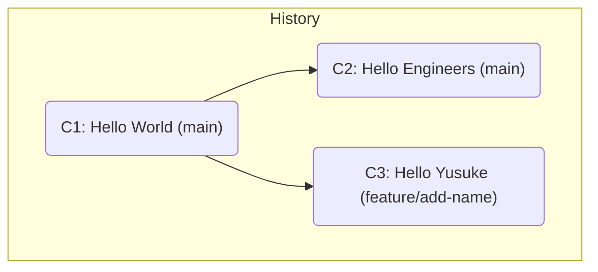

# 第 30 章: Pull Request でのコンフリクト解決

---

Pull Request (PR) のワークフローはチーム開発を円滑にしますが、複数の開発者が並行して作業を進める以上、**コンフリクト**は避けて通れない現実です。特に、自分がフィーチャーブランチで作業している間に、`main` ブランチが他の PR のマージによって先に進んでしまった場合にコンフリクトは頻繁に発生します。

PR 上でコンフリクトが発生すると、GitHub は「This branch has conflicts that must be resolved」と警告を出し、**マージボタンを無効化**します。
この章では、この PR 上のコンフリクトを解決するための、最も安全で標準的な手順を学びます。

---
## 30.1 コンフリクトが発生する原因

PR でのコンフリクトは、**PR の土台 (base) となっている `main` ブランチ**と、**あなたのフィーチャーブランチ**の両方で、**同じファイルの同じ箇所**が変更された場合に発生します。

**シナリオ**:
1.  `main` ブランチには、「Hello World」と書かれた `greeting.txt` があります。
2.  **あなた**: `main` から `feature/add-name` ブランチを切り、「Hello Yusuke」に変更します。
3.  **同僚**: `main` から別のブランチを切り、「Hello Engineers」に変更し、あなたより先に `main` にマージします。
4.  あなたが `feature/add-name` の PR を作成すると、`main` ブランチは既に「Hello Engineers」に変更されているため、GitHub はあなたの「Hello Yusuke」という変更を自動でマージできず、コンフリクトが発生します。


この状態で `C3` を `main` にマージしようとすると、`greeting.txt` の同じ行が `C2` と `C3` で異なる内容に変更されているため、コンフリクトが起こります。

---
## 30.2 コンフリクトの解決手順 (ローカルでの Rebase 推奨)

コンフリクトを解決するにはいくつかの方法がありますが、最終的な `main` ブランチの歴史をクリーンに保つために、**ローカルで `main` ブランチの最新の変更を `rebase` を使って取り込む**方法が最も推奨されます。

**解決ワークフロー**:
1.  **ローカルの `main` ブランチを最新化する**:
    ```bash
    git switch main
    git pull origin main
    ```
    これで、あなたのローカルの `main` ブランチは、同僚の変更を含んだ最新の状態になります。

2.  **フィーチャーブランチに切り替え、`rebase` を実行する**:
    ```bash
    git switch feature/add-name
    git rebase main
    ```
    このコマンドは、「`feature/add-name` ブランチの変更 (`C3`) を、現在の `main` ブランチ (`C2`) の上でやり直す (再適用する)」という操作です。
    当然、ここでコンフリクトが発生します。

3.  **ローカルでコンフリクトを解決する**:
    - `rebase` が一時停止するので、コンフリクトマーカー (`<<<<<<<`, `=======`, `>>>>>>>`) が挿入された `greeting.txt` をエディタで開きます。
    - 最終的にどちらの変更を採用するのか、あるいは両方を組み合わせるのかを判断し、ファイルを編集してマーカーを削除します。 (例: 「Hello Engineers and Yusuke」)
    - 編集が終わったら、ファイルを `add` して解決したことを Git に伝えます。
    ```bash
    git add greeting.txt
    ```

4.  **`rebase` を続行する**:
    ```bash
    git rebase --continue
    ```
    `rebase` が正常に完了すると、あなたのフィーチャーブランチの歴史は、最新の `main` の歴史の直後に続く、一直線の綺麗な形に書き換えられます。

    ```mermaid
    graph TD
        subgraph "After Rebase on Local"
            A("C1") --> B("C2 (main)") --> D("C3': Hello Engineers and Yusuke (feature/add-name)")
        end
    ```

5.  **解決済みのブランチを `push` する**:
    `rebase` によってローカルブランチの歴史が書き換えられたため、通常のリモートブランチとの歴史とは互換性がありません。そのため、`--force-with-lease` を使って、リモートのフィーチャーブランチを、解決済みのローカルブランチの状態で**上書き**します。

    ```bash
    git push --force-with-lease origin feature/add-name
    ```
    この `push` が成功すると、GitHub 上の PR は自動的に更新され、コンフリクトが解決された状態になり、マージ可能な状態に戻ります。

---
## 30.3 なぜ `merge` ではなく `rebase` なのか？

`git rebase main` の代わりに `git merge main` を使ってコンフリクトを解決することも可能です。
しかし、`merge` を使うと、あなたのフィーチャーブランチに「`main` の変更を取り込むためのマージコミット」が作られます。
```
*   Merge branch 'main' into feature/add-name
|\
| * C2 (main)
* | C3 (feature/add-name)
|/
* A
```
このブランチを PR に `push` すると、コンフリクトは解決されますが、この**一時的なマージの歴史**が PR に残り続けます。最終的にこの PR が `main` にマージされると、歴史が二重にマージされ、非常に複雑で追跡しにくいコミットグラフになってしまいます。

`rebase` を使うことで、あたかも最初から最新の `main` で作業していたかのようなクリーンな一直線の歴史を作り出すことができ、`main` ブランチのコミットログを綺麗に保つことができるのです。

---
**まとめ**

- PR でのコンフリクトは、`main` ブランチとフィーチャーブランチで同じ箇所が変更された場合に発生する。
- 解決のための推奨ワークフローは、ローカルで `rebase` を使う方法である。
    1.  `main` ブランチを `pull` して最新化する。
    2.  フィーチャーブランチで `git rebase main` を実行し、コンフリクトを発生させる。
    3.  ローカルでファイルを編集してコンフリクトを解決し、`git add` してから `git rebase --continue` で `rebase` を完了させる。
    4.  `git push --force-with-lease` で、解決済みのブランチをリモートに `push` して PR を更新する。
- `rebase` を使うことで、`main` ブランチの歴史を汚すことなく、コンフリクトを綺麗に解決できる。

