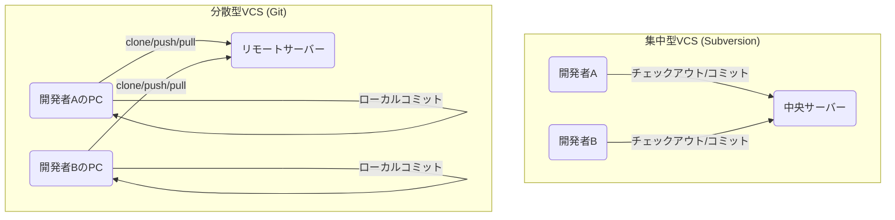
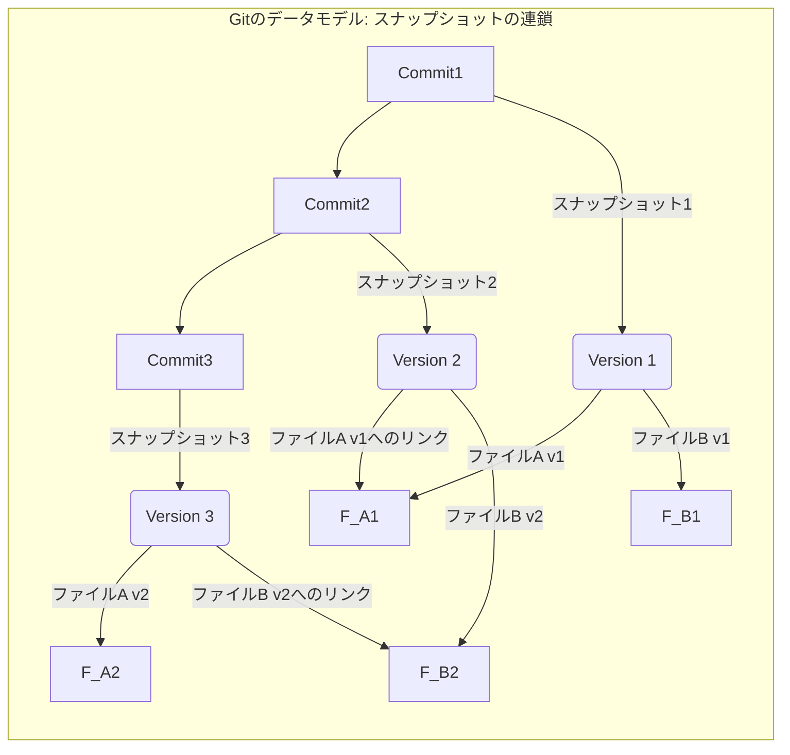

# 第 1 章: Git とは何か

ようこそ、『現場で本当に使える Git & GitHub 実践ガイド』へ。本書は、あなたが Git を「なんとなく」使う状態から脱却し、「完全に理解して」自信を持って使いこなせるようになるための一冊です。

多くの Git 入門書は、コマンドの羅列とその表面的な説明に終始しがちです。しかし、それではトラブルが発生したとき、あるいはチームで複雑な運用が求められたときに、途端に対応できなくなってしまいます。

本書のゴールはただ一つ。**Git の内部構造、特に `.git` ディレクトリの中で何が起きているのかを理解することで、あらゆるコマンドの「なぜ」を説明できるようになること**です。

この第 1 章では、まず私たちがなぜバージョン管理システム、とりわけ Git を使う必要があるのか、その根本的な理由から探っていきます。

---

## 1.1 バージョン管理がない世界の悪夢

あなたが一人でレポートを書いている場面を想像してみてください。

1.  `report.docx` というファイルを作成し、書き進めます。
2.  少し大きな修正を加える前に、念のためファイルをコピーして `report_v2.docx` を作ります。
3.  指導教官からのフィードバックを反映した `report_v2_fix.docx` を作ります。
4.  最終版のつもりで `report_final.docx` を作ります。
5.  しかし、さらに修正が入り `report_really_final.docx` が生まれます。
6.  提出後、「やっぱり `_v2` の時の図を使いたい」と思っても、どれが正しいバージョンか、何が違うのか、もはや分かりません。

これは多くの人が経験したことのある「ファイル名バージョン管理」の悪夢です。この手動管理には、致命的な問題がいくつもあります。

- **変更履歴が不明瞭**: いつ、誰が、なぜ、どの部分を変更したのかが分かりません。
- **過去のバージョンへの復元が困難**: 特定の時点の状態に正確に戻すことが非常に難しいです。
- **共同作業が破綻する**: 複数人で同じファイルを編集する場合、誰かの変更を上書きしてしまったり、変更点を手動で統合（マージ）したりする必要があり、膨大な手間とミスが発生します。メールでファイルを送り合うなどは、最悪のパターンです。

これらの問題を解決するために生まれたのが、**バージョン管理システム (Version Control System, VCS)** です。VCS は、ファイルやディレクトリへの変更履歴を記録し、特定の時点の状態を復元したり、複数人での共同作業を支援したりするためのシステムです。

## 1.2 Git の核心的特徴

VCS には様々な種類がありますが、現在、Git は圧倒的なデファクトスタンダードとなっています。なぜ Git がこれほどまでに広く使われているのでしょうか。その理由は、Git が持つ 2 つの核心的な特徴にあります。

### 1. 分散型バージョン管理システム (DVCS)

VCS は、そのアーキテクチャによって「集中型」と「分散型」に大別されます。

**集中型 VCS (例: Subversion)**
- 一つの中心的なサーバーに変更履歴のすべてが保存されます。
- 開発者は、作業を始める前にサーバーから最新版のファイルを取得（チェックアウト）し、作業が終わったらサーバーに変更内容を保存（コミット）します。

**分散型 VCS (例: Git)**
- 各開発者が、リポジトリ（変更履歴を含むプロジェクト全体）の完全なコピーを自分のローカルマシンに持ちます。
- 普段の作業（コミット、変更履歴の確認など）はすべてローカルで完結し、サーバーへの接続は不要です。
- 他の開発者と変更を共有したいときだけ、リモートリポジトリ（サーバー上のリポジトリ）とローカルリポジトリを同期します。

この違いを Mermaid を使って図解してみましょう。



分散型であることには、多くのメリットがあります。
- **オフラインでの作業**: ローカルに完全な履歴があるので、ネットワークがない環境でもコミットや履歴の閲覧が可能です。
- **高速な動作**: ほとんどの操作がローカルで完結するため、サーバーとの通信を待つ必要がなく、非常に高速です。
- **堅牢性**: 各開発者の PC とリモートサーバーに完全なバックアップが存在するため、リモートサーバーがダウンしても、誰かのローカルリポジトリから復元できます。

### 2. スナップショットの連鎖

Git のもう一つの重要な特徴は、データを「スナップショットの連鎖」として記録する点です。

多くの VCS は、最初のバージョンからの変更点（差分、デルタ）を時系列で記録していきます。一方、Git はコミットするたびに、その時点での**プロジェクト全体の状態を丸ごと記録（スナップショット）**します。

もちろん、効率化のために、変更されていないファイルは新しいスナップショットに再度保存するのではなく、前回のスナップショットへのリンクとして記録します。



このスナップショット方式は、Git の堅牢性と速度を支える根幹の思想です。すべてのファイルは、その内容から計算されたハッシュ値（チェックサム）で管理されており、ファイルが破損すればすぐに検知できます。これにより、データの完全性が保証されます。

## 1.3 本書の学習方針：まず、準備運動から

本書の核心は、これら Git の特徴が `.git` というディレクトリの中で、どのようにファイルとして表現されているかを解き明かすことにあります。

- **1 章 1 概念**: 複数の概念を一度に学びません。各章で一つのテーマに集中し、確実に理解を積み重ねます。
- **ハンズオン第一**: すべてのコマンドは、あなたが実際にターミナルに打ち込むことを前提としています。
- **.git の可視化**: コマンドを実行したら、必ず `.git` ディレクトリの中を覗き、何がどう変化したのかを自分の目で確かめます。

さっそく、最初の実践と準備運動を行いましょう。Git をインストールしたら、まず最初にやるべき設定が 2 つあります。あなたの名前とメールアドレスを登録することです。この情報は、あなたが誰であるかを識別し、すべてのコミットに記録されます。

以下のコマンドをコピー＆ペーストし、あなた自身の情報に書き換えて実行してください。

```bash
git config --global user.name "Your Name"
git config --global user.email "your.email@example.com"
```

このコマンドが何をしているのか、現時点では分からなくても構いません。`--global` は、この PC 上のすべての Git リポジトリでこの設定を使う、という意味です。

設定が正しく行われたか確認してみましょう。

```bash
git config --global --list
```

`user.name` と `user.email` が表示されれば成功です。

---

**まとめ**

この章では、バージョン管理の必要性と、Git がなぜ現代の開発に不可欠なツールとなったのか、その 2 大特徴（分散型、スナップショット）を見てきました。そして、最初の Git コマンドを実行し、開発の準備を整えました。

次の章では、いよいよ本書の聖域、`.git` ディレクトリの探検に出かけます。`git init` コマンドが、一体どんな魔法の箱を用意してくれるのか、その中身を一緒に見ていきましょう。
