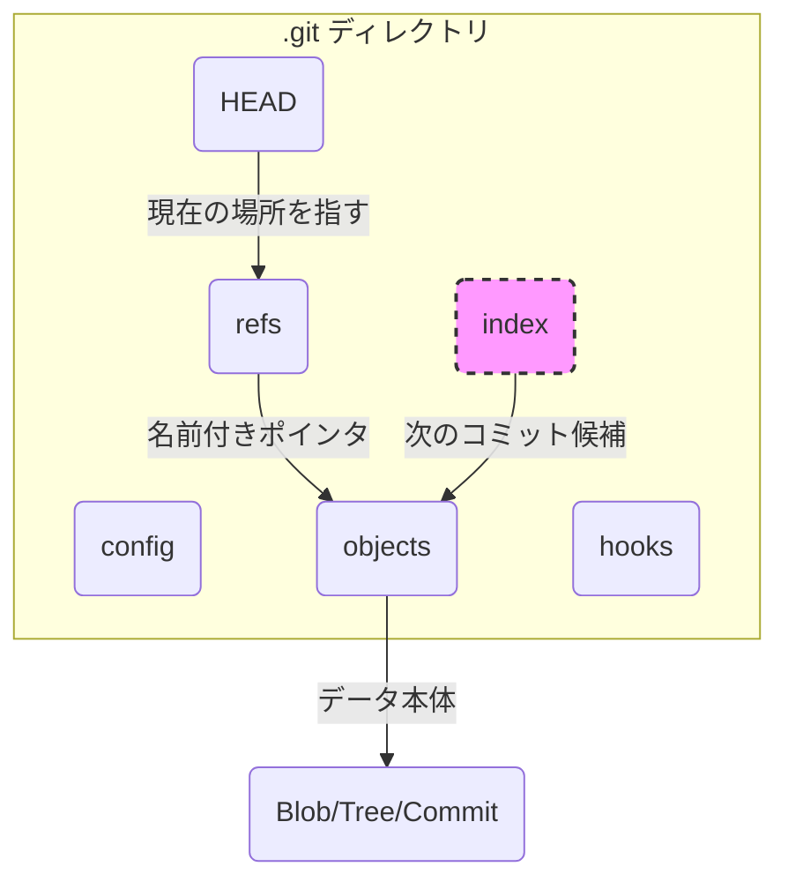

# 第 2 章: .git ディレクトリの全体像

第 1 章では、Git が「スナップショットの連鎖」として歴史を記録することを学びました。では、その重要な歴史は、一体どこに、どのような形で保存されているのでしょうか。その答えが、すべての Git リポジトリの心臓部である `.git` ディレクトリにあります。

この章では、`git init` コマンドでリポジトリを初期化し、自動生成される `.git` ディレクトリの構造を探検します。ここを理解することが、Git の内部構造をマスターするための鍵となります。

---

## 2.1 魔法の呪文 `git init`

まずは、この章を探検するための一時的な作業場を作りましょう。デスクトップでもどこでも構いませんので、新しいディレクトリを作成し、その中で作業を始めます。

以下のコマンドを一行ずつコピー＆ペーストして実行してください。

```bash
# 'git-practice' という名前のディレクトリを作成
mkdir git-practice

# 作成したディレクトリに移動
cd git-practice

# 現在地が git-practice ディレクトリであることを確認
pwd
```

さて、ここが私たちの実験室です。この空っぽのディレクトリを Git の管理下に置くための魔法の呪文、それが `git init` です。

```bash
git init
```

実行すると、おそらく `Initialized empty Git repository in ...` というメッセージが表示されるはずです。これは「空の Git リポジトリを初期化しました」という意味です。

一見、何も変わっていないように見えます。しかし、`ls -a` コマンドで隠しファイルを含めて表示すると、`.git` というディレクトリが作成されているのが分かります。

```bash
ls -a
```
出力結果：
```
. .. .git
```

この `.git` ディレクトリこそ、Git がすべての履歴、設定、オブジェクトを保存するデータベースそのものです。**あなたのプロジェクトの Git に関するすべての情報は、このディレクトリに集約されています。** 極端な話、プロジェクトの他のファイルをすべて消しても、この `.git` ディレクトリさえ残っていれば、過去の任意のバージョンのファイルを復元できるのです。

---

## 2.2 `.git` ディレクトリの探検ツアー

それでは、`git init` が生成した `.git` ディレクトリの中身を覗いてみましょう。

```bash
# .git ディレクトリの中身を一覧表示
ls -F .git
```
※お使いの Git のバージョンによって、表示されるファイルやディレクトリは多少異なる場合があります。

出力結果（例）：
```
HEAD         config*      description  hooks/       info/        objects/     refs/
```

まるで秘密基地のようですね。一つ一つのファイルやディレクトリには、重要な役割があります。現時点ですべてを完璧に理解する必要はありませんが、主要な登場人物の顔と役割を覚えておきましょう。


<small>※ `index` ファイルは、まだ何も `add` していない初期状態では存在しません。後の章で登場します。</small>

### 主要な登場人物

- **`HEAD` ファイル**:
  - **役割**: 「今、あなたはどこにいますか？」を示すポインタ。
  - **中身**: 現在チェックアウトしているブランチ（通常は `ref: refs/heads/main`）が書かれたテキストファイルです。第 6 章で詳しく探検します。

- **`objects` ディレクトリ**:
  - **役割**: Git のデータベースの核。すべてのデータ（ファイルの中身、ディレクトリ構造、コミット情報など）がここに格納されます。
  - **中身**: データは「オブジェクト」という単位で、圧縮されて保存されます。第 3 章から、このディレクトリの中身を徹底的に解剖していきます。

- **`refs` ディレクトリ**:
  - **役割**: ブランチやタグといった「人間が分かりやすい名前」が、どのコミットを指しているかを管理します。
  - **中身**: `refs/heads/` にはブランチが、`refs/tags/` にはタグが、それぞれコミットのハッシュ値を記録したファイルとして保存されます。

- **`config` ファイル**:
  - **役割**: このリポジトリ固有の設定を管理します。
  - **中身**: 第 1 章で設定した `user.name` のようなグローバルな設定を、このリポジトリだけ別の値で上書きしたい場合などに使います。

- **`index` ファイル (今はまだない)**:
  - **役割**: 「ステージングエリア」や「インデックス」と呼ばれる領域の実体です。次のコミットに含めるファイルの情報が記録されます。
  - **登場**: `git add` コマンドを初めて実行したときに作成されます。第 7 章の主役です。

---

**まとめ**

この章では、`git init` が `.git` という心臓部を作成するプロセスを見ました。そして、その主要な構成要素である `HEAD`、`objects`、`refs` などの役割を概観しました。

重要なのは、**Git の操作とは、突き詰めれば、この `.git` ディレクトリ内のファイルを読み書きしているに過ぎない**ということです。

次の章からは、いよいよ最も重要な `objects` ディレクトリに分け入り、`git add` したファイルがどのように「blob オブジェクト」として保存されるのか、そのミステリーを解き明かしていきます。

最後に、この章で作成した `git-practice` ディレクトリはもう不要なので、一つ上の階層に戻ってから削除しておきましょう。

```bash
# 一つ上の階層に移動
cd ..

# ディレクトリごと削除
rm -rf git-practice
```
