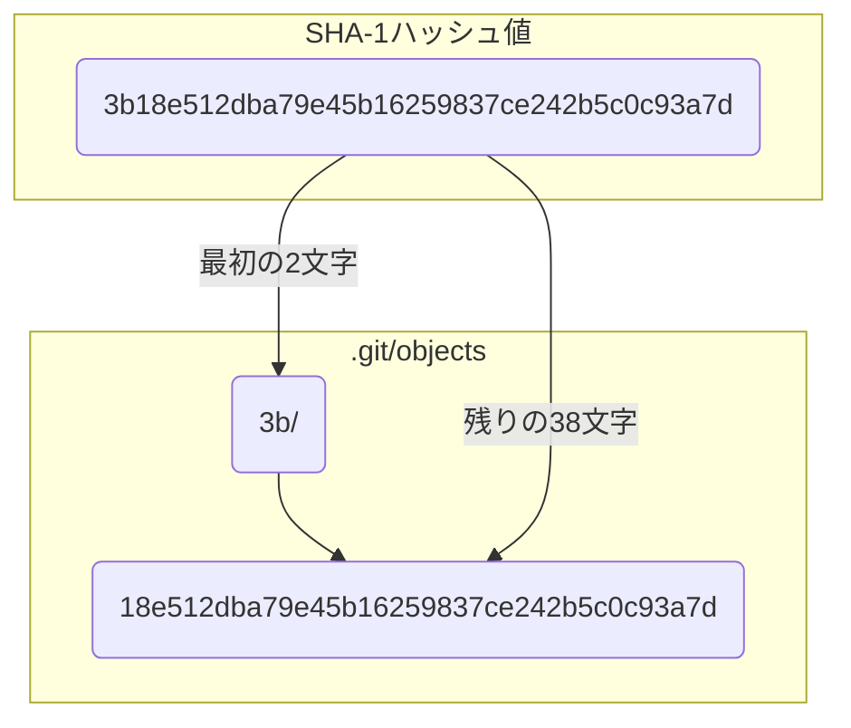

# 第 3 章: Git オブジェクト（blob）

前の章で、`.git` ディレクトリがリポジトリの心臓部であり、中でも `objects` ディレクトリがすべてのデータを格納するデータベースの核であると学びました。

この章からは、いよいよ `objects` ディレクトリの中身を解剖していきます。最初のテーマは **blob オブジェクト**です。blob とは "Binary Large Object" の略で、Git の世界では**ファイルの中身そのもの**を指します。

`git add` コマンドを実行したとき、ファイルの中身がどのように `objects` ディレクトリに格納されるのか、そのプロセスをハンズオンで追体験していきましょう。

---

## 3.1 `git add` の裏側を覗く

まずは、第 2 章と同様に、実験用のリポジトリを準備します。

```bash
# 'git-blob-practice' ディレクトリを作成して移動
mkdir git-blob-practice && cd git-blob-practice

# Gitリポジトリを初期化
git init
```

次に、バージョン管理したいファイルを作成します。今回は `hello.txt` というファイルに簡単なメッセージを書き込みましょう。

```bash
# "hello, world" という文字列を hello.txt に書き込む
echo "hello, world" > hello.txt
```

さて、ここからが本番です。`git add` を使って、このファイルをステージングエリアに追加します。

```bash
git add hello.txt
```

この瞬間、`.git/objects` ディレクトリに魔法がかけられました。中を覗いてみましょう。

```bash
# .git/objects ディレクトリの中身を表示
ls -F .git/objects
```

出力結果（例）：
```
3b/  info/ pack/
```
※ `3b` の部分は、あなたが実行した結果とは異なるハッシュ値になります。

`info` と `pack` は最初からあるディレクトリですが、新しく `3b` のような 2 文字のディレクトリが作成されたことに注目してください。さらにその中を見てみましょう。

```bash
# 新しくできたディレクトリの中身を表示 (あなたの環境のハッシュ値に置き換えてください)
ls .git/objects/3b
```
出力結果（例）：
```
18e512dba79e45b16259837ce242b5c0c93a7d
```

`3b` というディレクトリの中に、`18e5...` という非常に長い名前のファイルが一つ作成されています。これが **blob オブジェクト** の実体です。

Git は、`git add` されたファイルの中身を圧縮し、その内容から**SHA-1 ハッシュ**と呼ばれる 40 桁のユニークな ID を計算します。そして、そのハッシュ値の**最初の 2 文字をディレクトリ名**、**残りの 38 文字をファイル名**として、`.git/objects` 以下に保存するのです。



この仕組みにより、Git は膨大な数のオブジェクトを効率的に管理しています。

---

## 3.2 配管コマンドでオブジェクトを調べる

`objects` ディレクトリに保存されたファイルは、ただのテキストファイルではなく、圧縮されたバイナリデータです。`cat` コマンドで直接中身を見ることはできません。

そこで登場するのが、**配管コマンド (Plumbing Commands)** です。配管コマンドは、Git の内部構造を直接操作・調査するための低レベルなコマンド群で、普段使う `add` や `commit` といった「磁器コマンド (Porcelain Commands)」の裏側で動いています。

本書では、この配管コマンドを積極的に使い、Git の内部を探検していきます。

### `git cat-file`: オブジェクトの中身を見る

`git cat-file` は、オブジェクトの中身を表示するための配管コマンドです。先ほど見つけたオブジェクトの中身を見てみましょう。

ハッシュ値の指定は、完全な 40 桁である必要はなく、ユニークに特定できる最初の数文字（7 文字程度が一般的）で十分です。

```bash
# -p オプションは、中身を分かりやすく整形して表示 (pretty-print)
# あなたの環境で生成されたハッシュ値の最初の7文字程度に置き換えてください
git cat-file -p 3b18e51
```

出力結果：
```
hello, world
```

見事に `hello.txt` の内容が表示されました！ これで、`git add` がファイルの中身を `objects` ディレクトリに blob オブジェクトとして保存していることが確認できました。

### `git hash-object`: ハッシュ値を計算する

`git add` を実行しなくても、ファイルから blob オブジェクトを生成したり、そのハッシュ値を計算したりできる配管コマンドがあります。それが `git hash-object` です。

```bash
git hash-object hello.txt
```

出力結果（例）：
```
3b18e512dba79e45b16259837ce242b5c0c93a7d
```

このコマンドは、`hello.txt` の内容から SHA-1 ハッシュを計算して表示します。`.git/objects` に作られたオブジェクトのハッシュ値と完全に一致しているはずです。

このことから分かる重要な事実があります。

**Git はファイル名ではなく、ファイルの中身でデータを管理している**ということです。たとえファイル名が違っても、中身が全く同じであれば、生成される blob オブジェクトは一つだけで、ハッシュ値も同じになります。

試してみましょう。

```bash
# hello.txt をコピーして world.txt を作成
cp hello.txt world.txt

# world.txt のハッシュ値を計算
git hash-object world.txt
```

`hello.txt` の時と全く同じハッシュ値が表示されたはずです。これにより、Git はリポジトリ内で無駄な重複データを保存しない、非常に効率的な設計になっていることが分かります。

---

**まとめ**

この章では、`git add` の裏側で行われる核心的な処理を学びました。

- `git add` は、ファイルの中身を **blob オブジェクト**として `.git/objects` ディレクトリに保存する。
- blob オブジェクトは、ファイルの内容から計算された **SHA-1 ハッシュ** によって一意に識別される。
- `git cat-file` や `git hash-object` といった**配管コマンド**を使うことで、Git の内部データを直接調査できる。
- Git はファイル名ではなく**内容でデータを管理**しており、同じ内容のファイルは一つのオブジェクトを共有する。

これであなたは、Git がどのようにしてデータのスナップショットの「部品」を保存しているかを理解しました。次の章では、ディレクトリ構造を表現するためのもう一つの重要なオブジェクト、「tree オブジェクト」について学びます。

最後に、今回作成したディレクトリをクリーンアップしておきましょう。

```bash
# 一つ上の階層に移動
cd ..

# ディレクトリごと削除
rm -rf git-blob-practice
```
