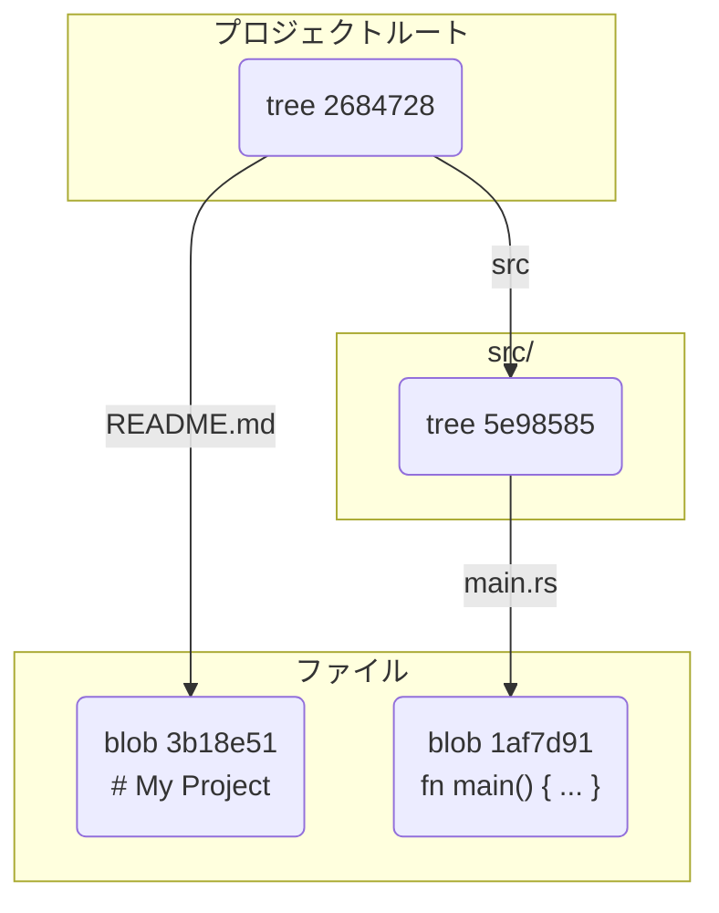

# 第 4 章: Git オブジェクト（tree）

第 3 章では、ファイルの中身が `blob` オブジェクトとして `.git/objects` に保存されることを見ました。しかし、`blob` オブジェクトはファイルの中身を保持するだけで、ファイル名や、どのディレクトリにファイルがあるか、といった情報は一切含んでいません。

考えてみてください。バージョン管理では、ファイルの中身だけでなく、「`src` ディレクトリの中にある `main.rs`」というような**ディレクトリ構造**も完全に復元できなければ意味がありません。

その役割を担うのが、Git の第二のオブジェクトタイプ、**tree オブジェクト**です。tree オブジェクトは、ディレクトリ構造を記録するための台帳のようなものです。

---

## 4.1 ディレクトリ構造を持つプロジェクト

それでは、実際にディレクトリ構造を持つプロジェクトを準備して、Git がそれをどう扱うのか見ていきましょう。

```bash
# 実験用のディレクトリを作成して移動
mkdir git-tree-practice && cd git-tree-practice

# Gitリポジトリを初期化
git init

# 'src' というディレクトリを作成
mkdir src

# 'src' ディレクトリの中に 'main.rs' というファイルを作成
echo 'fn main() { println!("Hello, Git!"); }' > src/main.rs

# プロジェクトのルートに README.md を作成
echo '# My Project' > README.md
```

これで、以下のようなファイル構造ができました。

```
.
├── README.md
└── src
    └── main.rs
```

この状態で、すべてのファイルをステージングエリアに追加してみましょう。

```bash
git add .
```

さて、この時点で `.git/objects` ディレクトリはどうなっているでしょうか。前章の知識から、`src/main.rs` と `README.md` の内容に対応する 2 つの `blob` オブジェクトが作成されているはずです。

これは `git ls-files --stage` という配管コマンドで確認できます。このコマンドは、現在のステージングエリア（インデックス）の内容を表示します。

```bash
git ls-files --stage
```

出力結果（例）：
```
100644 3b18e512dba79e45b16259837ce242b5c0c93a7d 0	README.md
100644 1af7d913c315ad2398add654e58b577e1c15f40f 0	src/main.rs
```
<small>※ハッシュ値はあなたの環境では異なります。</small>

この出力から分かること：
- `100644`: ファイルのパーミッション（通常のファイル）を示します。
- `3b18e5...`: `README.md` の内容に対応する `blob` オブジェクトのハッシュ値です。
- `1af7d9...`: `src/main.rs` の内容に対応する `blob` オブジェクトのハッシュ値です。
- `0`: ステージ番号（コンフリクトがない場合は 0）です。
- `README.md`, `src/main.rs`: **ファイルパス**です。

`git add` を実行すると、Git はファイルの `blob` を作成するだけでなく、ステージングエリア（`.git/index` ファイル）に「このパスのファイルは、この `blob` オブジェクトに対応する」という情報を記録します。**tree オブジェクトは、このステージングエリアの情報をもとに、`git commit` が実行されるタイミングで作成されます。**

---

## 4.2 tree オブジェクトの正体

`git commit` を実行する前に、現在のステージングエリアの情報から `tree` オブジェクトを手動で作成してみましょう。これには `git write-tree` という配管コマンドを使います。

```bash
git write-tree
```

出力結果（例）：
```
2684728d116238b9195a7092c57502c2f7b8849c
```

このコマンドは、現在のステージングエリアの内容に基づいてルート階層の `tree` オブジェクトを作成し、そのハッシュ値を返します。

`objects` ディレクトリを見ると、このハッシュ値に対応するオブジェクトが作成されているはずです。では、`git cat-file` でその中身を見てみましょう。

```bash
# -p オプションで整形して表示
# あなたの環境で出力されたハッシュ値に置き換えてください
git cat-file -p 2684728
```

出力結果（例）：
```
100644 blob 3b18e512dba79e45b16259837ce242b5c0c93a7d	README.md
040000 tree 5e9858535a2c2225a075908b08212e3658a5c9a7	src
```

これが `tree` オブジェクトの正体です。
- `blob`: この行が `blob` オブジェクト（つまりファイル）を指していることを示します。
- `tree`: この行が別の `tree` オブジェクト（つまりサブディレクトリ）を指していることを示します。
- `3b18e5...`: `README.md` の `blob` オブジェクトのハッシュ値です。
- `README.md`: ファイル名です。

`tree` オブジェクトは、そのディレクトリに含まれるファイルやサブディレクトリのリストを持っています。各エントリには、**[パーミッション] [オブジェクトの種類] [ハッシュ値] [名前]** が記録されています。

`src` ディレクトリに対応する `tree` オブジェクトの中身も見てみましょう。

```bash
git cat-file -p 5e98585
```

出力結果（例）：
```
100644 blob 1af7d913c315ad2398add654e58b577e1c15f40f	main.rs
```

`src` ディレクトリの `tree` オブジェクトは、`main.rs` という名前の `blob` を指しています。

これらの関係を図にすると、以下のようになります。


このように、`tree` オブジェクトが他の `tree` や `blob` を指し示すことで、プロジェクト全体のディレクトリ構造が表現されているのです。

---

**まとめ**

この章では、ディレクトリ構造を記録する `tree` オブジェクトについて学びました。

- `blob` オブジェクトにはファイル名やパスの情報が含まれていない。
- `tree` オブジェクトは、ディレクトリ内のファイル (`blob`) やサブディレクトリ (`tree`) の一覧を記録する台帳である。
- `git add` は、ステージングエリア（インデックス）を更新し、`git commit` はそのインデックス情報から `tree` オブジェクトを生成する。
- `tree` オブジェクトが入れ子状に他の `tree` オブジェクトを指し示すことで、複雑なディレクトリ構造も表現できる。

これで、スナップショットを構成する 2 つの主要な部品、`blob` と `tree` が揃いました。しかし、これだけではまだ「いつ」「誰が」「なぜ」このスナップショットを作成したのかという情報がありません。

その最後のピースを埋めるのが、次章で学ぶ **commit オブジェクト**です。

最後に、実験用ディレクトリを削除しておきましょう。

```bash
cd ..
rm -rf git-tree-practice
```
