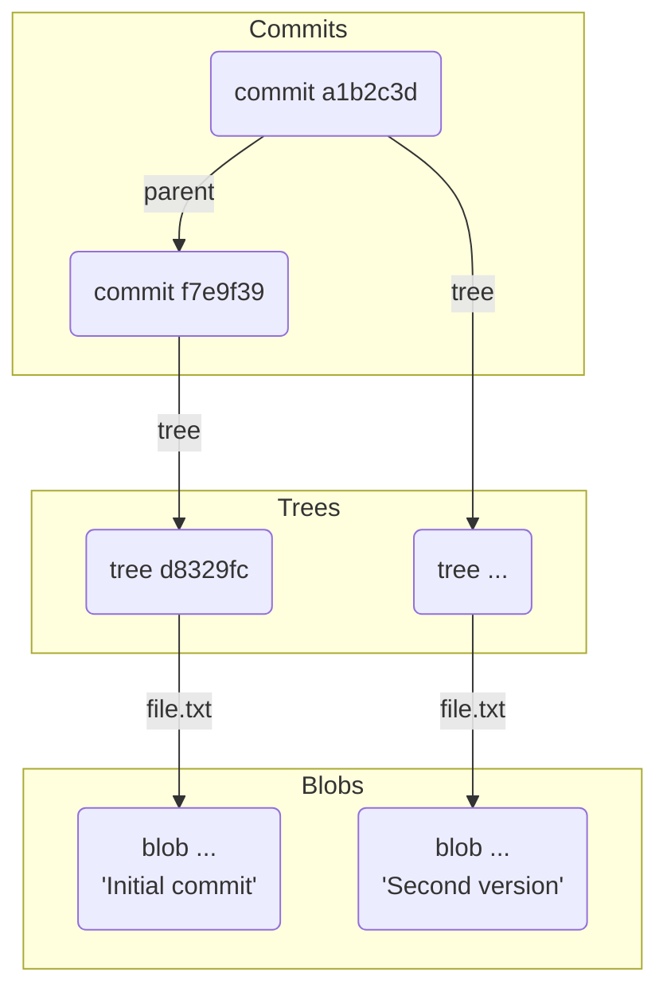

# 第 5 章: Git オブジェクト（commit）

`blob` オブジェクトでファイルの中身を、`tree` オブジェクトでディレクトリ構造を保存する方法を学びました。これらを組み合わせることで、プロジェクトのある一瞬を切り取った「スナップショット」が完成します。

しかし、このスナップショットが「いつ」「誰によって」「どのような目的で」作成されたのか、という情報がなければ、それは単なるデータの塊に過ぎません。また、スナップショット間の繋がり、つまり歴史の前後関係も分かりません。

この最後のピースを埋め、スナップショットに命を吹き込むのが、第 3 のオブジェクトタイプである **commit オブジェクト**です。

---

## 5.1 コミットの三大要素

`commit` オブジェクトは、主に以下の 3 つの重要な情報を持っています。

1.  **スナップショット (`tree`)**:
    -   このコミットが記録するプロジェクト全体のディレクトリ構造を指し示す `tree` オブジェクトのハッシュ値。

2.  **メタデータ (Author, Committer, Message)**:
    -   **Author**: この変更を最初に作成した人（名前、メールアドレス、タイムスタンプ）。
    -   **Committer**: この変更をリポジトリにコミットした人（名前、メールアドレス、タイムスタンプ）。通常は Author と同じですが、パッチを代理で適用した場合などには異なることがあります。
    -   **Commit Message**: この変更が何であるかを説明するメッセージ。

3.  **親コミット (`parent`)**:
    -   このコミットの一つ前のコミット（親コミット）のハッシュ値。この `parent` ポインタによって、コミットが時系列に沿って鎖のように繋がり、プロジェクトの歴史が形成されます。最初のコミットには親がいません。

---

## 5.2 最初のコミットを手作りする

`git commit` コマンドの裏側を理解するために、配管コマンドを使って最初のコミットを手作りしてみましょう。

```bash
# 実験用ディレクトリを作成して移動
mkdir git-commit-practice && cd git-commit-practice

# Gitリポジトリを初期化
git init

# 第1章で設定した名前とメールアドレスを確認（設定していない場合はここで設定）
git config user.name "Your Name"
git config user.email "you@example.com"

# コミット対象のファイルを作成
echo "Initial commit" > file.txt

# ステージングエリアに追加
git add file.txt

# ステージングエリアから tree オブジェクトを作成
git write-tree
```

`git write-tree` を実行すると、`tree` オブジェクトのハッシュ値が出力されます（例: `d8329fc1cc938780ffdd9f94ff0d3d248ea3463a`）。このハッシュ値を控えておいてください。

次に、この `tree` を指す `commit` オブジェクトを作成します。使うのは `git commit-tree` という配管コマンドです。このコマンドは、指定された `tree` オブジェクト、親コミット、コミットメッセージから `commit` オブジェクトを作成し、そのハッシュ値を返します。

```bash
# echo "<コミットメッセージ>" | git commit-tree <treeのハッシュ値>
# 今回は最初のコミットなので、親 (-p オプション) は指定しない
echo "Initial commit message" | git commit-tree d8329fc
```
<small>※ `d8329fc` の部分は、あなたの環境で `git write-tree` が出力したハッシュ値に置き換えてください。</small>

実行すると、新しい `commit` オブジェクトのハッシュ値が出力されます（例: `f7e9f398413f41249b5a935402637a723c0611e9`）。

`git cat-file` で中身を確認しましょう。

```bash
git cat-file -p f7e9f39
```

出力結果（例）：
```
tree d8329fc1cc938780ffdd9f94ff0d3d248ea3463a
author Your Name <you@example.com> 1672531200 +0900
committer Your Name <you@example.com> 1672531200 +0900

Initial commit message
```

見事に `commit` オブジェクトが作成されました！
- `tree` 行には、先ほど指定した `tree` オブジェクトのハッシュ値が記録されています。
- `author` と `committer` には、`git config` で設定した情報がタイムスタンプと共に記録されています。
- 空行の後に、指定したコミットメッセージが記録されています。
- `parent` 行がないことに注目してください。これは、このコミットが歴史の始点であることを示しています。

## 5.3 歴史を繋げる（親子関係）

次に、2 つ目のコミットを作成して、コミット同士が `parent` で繋がる様子を見てみましょう。

今度は普段使っている `git commit` コマンドを使います。（実は `git commit` は、`git write-tree` と `git commit-tree` を適切に実行してくれる便利なラッパーコマンドなのです。）

まず、先ほど手作りしたコミットをリポジトリの歴史として認識させる必要があります。現状では、ただオブジェクトが存在するだけで、どのブランチもこのコミットを指していません。これについては次章で詳しく学びますが、ここではおまじないとして以下のコマンドを実行します。

```bash
# 'main' ブランチを、先ほど作成したコミットに向ける
git update-ref refs/heads/main f7e9f39
```

では、ファイルを変更して 2 回目のコミットを実行します。

```bash
# ファイルを編集
echo "Second version" > file.txt

# 変更をステージング
git add file.txt

# git commit で2回目のコミットを実行
git commit -m "Update file.txt"
```

これで新しいコミットが作成されました。`git log` で歴史を確認してみましょう。

```bash
git log --oneline
```
出力結果（例）：
```
a1b2c3d (HEAD -> main) Update file.txt
f7e9f39 Initial commit message
```

最新のコミット（例: `a1b2c3d`）の中身を `git cat-file` で覗いてみると...

```bash
git cat-file -p a1b2c3d
```
出力結果（例）：
```
tree ...
parent f7e9f398413f41249b5a935402637a723c0611e9
author Your Name <you@example.com> ...
committer Your Name <you@example.com> ...

Update file.txt
```

今度は `parent` 行が存在し、その値が 1 つ前のコミット `f7e9f39...` を指していることが分かります。
この `parent` ポインタによって、コミットは過去に向かって一本の鎖のように繋がっていくのです。



---
**まとめ**

この章では、Git の歴史を構成する最後のオブジェクト、`commit` について学びました。

-   `commit` オブジェクトは、**スナップショット (`tree`)**、**メタデータ**、そして**親コミット (`parent`)** という 3 つの重要な情報を持つ。
-   `git commit-tree` という配管コマンドで、手動でコミットを作成できる。
-   `parent` ポインタが前のコミットを指し示すことで、コミットの連鎖、すなわち**歴史**が形成される。
-   普段使う `git commit` は、スナップショット (`tree`) の作成と、それを指す `commit` オブジェクトの作成を自動で行う便利なコマンドである。

これで、第 1 部のゴールである「Git の内部構造の理解」に必要な 3 種類のオブジェクト (`blob`, `tree`, `commit`) がすべて出揃いました。

しかし、`f7e9f39` のようなハッシュ値で歴史を管理するのは大変です。次章では、この無機質なハッシュ値に `main` のような人間が分かりやすい名前を与える「参照（refs）」の仕組みについて学びます。

最後に、実験用ディレクトリを片付けておきましょう。
```bash
cd ..
rm -rf git-commit-practice
```
