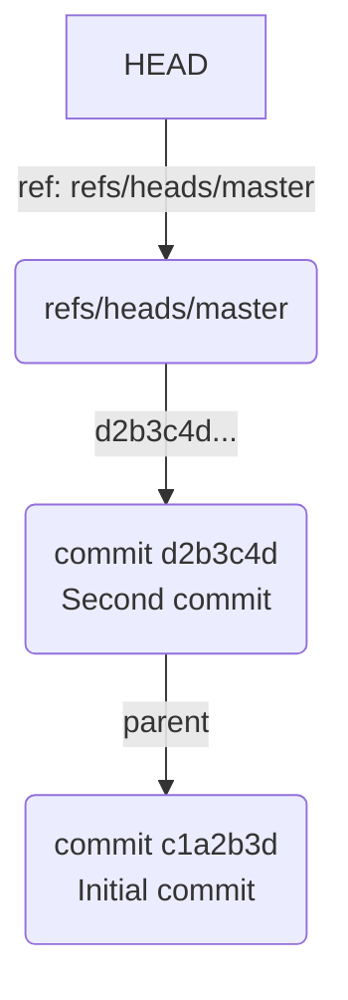
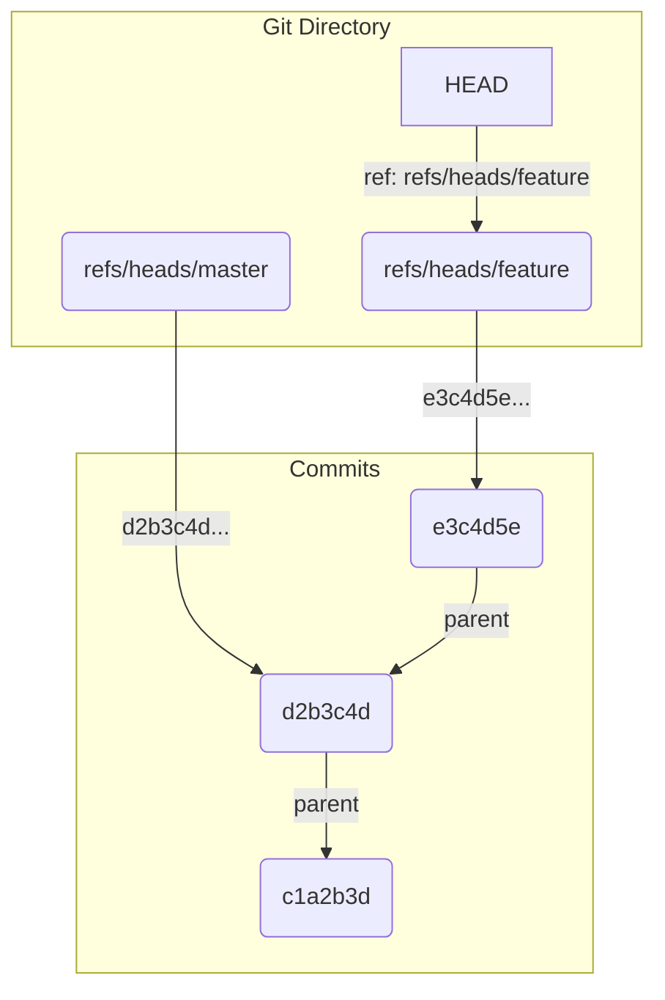

# 第6章: 参照（refs）とブランチ

これまでの章で、Gitの歴史が`commit`オブジェクトの連鎖によって形成されていることを学びました。しかし、最新のコミットを指し示すために、`a1b2c3d...`のような40桁のハッシュ値を毎回覚えておくのは現実的ではありません。

そこで登場するのが**参照（reference、略して ref）**です。参照とは、特定のコミットハッシュ値に付けられた、人間が読みやすい「名前」や「ラベル」のことです。その最も代表的な例が、私たちが日常的に使っている「ブランチ」です。

この章では、ブランチの正体が、実は`.git`ディレクトリ内のごく単純なテキストファイルであることを解き明かします。

---

## 6.1 ブランチの正体はただのファイル

ブランチがどのように機能するのか、実験を通して見ていきましょう。

```bash
# 実験用ディレクトリを作成して移動
mkdir git-refs-practice && cd git-refs-practice

# Gitリポジトリを初期化
git init

# 最初のコミットを作成
echo "version 1" > file.txt
git add file.txt
git commit -m "Initial commit"
```

この時点で、`git log --oneline` を実行すると、最初のコミットのハッシュ値が表示されます（例: `c1a2b3d`）。

さて、この `master`（または `main`）ブランチの実体はどこにあるのでしょうか。`.git/refs/heads` ディレクトリの中を覗いてみましょう。

```bash
ls .git/refs/heads
```
出力結果：
```
master
```

`master` という名前のファイルがありますね。この中身を見てみましょう。

```bash
cat .git/refs/heads/master
```
出力結果（例）：
```
c1a2b3d4e5f6a7b8c9d0e1f2a3b4c5d6e7f8a9b0
```

中には、最初のコミットの完全なSHA-1ハッシュ値が一行だけ書かれています。

**これがブランチの正体です。** Gitのブランチとは、単に**特定のコミットのハッシュ値を記録した、`refs/heads/`ディレクトリにあるテキストファイル**に過ぎません。

新しいコミットを作成すると何が起こるでしょうか？

```bash
echo "version 2" > file.txt
git add file.txt
git commit -m "Second commit"
```

新しいコミット（例: `d2b3c4d`）が作成されました。もう一度 `master` ファイルの中身を確認します。

```bash
cat .git/refs/heads/master
```
出力結果（例）：
```
d2b3c4d5e6f7a8b9c0d1e2f3a4b5c6d7e8f9a0b1
```

ファイルの中身が、新しいコミットのハッシュ値に自動的に更新されています。つまり、**コミットとは、現在いるブランチの参照ファイルを、新しいコミットのハッシュ値で上書きする操作**なのです。この仕組みのおかげで、ブランチは常にその歴史の先端を指し示すことができます。

---

## 6.2 HEAD: 「現在地」を示すポインタ

では、Git はどうやって「現在いるブランチ」を把握しているのでしょうか。その答えが、`.git` ディレクトリのルートにある `HEAD` ファイルです。

```bash
cat .git/HEAD
```
出力結果：
```
ref: refs/heads/master
```

`HEAD` ファイルは、**「現在あなたは `refs/heads/master` というブランチにいますよ」**という情報を持っています。`HEAD` は特定のコミットを直接指すのではなく、通常は**ブランチ（参照ファイル）を指し示しています**。これを**シンボリック参照**と呼びます。

この関係を図にすると、以下のようになります。



### ブランチの作成と切り替え

`git branch` や `git checkout` (または `git switch`) を実行すると、この参照ファイルと `HEAD` がどのように変化するか見てみましょう。

新しいブランチ `feature` を作成します。
```bash
git branch feature
```
このコマンドは、`.git/refs/heads/` に `feature` という新しいファイルを作成するだけです。中身は、現在のブランチ (`master`) が指しているコミットのハッシュ値と同じです。

```bash
# 新しいファイルが作成されたか確認
ls .git/refs/heads

# 中身が master と同じか確認
cat .git/refs/heads/feature
```

次に、`feature` ブランチに切り替えます。
```bash
git checkout feature
```
このコマンドは、`.git/HEAD` ファイルの中身を書き換えるだけです。

```bash
cat .git/HEAD
```
出力結果：
```
ref: refs/heads/feature
```

`HEAD` が `feature` ブランチを指すようになりました。この状態で新しいコミットを作成すると、`feature` ファイルだけが更新され、`master` ファイルは元のままになります。これが、ブランチが分岐していく仕組みです。

```bash
echo "version 3" > file.txt
git add file.txt
git commit -m "Third commit on feature"
```
- `cat .git/refs/heads/feature` -> 3番目のコミットのハッシュ値に更新
- `cat .git/refs/heads/master` -> 2番目のコミットのハッシュ値のまま


Gitのブランチ作成や切り替えが非常に高速なのは、このように単に40バイト程度のテキストファイルを操作しているだけだからです。

---
## 6.3 配管コマンドで参照を操る

-   **`git update-ref`**: 参照を直接作成・更新するコマンドです。第5章で「おまじない」として使いましたが、これは `refs/heads/master` ファイルに指定したコミットハッシュを書き込む操作だったのです。
-   **`git rev-parse`**: 参照名（`master`, `HEAD` など）から、それが最終的に指し示しているコミットのハッシュ値を取得します。

```bash
# masterブランチが指すコミットハッシュを取得
git rev-parse master

# HEADが指すコミットハッシュを取得
git rev-parse HEAD
```

---
**まとめ**

この章では、ブランチと `HEAD` の謎を解き明かしました。

-   **ブランチ**の正体は、`.git/refs/heads/` 内にある、コミットハッシュを記録した単純なテキストファイルである。
-   新しいコミットは、現在のブランチの参照ファイルを更新する。
-   **HEAD** は、`.git/HEAD` ファイルに記録された、現在作業中のブランチを示すポインタである。
-   ブランチの作成や切り替えが高速なのは、これらの小さなファイルを操作しているだけだから。

これで、Gitのオブジェクト (`blob`, `tree`, `commit`) と、それらを指し示す参照 (`refs`, `HEAD`) という、Gitの内部構造を支える両輪を理解しました。

しかし、まだ一つ謎が残っています。`git add` したファイルは、コミットされるまでどこにいるのでしょうか？ 次章では、コミットの準備段階である「ステージングエリア」とその実体「インデックス」について学び、第1部を完成させます。

最後に、実験用ディレクトリを削除しておきましょう。
```bash
cd ..
rm -rf git-refs-practice
```
