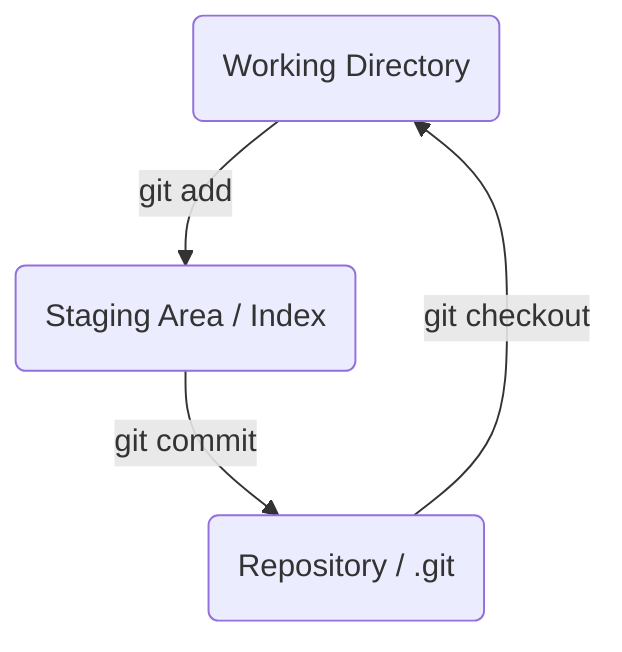

# 第 7 章: ステージングエリアとインデックス

これまでの章で、ワーキングディレクトリ（作業中のファイル）、`.git/objects` に保存されるオブジェクト（リポジトリの歴史）、そして `refs`（ブランチなど）について学びました。

しかし、Git にはもう一つ、極めて重要な概念上のエリアが存在します。それが**ステージングエリア (Staging Area)** です。ステージングエリアとは、**次のコミットに含める変更内容を準備しておく場所**です。`git add` コマンドは、ファイルをリポジトリに直接保存するのではなく、このステージングエリアに登録するためのコマンドです。

この章では、この抽象的な概念であるステージングエリアの正体が、`.git` ディレクトリにある `index` という名前のバイナリファイルであることを突き止めます。

---

## 7.1 Git の「三大エリア」

Git の世界を理解するには、以下の 3 つのエリアの関係を把握することが不可欠です。

1.  **ワーキングディレクトリ (Working Directory)**:
    -   実際にファイルを編集する、あなたの作業場です。`git status` で "Changes not staged for commit" と表示される変更は、ここに存在します。

2.  **ステージングエリア (Staging Area / Index)**:
    -   次のコミットに含めるスナップショットの候補を置く場所です。`git add` された変更はここに移されます。`git status` では "Changes to be committed" として表示されます。

3.  **リポジトリ (Repository)**:
    -   `.git` ディレクトリのことです。コミットされたスナップショット（`commit` オブジェクト）が永続的に保存される場所です。

`git add` はワーキングディレクトリからステージングエリアへ、`git commit` はステージングエリアからリポジトリへ、というデータの流れが基本となります。



---

## 7.2 インデックスファイルの正体

では、ステージングエリアの実体である `index` ファイルを直接見ていきましょう。

```bash
# 実験用ディレクトリを作成して移動
mkdir git-index-practice && cd git-index-practice

# Gitリポジトリを初期化
git init

# .git ディレクトリ直下を確認
ls -a .git
```
`git init` 直後の状態では、`.git` ディレクトリに `index` ファイルは存在しないことに注目してください。`index` ファイルは、**最初の `git add` が実行されたタイミングで作成されます**。

```bash
echo "Hello" > file1.txt
git add file1.txt

# 再度 .git ディレクトリ直下を確認
ls -a .git
```
今度は `index` というファイルが作成されているはずです。

この `index` ファイルは特殊なバイナリ形式で書かれているため、`cat` コマンドで読んでも意味不明な文字列が表示されます。その中身を人間が読める形式で表示してくれるのが、`git ls-files --stage` という配管コマンドです。

```bash
git ls-files --stage
```
出力結果（例）：
```
100644 557db03de997c86a4a028e1ebd3a1ceb225be238 0	file1.txt
```

この一行は、「`file1.txt` という名前のファイルが、`557db03...` というハッシュ値を持つ `blob` オブジェクトとして、次のコミットに含まれる準備ができています」という情報を意味します。

つまり、**`index` ファイルとは、次のコミットで作成される `tree` オブジェクトの設計図**なのです。

さらにファイルを追加・変更してみましょう。

```bash
echo "World" > file2.txt
git add file2.txt

# file1.txt の中身を書き換える
echo "Hello, Index!" > file1.txt
git add file1.txt

# index の最新の状態を確認
git ls-files --stage
```
出力結果（例）：
```
100644 492413265d3a776151c1f1853d24c0a3a413d783 0	file1.txt
100644 a0423896973646779587b2164b12a56ba0562e6e 0	file2.txt
```
`file1.txt` に対応する `blob` のハッシュ値が、新しい内容を反映したものに更新されているのが分かります。`git add` は、ワーキングディレクトリのファイルから新しい `blob` を作成し、`index` ファイル内の対応するエントリを更新（または新規追加）するコマンドなのです。

この状態で `git commit` を実行すると、Git はこの `index` の情報に基づいて `tree` オブジェクトを構築し、新しいコミットを作成します。

---
## 7.3 なぜステージングエリアが必要なのか？

ステージングエリアがあることで、私たちはコミットをより意図的に、綺麗に作ることができます。

例えば、2 つの異なる機能（Feature A と Feature B）の変更を、同じファイル (`main.js`) に同時に加えてしまったとします。

```javascript
// main.js
// ... 既存のコード ...

// Feature A のための変更
function featureA() {
  console.log("Feature A added");
}
featureA();

// Feature B のための変更
function featureB() {
  console.log("Feature B added");
}
featureB();

// ... 既存のコード ...
```

これらを一つのコミットにまとめてしまうと、後から履歴を見たときに「このコミットは何の変更だったのか」が分かりにくくなります。

ステージングエリアがあれば、`git add -p` (パッチモード) などの機能を使い、**ファイルの一部分だけをステージング**することができます。

```bash
# -p オプションで対話的にステージングする変更箇所を選ぶ
git add -p main.js
```

これにより、まず `featureA` の部分だけをステージングして「feat: Add feature A」というコミットを作成し、次に残りの `featureB` の部分をステージングして「feat: Add feature B」というコミットを作成する、といった柔軟な操作が可能になります。

ステージングエリアは、**ワーキングディレクトリという混沌とした作業場から、リポジトリという整理された歴史記録を作るための中間バッファー**の役割を果たしているのです。

---
**第 1 部のまとめ**

お疲れ様でした！ これで第 1 部「Git の内部構造を理解する」は完了です。

私たちは `.git` というブラックボックスを開け、その中にあるオブジェクト、参照、そしてインデックスという部品が、どのように連携してバージョン管理を実現しているのかを学びました。

-   `blob`, `tree`, `commit` という 3 種の**オブジェクト**が、スナップショットと歴史の本体を形成する。
-   `refs` と `HEAD` という**参照**が、コミットハッシュに人間が分かりやすい名前を与え、現在地を示す。
-   `index` という**インデックスファイル**が、次のコミットを準備するステージングエリアの実体である。

この知識は、これから学ぶすべての Git コマンドの挙動を「なぜそうなるのか」というレベルで理解するための強固な土台となります。

第 2 部からは、この内部構造の知識を元に、`git add` や `git commit` といった日常的なコマンドが、裏側でこれらの部品をどのように操作しているのかを、改めて見直していきます。

最後に、実験用ディレクトリを削除しておきましょう。
```bash
cd ..
rm -rf git-index-practice
```
