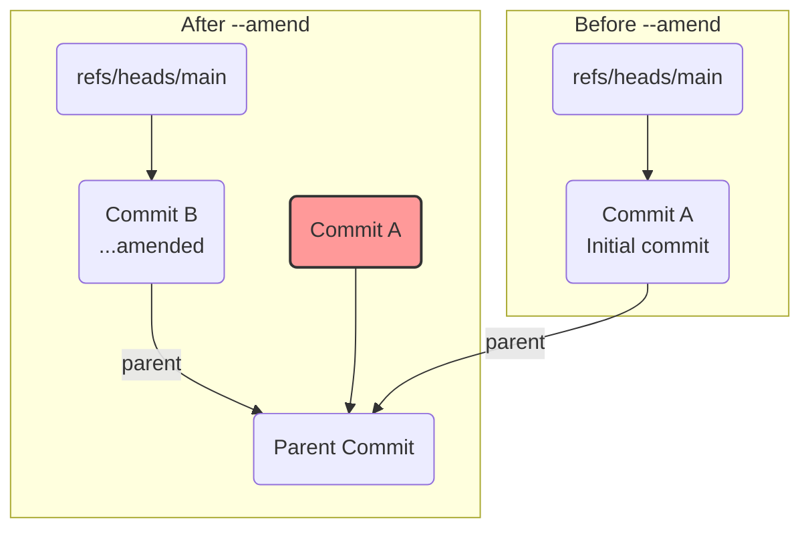

# 第 9 章: `git commit` の完全理解

`git add` によって、次のスナップショットの設計図であるインデックスが完成しました。`git commit` コマンドの役割は、この**インデックスの内容を元に、永続的な記録をリポジトリに作成する**ことです。

第 1 部で学んだ通り、`git commit` は主に 2 つのことを行います。

1.  **`tree` オブジェクトの作成**: 現在のインデックスの内容から、プロジェクト全体のディレクトリ構造を表す `tree` オブジェクト（および必要に応じてサブ `tree`）を生成します。これは配管コマンド `git write-tree` が行うことと全く同じです。
2.  **`commit` オブジェクトの作成**: 上記で作成した `tree` オブジェクトと、現在の `HEAD` が指す親コミット、そしてユーザーが指定したコミットメッセージや著者情報（Author/Committer）を使って、新しい `commit` オブジェクトを生成します。これは `git commit-tree` の役割です。

つまり、`git commit` とは、`git write-tree` と `git commit-tree` という 2 つの配管コマンドの処理を適切に組み合わせ、さらに現在のブランチ参照を新しいコミットに更新するまでを自動で行ってくれる、便利な高レベルコマンド（Porcelain Command）なのです。

---

## 9.1 `git commit` のステップバイステップ

`git commit` の内部動作を、実際のコマンドと `.git` の状態を比較しながら追体験してみましょう。

```bash
# 実験用ディレクトリを作成して移動
mkdir git-commit-practice && cd git-commit-practice
git init

# 最初のファイルを追加してステージング
echo "Hello" > file1.txt
git add file1.txt
```

この時点で、`index` には `file1.txt` のエントリが一つだけ記録されています。

`git commit` を実行すると何が起こるか、その「プレビュー」を `git write-tree` で見てみましょう。
```bash
git write-tree
```
出力結果（例）:
```
8d833e05353594b3917a1577d52f3659db62f8a4
```
このハッシュ値は、`file1.txt` を含むルートディレクトリのスナップショットを表す `tree` オブジェクトの ID です。`git commit` は、内部でまずこのオブジェクトを作成します。

それでは、コミットを実行しましょう。
```bash
git commit -m "Initial commit"
```

新しいコミットが作成されました。`git log --oneline` でコミットハッシュを確認し、`git cat-file -p` でその中身を覗いてみます。`HEAD` は最新のコミットを指しているので、`HEAD` を使って調べることができます。

```bash
git cat-file -p HEAD
```
出力結果（例）:
```
tree 8d833e05353594b3917a1577d52f3659db62f8a4
author Your Name <you@example.com> 1672531200 +0900
committer Your Name <you@example.com> 1672531200 +0900

Initial commit
```
注目すべきは `tree` の行です。そのハッシュ値が、先ほど `git write-tree` でプレビューした値と**完全に一致**しています。また、最初のコミットなので `parent` 行はありません。

さらに、`main` ブランチの参照ファイルの中身も見てみましょう。
```bash
cat .git/refs/heads/main
```
このファイルの中身は、今作成された新しいコミットのハッシュ値に更新されています。

**`git commit` の完全なプロセス**:
1.  現在のインデックスから `tree` オブジェクトを（再帰的に）作成する (`git write-tree`)。
2.  `HEAD` が指しているコミットを親 (`parent`) として取得する。
3.  `config` の `user.name` と `user.email` を著者 (`author`/`committer`) として取得する。
4.  指定されたコミットメッセージを取得する。
5.  上記 1〜4 の情報を使って `commit` オブジェクトを作成する (`git commit-tree`)。
6.  `HEAD` が指しているブランチ参照（例: `refs/heads/main`）を、新しく作成したコミットのハッシュ値で更新する。

---
## 9.2 コミットを「修正」する `--amend` の正体

「あ、コミットメッセージを間違えた！」という時に便利な `git commit --amend`。多くの入門書では「直前のコミットを修正する」と説明されますが、**Git の内部構造を理解した私たちは、この説明が厳密には正しくない**ことを知っています。

Git のオブジェクト（`blob`, `tree`, `commit`）は、一度作成されたらその中身が変わることは絶対にありません。もし変われば、ハッシュ値が変わってしまうからです。

では、`--amend` は何をしているのでしょうか？ 答えは、**「修正」ではなく「新しいコミットに置き換える」**です。

実験してみましょう。
```bash
# 現在の最新のコミットハッシュを覚えておく
git rev-parse HEAD

# --amend を使ってコミットメッセージを修正
git commit --amend -m "Initial commit (amended)"

# --amend 後の最新のコミットハッシュを確認
git rev-parse HEAD
```
2 つのハッシュ値が異なっているはずです。`git log` を見ると、まるでコミットが修正されたかのように見えますが、実際には新しいコミットが作られ、`main` ブランチがそちらを指すように変更されただけです。



`--amend` が行っていること:
1.  現在のインデックス（またはワーキングディレクトリの変更も `--no-edit -a` などで含めることができる）から、新しい `tree` オブジェクトを作成する。
2.  **破棄したい古いコミットの親**を、新しいコミットの親として設定する。
3.  新しいコミットメッセージで、新しい `commit` オブジェクトを作成する。
4.  現在のブランチ参照を、この新しいコミットに向ける。

元のコミット（図の Commit A）は、ブランチから参照されなくなり、「孤児」となります。この孤児コミットは、いずれ `git gc` によって掃除されます。この仕組みを理解していることは、特にリモートリポジトリに `push` 済みのコミットを `--amend` してはいけない理由（歴史の分岐と強制プッシュが必要になる）を理解する上で非常に重要です。

---
**まとめ**

この章では、`git commit` がインデックスからリポジトリへ、スナップショットを記録するプロセスを解き明かしました。

-   `git commit` は、`git write-tree` と `git commit-tree` の処理を自動化し、ブランチ参照を更新する便利なラッパーコマンドである。
-   コミットの際には、現在のインデックスが `tree` となり、`HEAD` が親となって新しい `commit` オブジェクトが作られる。
-   `git commit --amend` は「修正」ではなく、新しいコミットで「置き換え」る操作であり、元のコミットは参照を失う。

これで、Git の最も基本的なワークフロー `add -> commit` の裏側を完全に理解しました。次の章では、これらの状態を確認するための最も重要な相棒、`git status` がどのように情報を集めて表示しているのかを探ります。

最後に実験用ディレクトリを削除しておきましょう。
```bash
cd ..
rm -rf git-commit-practice
```
