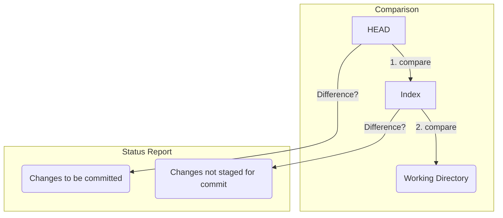

# 第 10 章: `git status` の読み方

`git status` は、現在のリポジトリの状態を診断してくれる、Git の健康診断ツールのようなものです。私たちはその出力を見て、次に何をすべきか（`add` するか、`commit` するかなど）を判断します。

では、`git status` は一体**何を基準に**「変更がある」とか「ステージングされている」と判断しているのでしょうか？

その答えは、**Git の三大エリア間の比較**にあります。`git status` は、基本的に以下の 2 つの比較を行っています。

1.  **`HEAD` vs インデックス**:
    -   `HEAD` が指す最新コミットのスナップショット（`tree`）と、現在のインデックス（ステージングエリア）の状態を比較します。
    -   ここに差分があれば、「**Changes to be committed**」（コミットされるべき変更）として表示されます。

2.  **インデックス vs ワーキングディレクトリ**:
    -   現在のインデックスの状態と、ワーキングディレクトリにある実際のファイルの状態を比較します。
    -   ここに差分があれば、「**Changes not staged for commit**」（ステージングされていない変更）として表示されます。

この 2 つの比較を理解すれば、`git status` の出力はもはや謎ではありません。

---
## 10.1 `status` の状態変化を追う

実験を通して、`git status` が内部で何を見ているのかを明らかにしましょう。

```bash
# 実験用ディレクトリを作成して移動
mkdir git-status-practice && cd git-status-practice
git init

# 最初のコミットを作成
echo "version 1" > file.txt
git add file.txt
git commit -m "v1"
```

### 状態 1: クリーンな状態

まず、コミット直後のクリーンな状態で `git status` を実行します。
```bash
git status
```
出力結果:
```
On branch main
nothing to commit, working tree clean
```
「ワーキングツリーはきれいです」と表示されるのは、**`HEAD` の `tree`、インデックス、ワーキングディレクトリの 3 者の状態が完全に一致している**からです。差分がどこにもない、完璧な同期状態です。

### 状態 2: ワーキングディレクトリでの変更

次に、ファイルを編集します。
```bash
echo "version 2" > file.txt
git status
```
出力結果:
```
On branch main
Changes not staged for commit:
  (use "git add <file>..." to update what will be committed)
  (use "git restore <file>..." to discard changes in working directory)
	modified:   file.txt

no changes added to commit (use "git add" and/or "git commit -a")
```
`git status` は、**インデックスとワーking ディレクトリを比較**し、`file.txt` に差分があることを見つけました。しかし、`HEAD` とインデックスはまだ同じ状態なので、「Changes to be committed」は表示されません。

### 状態 3: ステージング後の変更

では、この変更をステージングしましょう。
```bash
git add file.txt
git status
```
出力結果:
```
On branch main
Changes to be committed:
  (use "git restore --staged <file>..." to unstage)
	modified:   file.txt
```
今度は、`git status` は**`HEAD` の `tree` とインデックスを比較**し、差分があることを見つけました。`git add` によってインデックスがワーキングディレクトリの状態に更新されたため、インデックスとワーキングディレクトリ間の差分はなくなりました。

### 状態 4: 最も興味深い状態

ここが一番面白いところです。ファイルをステージングした**後**に、もう一度ファイルを編集するとどうなるでしょうか。

```bash
echo "version 3" > file.txt
git status
```
出力結果:
```
On branch main
Changes to be committed:
  (use "git restore --staged <file>..." to unstage)
	modified:   file.txt

Changes not staged for commit:
  (use "git add <file>..." to update what will be committed)
  (use "git restore <file>..." to discard changes in working directory)
	modified:   file.txt
```
`file.txt` が**両方のセクションに**現れました！ なぜこうなるのか、内部構造を知っていれば簡単に説明できます。

-   **`HEAD` vs インデックス**: `HEAD`（v1）とインデックス（v2）には差分があります。→ 「Changes to be committed」に表示。
-   **インデックス vs ワーキングディレクトリ**: インデックス（v2）とワーキングディレクトリ（v3）にも差分があります。→ 「Changes not staged for commit」に表示。

この状態でコミットすると、ステージングされている `version 2` の内容だけがコミットされ、ワーキングディレクトリの `version 3` の変更はそのまま残ります。

---
## 10.2 Untracked files (追跡されていないファイル)

`git status` の出力には、もう一つ「**Untracked files**」というセクションがあります。

```bash
# 新しいファイルを作成するが、add はしない
echo "new" > new_file.txt
git status
```
出力結果:
```
...
Untracked files:
  (use "git add <file>..." to include in what will be committed)
	new_file.txt
...
```
これは、`git status` が三大比較を行った結果、**ワーキングディレクトリには存在するが、インデックスには全く記載がない**ファイルを見つけたことを意味します。Git は「こんなファイル知らないよ」と言っているわけです。一度でも `add` されれば、そのファイルは Git の管理下（追跡対象）に入ります。

---
**まとめ**

`git status` の謎はすべて解けました。

-   `git status` は、`HEAD`、インデックス、ワーキングディレクトリという**三大エリア間の差分を報告する**コマンドである。
-   **"Changes to be committed"** は `HEAD` と **インデックス** の差分。
-   **"Changes not staged for commit"** は **インデックス** と **ワーキングディレクトリ** の差分。
-   **"Untracked files"** は、インデックスに記録がなく、ワーキングディレクトリにのみ存在するファイル。

この三者比較のメンタルモデルを持つことで、`git status` の出力に戸惑うことはなくなり、常に自信を持ってリポジトリの状態を把握できるようになります。



次の章では、コミットの歴史を様々な角度から閲覧するための強力なツール、`git log` を探求します。

最後に実験用ディレクトリを削除しておきましょう。
```bash
cd ..
rm -rf git-status-practice
```
