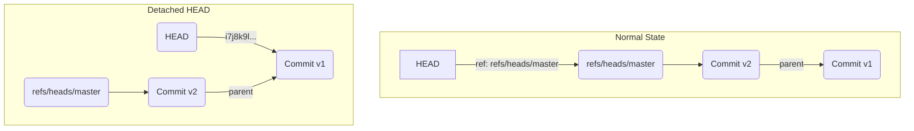

# 第12章: ブランチの作成と切り替え

第1部の探検で、私たちはブランチの驚くほどシンプルな正体を突き止めました。

-   **ブランチ**: 特定のコミットハッシュを指すポインタ。実体は `.git/refs/heads/` 内のファイル。
-   **`HEAD`**: 現在チェックアウトしているブランチを指すポインタ。実体は `.git/HEAD` ファイル。

この内部構造を理解していると、ブランチを操作するコマンド群はもはや魔法ではありません。`.git` ディレクトリ内のファイルを操作するための、分かりやすいインターフェースに過ぎないのです。この章では、`git branch` と `git switch` (および旧来の `git checkout`) が、これらのファイルをどのように扱っているかを見ていきます。

---
## 12.1 ブランチ管理者 `git branch`

`git branch` コマンドは、ブランチ（`.git/refs/heads/` 内のファイル）を作成、一覧表示、削除するためのコマンドです。

まずは実験の準備をしましょう。
```bash
# 実験用ディレクトリを作成して移動
mkdir git-branch-practice && cd git-branch-practice
git init

# コミットを2つ作成
echo "v1" > file.txt && git add . && git commit -m "v1"
echo "v2" > file.txt && git add . && git commit -m "v2"

# 最新のコミットハッシュを控えておく
git rev-parse HEAD
# (例: a1b2c3d...)
```

### ブランチの作成: `git branch <branch-name>`

新しいブランチ `feature` を作成します。
```bash
git branch feature
```
このコマンドが実行することは、たった一つです。
**現在の`HEAD`が指すコミットのハッシュ値をコピーして、`.git/refs/heads/feature` という新しいファイルを作成する。**

確認してみましょう。
```bash
# featureファイルが作成されているか確認
ls .git/refs/heads

# featureファイルの中身を確認
cat .git/refs/heads/feature
```
中身は、先ほど控えておいた最新のコミットハッシュと完全に一致しているはずです。この操作は `HEAD` ファイルには一切影響を与えないため、現在いるブランチは `master` のままです。

### ブランチの一覧表示: `git branch`

引数なしで実行すると、ブランチの一覧が表示されます。
```bash
git branch
```
出力結果:
```
  feature
* master
```
このコマンドは、`.git/refs/heads` ディレクトリ内のすべてのファイル名をリストアップし、`.git/HEAD` が指しているブランチ（この場合は `master`）に `*` を付けて表示しています。

### ブランチの削除: `git branch -d <branch-name>`

ブランチを削除してみましょう。
```bash
git branch -d feature
```
このコマンドもまた、実行することは一つだけです。
**`.git/refs/heads/feature` ファイルを削除する。**

`ls .git/refs/heads` を実行すれば、`feature` ファイルが消えていることが確認できます。ブランチの作成と削除がこれほど高速なのは、40バイト程度の小さなファイルを操作しているに過ぎないからです。

---
## 12.2 時空トラベラー `git switch`

ブランチを切り替えるための現代的なコマンドが `git switch` です。（古い `git checkout` も同じ役割を果たしますが、`switch` の方が意図が明確です。）

`git switch` は、主に2つの重要な処理を行います。

1.  **`HEAD` の更新**: `.git/HEAD` ファイルの中身を、移動先のブランチを指すように書き換える。
2.  **ワーキングディレクトリとインデックスの更新**: 移動先のブランチが指すコミットのスナップショットに合わせて、ワーキングディレクトリのファイルとインデックスを更新する。

実験してみましょう。
```bash
# 再度 feature ブランチを作成
git branch feature

# feature ブランチで新しいコミットを作成
echo "v3-feature" > file.txt && git add . && git commit -m "v3 on feature"
# この時点では HEAD は master を指したままのはず。失礼しました。
# 正しくは、ブランチを切り替えてからコミットします。
git checkout feature
echo "v3-feature" > file.txt && git add . && git commit -m "v3 on feature"


# master ブランチに切り替える
git switch master
```
この瞬間、内部では何が起きたでしょうか。
```bash
# 1. HEADがmasterを指すように戻った
cat .git/HEAD
# -> ref: refs/heads/master

# 2. ワーキングディレクトリのファイルがmasterの状態に戻った
cat file.txt
# -> v2
```

`git switch feature` を実行すれば、再び `HEAD` は `feature` を指し、`file.txt` の中身は `v3-feature` に戻ります。この「スナップショットの入れ替え」こそがブランチ切り替えの本質です。

### デタッチドHEAD: コミットへの直接旅行

ブランチ名ではなく、特定のコミットハッシュを直接指定して移動することもできます。
```bash
# v1コミットのハッシュを取得
git rev-parse HEAD~2 # 2つ前のコミット

# v1コミットに直接移動
git checkout <v1のハッシュ>
```

この状態を**デタッチドHEAD (detached HEAD)** と呼びます。`HEAD` ファイルの中身を見てみましょう。
```bash
cat .git/HEAD
```
出力結果（例）:
```
i7j8k9l...
```
`ref: refs/heads/...` という形式ではなく、コミットハッシュが直接書き込まれています。`HEAD` が特定のブランチから「分離(detach)」し、コミットオブジェクトを直接指している状態です。


この状態で新しいコミットを作成すると、そのコミットはどのブランチにも属さない「浮遊」した状態になります。その後、別のブランチに切り替えてしまうと、この浮遊コミットに戻る名前がなくなり、いずれガベージコレクションによって削除されてしまう可能性があります。デタッチドHEAD状態で作業を続ける場合は、`git switch -c <new-branch-name>` などで新しいブランチを作成し、作業内容を保存することが重要です。

---
**まとめ**

-   `git branch` コマンドは、`.git/refs/heads` ディレクトリ内の参照ファイルを管理するツールである。
-   `git switch` (または `checkout`) は、`HEAD` ポインタを切り替え、ワーキングディレクトリとインデックスを指定したスナップショットに同期させるコマンドである。
-   ブランチ操作が軽量なのは、小さなポインタファイルを操作しているだけだから。
-   デタッチドHEADとは、`HEAD` がブランチではなく特定のコミットを直接指している状態であり、注意が必要である。

次の章では、2つの異なる歴史、すなわちブランチ間の差分を確認するための `git diff` コマンドを探求します。

最後に実験用ディレクトリを削除しておきましょう。
```bash
cd ..
rm -rf git-branch-practice
```
