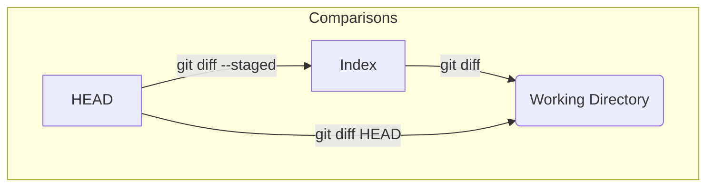

# 第 13 章: `git diff` で差分を確認

`git status` がリポジトリの「健康状態」を教えてくれる診断ツールだとすれば、`git diff` はその詳細な「検査結果」を見せてくれる解析ツールです。2 つのスナップショット（`tree` オブジェクト）を比較し、その間にどのような変更があったのかを、行単位で具体的に示してくれます。

`git status` と同様に、`git diff` の振る舞いも、Git の三大エリア（`HEAD`、インデックス、ワーキングディレクトリ）を理解していると非常に明快になります。引数なしで実行した場合と、オプションを付けた場合で、どのエリア間を比較しているのかが変わるのです。

---

## 13.1 三大エリア間の差分を見る

`git diff` の最も基本的な 3 つの使い方と、それぞれが内部で何を比較しているのかを見ていきましょう。

まずは実験の準備です。
```bash
# 実験用ディレクトリを作成して移動
mkdir git-diff-practice && cd git-diff-practice
git init

# 最初のコミットを作成
echo "line 1" > file.txt
git add .
git commit -m "v1"
```

### `git diff`: インデックス vs ワーキングディレクトリ

引数なしの `git diff` は、**インデックスとワーキングディレクトリを比較**します。これは、`git status` の "Changes not staged for commit" に対応します。

```bash
# ファイルに追記
echo "line 2" >> file.txt

# 差分を確認
git diff
```
出力結果:
```diff
--- a/file.txt
+++ b/file.txt
@@ -1 +1,2 @@
 line 1
+line 2
```
これは、「ワーキングディレクトリの `file.txt` には、インデックスの `file.txt` にはない `line 2` が追加されていますよ」という意味です。

### `git diff --staged`: HEAD vs インデックス

`--staged` (または `--cached`) オプションを付けると、**`HEAD` が指すコミットとインデックスを比較**します。これは、`git status` の "Changes to be committed" に対応します。

```bash
# `line 2` の変更をステージング
git add file.txt

# インデックス vs ワーキングディレクトリの差分はなくなる
git diff # -> 何も出力されない

# HEAD vs インデックスの差分を確認
git diff --staged
```
出力結果は、先ほどと同じ diff が表示されます。これは、「インデックスの状態は、`HEAD` の状態（v1）と比べて `line 2` が追加されていますよ」という意味です。

### `git diff HEAD`: HEAD vs ワーキングディレクトリ

`HEAD` を指定すると、**`HEAD` が指すコミットとワーキングディレクトリを比較**します。これは、ステージングされているかどうかに関わらず、最後のコミットからの全ての変更を表示します。

```bash
# さらに `line 3` を追記（add はしない）
echo "line 3" >> file.txt

# HEAD vs ワーキングディレクトリの差分を確認
git diff HEAD
```
出力結果:
```diff
--- a/file.txt
+++ b/file.txt
@@ -1 +1,3 @@
 line 1
+line 2
+line 3
```
`line 2`（ステージング済み）と `line 3`（未ステージング）の両方の変更が表示されました。



---
## 13.2 コミットとブランチ間の差分を見る

`git diff` の真価は、任意の 2 点間の差分を表示できることにあります。

### `git diff <commit1> <commit2>`

2 つのコミットハッシュを指定すると、それぞれのコミットが指す `tree` オブジェクトを再帰的に比較し、スナップショット間の差分を表示します。

```bash
# v2 をコミット
git add .
git commit -m "v2"

# 2つのコミットハッシュを取得
git log --oneline
# (例)
# b1c2d3e (HEAD -> main) v2
# a1b2c3d v1

# v1 と v2 の差分を表示
git diff a1b2c3d b1c2d3e
```
`line 2` を追加した差分が表示されるはずです。

### `git diff <branch1>..<branch2>`

ブランチは特定のコミットを指すポインタなので、ブランチ名を指定して差分を見ることもできます。`..` 記法は範囲指定で、`git diff branch1 branch2` と同じ意味です。

```bash
# featureブランチを作成して、そこで変更・コミット
git switch -c feature
echo "feature work" >> feature.txt
git add .
git commit -m "add feature"

# mainとfeatureの差分を確認
git diff main..feature
```
出力結果には、`feature.txt` が新しく追加されたことが表示されます。これは、「`main` ブランチの先端から `feature` ブランチの先端に至るまでの差分」を意味します。

### `git diff <branch1>...<branch2>`

`...` (ドット 3 つ) の記法は少し特殊で、**`branch1` と `branch2` の共通の祖先（マージベース）から `branch2` の先端まで**の差分を表示します。

これは、**「このフィーチャーブランチで、main から分岐した後に何が変更されたのか」** を知りたい場合に非常に便利です。プルリクエストやマージリクエストで表示される差分は、基本的にこの `...` の比較です。

```bash
git diff main...feature
```
多くの場合、`..` と `...` の結果は同じになりますが、`main` 側でも分岐後にコミットが進んでいる場合に違いが現れます。

---
**まとめ**

この章では、`git diff` が Git の内部オブジェクトを比較して、その内容を分かりやすく表示してくれる強力なツールであることを学びました。

-   引数なしの `git diff` は、**インデックスとワーキングディレクトリ**の差分を表示する。
-   `git diff --staged` は、**`HEAD` とインデックス**の差分を表示する。
-   コミットハッシュやブランチ名を指定することで、**任意の 2 つのスナップショット間**の差分を比較できる。
-   `...` 記法は、プルリクエストの差分を確認する際など、**共通祖先からの変更**を確認するのに役立つ。

`diff` を使いこなすことで、変更内容を正確に把握し、自信を持って `add` や `commit` を行えるようになります。

最後に実験用ディレクトリを削除しておきましょう。
```bash
cd ..
rm -rf git-diff-practice
```
