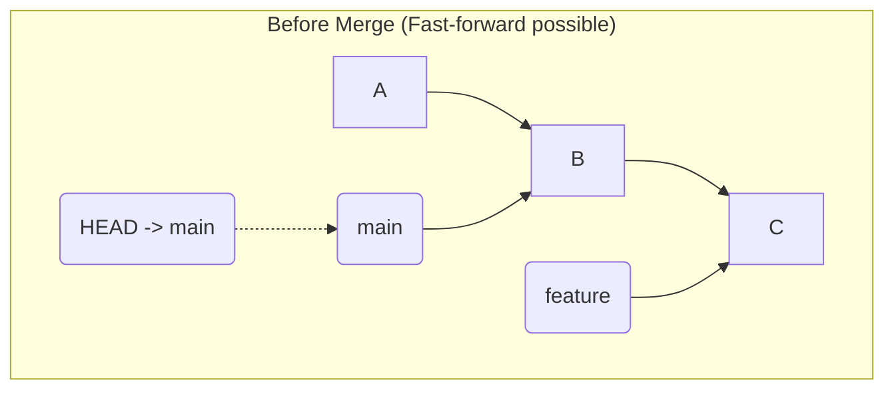
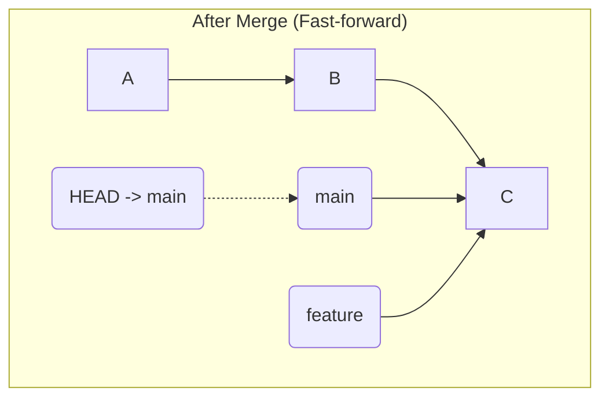

# 第 3 部: ブランチの合流とコンフリクト解決

---

# 第 15 章: Fast-forward マージ

第 2 部では、ブランチを作成して歴史を分岐させる方法を学びました。しかし、分岐した歴史はいつか一つにまとめる必要があります。この「歴史の合流」を行うのが `git merge` コマンドです。

`git merge` にはいくつかの戦略がありますが、最もシンプルで基本的なのが **Fast-forward (早送り) マージ** です。

---
## 15.1 Fast-forward が可能な条件

Fast-forward マージが発生するには、非常にシンプルな条件が一つだけあります。

**条件**: 合流される側のブランチ（例: `main`）の歴史が、合流する側のブランチ（例: `feature`）の歴史に**完全に含まれている**こと。

言い換えると、`main` ブランチの先端コミットが、`feature` ブランチの歴史の途中のコミットと同一である場合です。このとき、`main` ブランチでは `feature` ブランチが分岐してから新しいコミットが一切行われていません。



この図では、`main` はコミット B を指しており、`feature` はコミット C を指しています。コミット C の親は B であり、`main` の歴史は `feature` の歴史に完全に含まれています。この状態が Fast-forward マージの条件を満たしています。

---
## 15.2 Fast-forward マージの内部動作

では、実際に Fast-forward マージを実行し、`.git` の内部で何が起こるのかを見てみましょう。

```bash
# 実験用ディレクトリを作成して移動
mkdir ff-merge-practice && cd ff-merge-practice
git init

# ベースとなるコミットを作成
echo "v1" > file.txt && git add . && git commit -m "v1"

# featureブランチを作成して、そこで作業を進める
git switch -c feature
echo "v2" > file.txt && git add . && git commit -m "v2"
echo "v3" > file.txt && git add . && git commit -m "v3"
```
この時点で、`main` は v1 コミットを、`feature` は v3 コミットを指しています。これは Fast-forward 可能な状態です。

マージを実行するために、まず合流の受け手となる `main` ブランチに移動します。
```bash
git switch main
```

そして、`git merge` コマンドで `feature` ブランチを取り込みます。
```bash
git merge feature
```

出力結果に注目してください。
```
Updating <v1のハッシュ>..<v3のハッシュ>
Fast-forward
 file.txt | 2 +-
 1 file changed, 1 insertion(+), 1 deletion(-)
```
「Fast-forward」という文字が表示され、マージが成功したことが分かります。

このとき、Git が内部で行ったことは驚くほどシンプルです。

**`main` ブランチのポインタ（`.git/refs/heads/main` ファイルの中身）を、`feature` ブランチが指しているコミットのハッシュ値に書き換える。**

たったこれだけです。新しいコミットは一切作成されません。ただブランチのポインタを「早送り」するだけなので、非常に高速に処理が終わります。


マージ後、`main` と `feature` は全く同じコミットを指すことになります。`git log --oneline --graph` を見ても、歴史は分岐することなく、一直線のままです。

---
## 15.3 Fast-forward の利点と欠点

**利点**:
- **クリーンな歴史**: マージコミットが作られないため、プロジェクトの歴史が一直線に保たれ、非常に見通しが良くなります。
- **高速**: 新しいオブジェクトを作成せず、ポインタを動かすだけなので処理が高速です。

**欠点**:
- **情報の損失**: 「どこで `feature` ブランチが `main` に合流したのか」という情報が歴史から失われます。全てのコミットが `main` 上で直接行われたかのように見えてしまいます。

この情報の損失を避けたい場合、`--no-ff` (No Fast-forward) オプションを使うことで、Fast-forward が可能な状況でも意図的にマージコミットを作成することができます。これについては次の章で詳しく学びます。

---
**まとめ**

- Fast-forward マージは、合流先のブランチの歴史が分岐していない場合にのみ発生する。
- 内部的には、新しいコミットは作成されず、単にブランチのポインタが移動するだけである。
- 歴史が一直線でクリーンに保たれる利点がある一方、どこでブランチが合流したかの情報が失われるという欠点もある。

次の章では、歴史が分岐している場合に発生する、より一般的なマージ方法である「Three-way マージ」について探求します。

最後に実験用ディレクトリを削除しておきましょう。
```bash
cd ..
rm -rf ff-merge-practice
```
