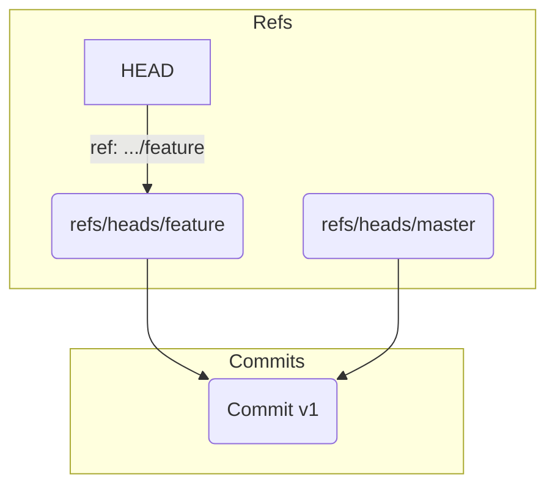
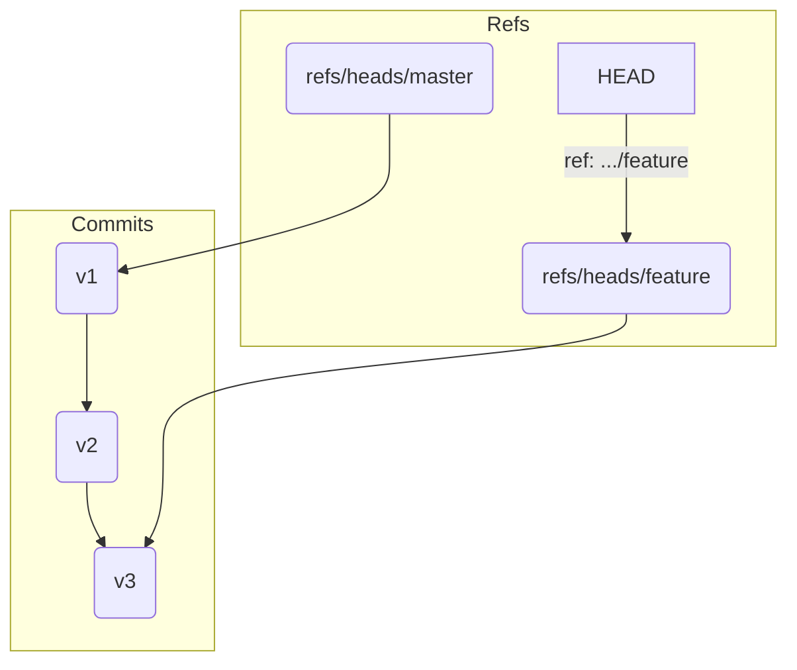
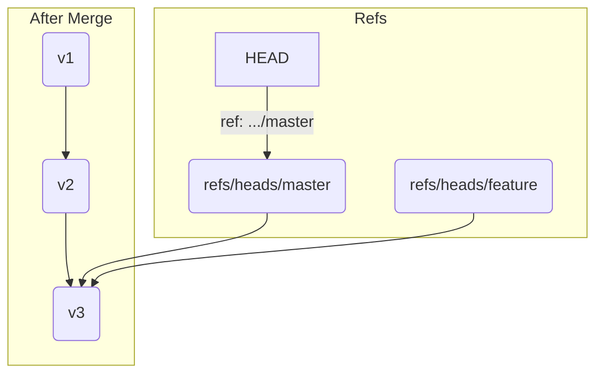

# 第3部: マージとコンフリクト

---

# 第15章: Fast-forward マージ

ブランチを使って、本流の歴史に影響を与えることなく、安全に新機能の開発やバグ修正を行うことができるようになりました。しかし、分岐した歴史は、いつか本流に統合してこそ意味を持ちます。そのための最も基本的な操作が `git merge` です。

`git merge` にはいくつかの種類がありますが、この章では最もシンプルで、Gitが「ただ歴史を進めるだけ」で統合できる**Fast-forward（早送り）マージ**について学びます。

Fast-forwardマージが起こる条件はただ一つです。

**統合先のブランチ（例: `master`）の歴史が、統合したいブランチ（例: `feature`）の歴史に完全に含まれており、`master` 分岐後に `master` 自身には新しいコミットが生まれていないこと。**

この条件が満たされるとき、Gitはわざわざ新しい「マージコミット」を作る必要はありません。ただ単に`master`ブランチのポインタを`feature`ブランチの先端まで早送りするだけです。

---
## 15.1 Fast-forwardマージの実演

言葉で聞くより、実際に目で見るのが一番です。Fast-forwardマージが起こる典型的なシナリオを体験しましょう。

```bash
# 実験用ディレクトリを作成して移動
mkdir git-merge-practice && cd git-merge-practice
git init

# masterブランチで最初のコミット
echo "v1" > file.txt && git add . && git commit -m "v1"

# featureブランチを作成して、そちらに切り替え
git switch -c feature
```
この時点での歴史は以下のようになっています。`master`も`feature`も同じコミットを指しています。


次に、`feature`ブランチだけで作業を進めます。
```bash
echo "v2" >> file.txt && git add . && git commit -m "v2 on feature"
echo "v3" >> file.txt && git add . && git commit -m "v3 on feature"
```
`feature`ブランチが2つ先に進みました。`master`ブランチは`v1`に取り残されたままです。



さて、`feature`ブランチでの開発が終わったので、この成果を`master`ブランチに取り込みます。まずは`master`ブランチに戻ります。
```bash
git switch master
```

そして、`git merge`コマンドを実行します。
```bash
git merge feature
```
出力結果:
```
Updating <hash1>..<hash3>
Fast-forward
 file.txt | 2 ++
 1 file changed, 2 insertions(+)
```
出力に "Fast-forward" と明記されていることに注目してください。

`git log --oneline --graph --all` で歴史を確認してみましょう。
```
* <hash3> (HEAD -> master, feature) v3 on feature
* <hash2> v2 on feature
* <hash1> v1
```
分岐していたはずの歴史が、一直線に繋がりました。

---
## 15.2 Fast-forwardマージの内部動作

`git merge feature` を実行したとき、`.git` の中で何が起こったのでしょうか？
答えは驚くほどシンプルです。

**`.git/refs/heads/master` ファイルの中身を、`.git/refs/heads/feature` ファイルの中身で上書きした。**

これだけです。
Gitはマージを実行する際、まず`master`が指すコミット(`v1`)が、`feature`が指すコミット(`v3`)の直接の祖先であるかを確認します。この関係が成り立つため、「わざわざ新しいマージコミットを作るまでもない。ただ`master`のポインタを`v3`に進めればよい」と判断します。これがFast-forwardマージです。



新しいコミットは一切作られず、ただブランチという名のポインタが移動するだけなので、非常にクリーンで分かりやすい歴史が保たれます。個人のローカルリポジトリでトピックブランチを最新の`main`に追従させる際など、頻繁に発生するマージの形です。

---
**まとめ**

この章では、最も基本的なマージの形態であるFast-forwardマージについて学びました。

-   Fast-forwardマージは、統合先ブランチが分岐後に変更されていない場合にのみ発生する。
-   新しいマージコミットは作成されず、単にブランチのポインタ（参照）が移動するだけである。
-   内部的には、`.git/refs/heads/` 内の参照ファイルの中身が更新されるだけの、非常に軽量な操作である。
-   結果として、歴史は分岐のない一直線の状態が保たれる。

では、`master`ブランチも分岐後に変更が進んでいた場合はどうなるのでしょうか？ その時こそ、Gitの真価が発揮される「Three-wayマージ」の出番です。次章で詳しく見ていきましょう。

最後に演習用ディレクトリを削除しておきましょう。
```bash
cd ..
rm -rf git-merge-practice
```
