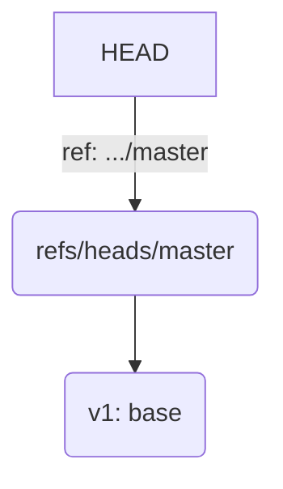
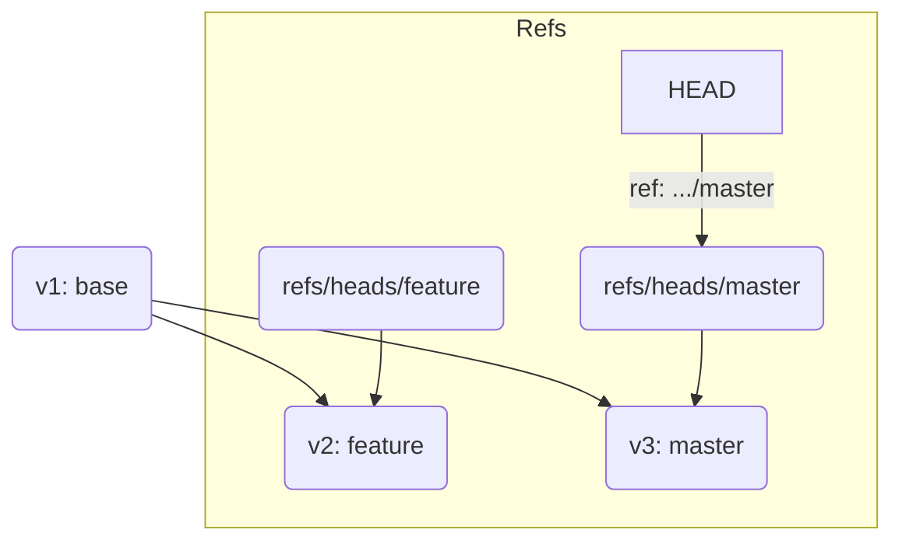
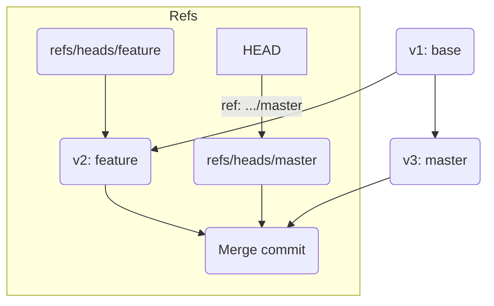

# 第16章: Three-way マージ

Fast-forwardマージは、歴史が一直線に進んでいるという特殊な状況でしか発生しません。チーム開発の現場では、あなたが`feature`ブランチで作業している間に、他の誰かが変更を`master`ブランチにマージし、`master`の歴史が進んでいることがほとんどです。

このように、統合元と統合先のブランチが分岐した後に、両方の歴史が進んでいる場合、Gitは自動的に**Three-wayマージ（3者間マージ）** を行います。これは、新しい**マージコミット**を作成することで、2つの異なる歴史を1つに統合する、より一般的で強力なマージ方法です。

---
## 16.1 Three-wayマージの発生シナリオ

まず、Three-wayマージが発生する典型的な状況を再現してみましょう。

```bash
# 実験用ディレクトリを作成して移動
mkdir git-3way-merge && cd git-3way-merge
git init

# 共通の祖先となる最初のコミットを作成
echo "line 1" > file.txt && git add . && git commit -m "v1: base"
```
このv1コミットが、これから分岐する2つの歴史の**共通の祖先（merge base）** となります。



次に、`feature`ブランチを作成し、そこで作業を進めます。
```bash
git switch -c feature
echo "line 2: feature" >> file.txt && git add . && git commit -m "v2: feature"
```

ここで、`master`ブランチにも別の変更が加わったと仮定します。一度`master`に戻り、別の作業を行います。
```bash
git switch master
echo "line 3: master" >> file.txt && git add . && git commit -m "v3: master"
```
これで、`v1`という共通の祖先から、`feature`ブランチと`master`ブランチがそれぞれ異なる歴史を歩むことになりました。
`git log --oneline --graph --all` で確認すると、歴史が分岐しているのが明確にわかります。
```
* <hash3> (HEAD -> master) v3: master
| * <hash2> (feature) v2: feature
|/
* <hash1> v1: base
```
図で表すと以下のようになります。


---
## 16.2 マージの実行とマージコミット

いよいよ、この分岐した歴史を統合します。`master`ブランチにいることを確認し、`feature`ブランチをマージします。

```bash
# masterブランチにいることを確認
git switch master

git merge feature
```
すると、Gitはマージコミットのメッセージを編集するためのエディタを起動します。デフォルトのメッセージ（`Merge branch 'feature'`）のまま保存して終了しましょう。

マージが完了しました。`git log --oneline --graph --all` で歴史をもう一度見てみましょう。
```
*   <hash4> (HEAD -> master) Merge branch 'feature'
|\
| * <hash2> (feature) v2: feature
* | <hash3> v3: master
|/
*   <hash1> v1: base
```
`v2`と`v3`の歴史が、新しく作られたコミット`Merge branch 'feature'`（hash4）に統合されました。このコミットが**マージコミット**です。

マージコミットの大きな特徴は、**親が2つある**ことです。`git cat-file -p HEAD` でマージコミットの内部を見てみましょう。
```
tree <tree_hash>
parent <hash3> # 1番目の親: masterの先端
parent <hash2> # 2番目の親: featureの先端
author ...
committer ...

Merge branch 'feature'
```
`parent`が2つ存在することが、このコミットが2つの歴史を束ねる特別なコミットであることを示しています。



---
## 16.3 Three-wayマージの内部動作

なぜ「Three-way（3者間）」なのでしょうか？ それは、Gitがマージを行う際に3つのコミットを比較対象として利用するからです。

1.  **共通の祖先 (Merge Base)**: `v1`のコミット。
2.  **統合先のブランチの先端 (HEAD)**: `master`の`v3`のコミット。
3.  **統合元のブランチの先端**: `feature`の`v2`のコミット。

Gitは、この3つのスナップショット（正確にはtreeオブジェクト）を使って、以下のように変更点を判断し、新しいスナップショットを作成します。

-   **共通祖先から`master`での変更点**: `v1` -> `v3` の差分 (「line 3: master」の追加)
-   **共通祖先から`feature`での変更点**: `v1` -> `v2` の差分 (「line 2: feature」の追加)

そして、この2つの変更点を**両方とも適用**した新しい状態を作り出します。今回の例では、`file.txt`の末尾に`line 2`と`line 3`が両方追加された状態です。Gitは、この新しい状態から新しい`tree`オブジェクトを作成し、2つの親を持つ新しい`commit`オブジェクト（マージコミット）を作成して、`master`ブランチの参照をそこに進めるのです。

この賢い仕組みのおかげで、並行して進んだ別々の作業を、Gitは自動的に統合することができます。

---
**まとめ**

この章では、チーム開発における標準的なマージ方法であるThree-wayマージを学びました。

-   統合元と統合先のブランチが分岐後に、両方とも歴史が進んでいる場合に発生する。
-   **マージコミット**という、2つの親を持つ特別なコミットが新たに作成される。
-   内部的には、「共通の祖先」「統合先の先端」「統合元の先端」という3つのコミットを比較し、両方の変更を適用した新しい状態を作り出している。
-   これにより、分岐した開発の歴史を安全に1つに統合できる。

しかし、もし`master`と`feature`で**同じファイルの同じ行**を変更していたらどうなるのでしょうか？ Gitはどちらの変更を採用すべきか自動では判断できません。これこそが、次章で学ぶ「コンフリクト」の正体です。

最後に演習用ディレクトリを削除しておきましょう。
```bash
cd ..
rm -rf git-3way-merge
```
