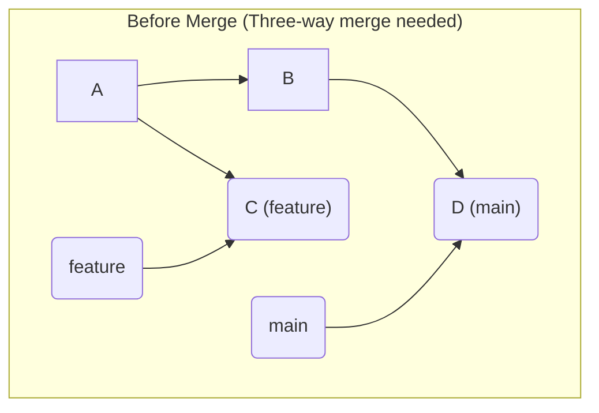

# 第 16 章: Three-way マージ

Fast-forward マージはシンプルですが、実際のチーム開発では、自分が `feature` ブランチで作業している間に、他の誰かが `main` ブランチを更新している、という状況が頻繁に発生します。

このように、**合流先のブランチ (`main`) と合流元のブランチ (`feature`) の歴史が分岐してしまった**場合、Git はもはやポインタを早送りするだけでは歴史を統合できません。ここで登場するのが、Git のマージ戦略の主力である **Three-way (3 者間) マージ** です。

---
## 16.1 Three-way マージの発生条件

Three-way マージが発生する条件は、Fast-forward の逆です。

**条件**: 合流する `main` ブランチと `feature` ブランチが、**共通の祖先（マージベース）**からそれぞれ異なるコミットを進めていること。


この図では、コミット A が `main` と `feature` の共通祖先（マージベース）です。その後、`main` はコミット D に、`feature` はコミット C に進んでおり、歴史が分岐しています。この状態をマージしようとすると、Three-way マージが実行されます。

---
## 16.2 Three-way マージの内部動作

Three-way マージは、その名の通り 3 つのコミットを比較して動作します。

1.  **マージベース (Merge Base)**: 2 つのブランチが分岐した共通の祖先コミット。上の図の A。
2.  **ターゲットブランチの HEAD**: マージされる側のブランチの先端コミット。上の図の D (`main`)。
3.  **マージングブランチの HEAD**: マージする側のブランチの先端コミット。上の図の C (`feature`)。

Git はこれら 3 つのスナップショットを元に、以下のロジックで新しいスナップショットを自動生成します。

-   **マージベースから片方のブランチだけが変更した箇所**: その変更をそのまま採用する。
-   **マージベースから両方のブランチが変更したが、内容が同じ箇所**: その変更をそのまま採用する。
-   **マージベースから両方のブランチが、それぞれ異なる変更を加えた箇所**: Git は自動で判断できない。これを**コンフリクト (衝突)** と呼び、ユーザーに解決を委ねる。（コンフリクトについては次章で詳しく学びます。）
-   **両方とも変更していない箇所**: そのまま維持する。

そして、この新しいスナップショットから `tree` オブジェクトを作成し、**2 つの親を持つ特別なコミット**、すなわち**マージコミット**を新たに作成します。

### Three-way マージの実演

実際に体験してみましょう。

```bash
# 実験用ディレクトリを作成して移動
mkdir 3way-merge-practice && cd 3way-merge-practice
git init

# 共通の祖先となるコミットを作成
echo "common base" > file.txt && git add . && git commit -m "base"

# featureブランチを作成し、そこで変更
git switch -c feature
echo "feature change" >> file.txt && git add . && git commit -m "feat: change"

# mainブランチに戻り、main側でも別の変更を行う
git switch main
echo "main change" >> file.txt && git add . && git commit -m "docs: change"
```

これで歴史が分岐しました。`git log --oneline --graph --all` で確認できます。
いよいよマージを実行します。
```bash
git merge feature
```
コンフリクトがなければ、エディタが立ち上がり、マージコミットのメッセージを編集する画面になります。（デフォルトメッセージのままでよければ、そのまま保存して閉じてください。）

マージが完了すると、新しいマージコミットが作成されます。`git log --oneline --graph` を見てみましょう。
```
*   a1b2c3d (HEAD -> main) Merge branch 'feature'
|\
| * e4f5g6h (feature) feat: change
* | i7j8k9l docs: change
|/
* l0m1n2o base
```
`a1b2c3d` がマージコミットです。グラフが 2 つのブランチが 1 つに合流したことを示しています。
このマージコミットの中身を `git cat-file -p HEAD` で見てみると、`parent` が 2 つあることが分かります。

```
tree <tree_hash>
parent <main_commit_hash>
parent <feature_commit_hash>
author ...
committer ...

Merge branch 'feature'
```

これが Three-way マージの正体です。分岐した歴史を、その事実を消すことなく（Fast-forward のように）、一つの新しい歴史として統合するための仕組みなのです。

---
## 16.3 `--no-ff` オプション

前章で少し触れた `--no-ff` (No Fast-forward) オプションは、Fast-forward が可能な状況でも、**意図的に Three-way マージ（の形）を強制する**ためのものです。

なぜこれが必要なのでしょうか？ Fast-forward マージは歴史が一直線になり綺麗ですが、「この一連のコミットは `feature-X` という機能開発のために行われた」という文脈情報が失われてしまいます。

`--no-ff` を使ってマージすると、たとえ Fast-forward が可能でも必ずマージコミットが作られます。これにより、ブランチの存在した事実が歴史に残り、後から見返した時に「どこからどこまでが、ある機能開発の単位だったのか」が明確になります。多くのチーム開発の現場で、`main` ブランチへのマージには `--no-ff` が推奨されるのはこのためです。

---
**まとめ**

- Three-way マージは、分岐した 2 つのブランチを合流させるための標準的な方法である。
- **マージベース**、**ターゲットブランチ**、**マージングブランチ**の 3 者を比較して、新しいスナップショットを自動生成する。
- 結果として、**2 つの親を持つマージコミット**が新たに作成され、歴史の合流点が明確に記録される。
- `--no-ff` オプションを使うことで、Fast-forward 可能な状況でもマージコミットの作成を強制し、開発の文脈を歴史に残すことができる。

しかし、もし 2 つのブランチが同じファイルの同じ行を別々に変更していたら？ 次の章では、Git が自動解決できない状況、すなわち「コンフリクト」の謎に迫ります。

最後に実験用ディレクトリを削除しておきましょう。
```bash
cd ..
rm -rf 3way-merge-practice
```
