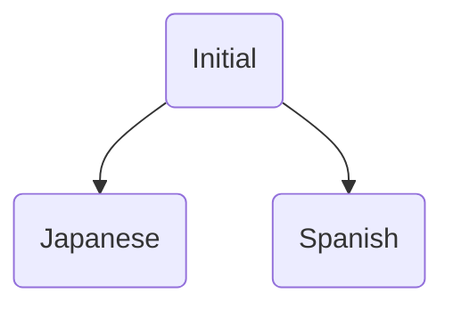
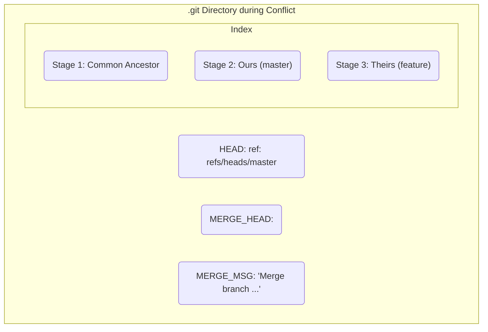

# 第17章: コンフリクトの発生原理

これまでのマージは、Gitが全ての判断を自動で行える「幸せな」ケースでした。しかし、チームでの開発では、複数の開発者が同じファイルを同時に編集することは日常茶飯事です。そして、もしその変更箇所が同じ行だった場合、Gitは機械的にどちらの変更が正しいかを判断することはできません。

このように、Gitが自動マージに失敗し、ユーザーに手動での解決を委ねる状態を**コンフリ-  - クト（競合）** と呼びます。

コンフリクトはエラーではありません。Gitが「どちらの変更を採用すべきか、私には判断できないので、あなたが決めてください」とユーザーに対話を求めている、ごく正常な状態です。この章では、コンフリクトがどのような原理で発生するのかを、内部の動きと共に見ていきましょう。

---
## 17.1 コンフリクトを意図的に起こす

コンフリクトを理解する最善の方法は、自分で作ってみることです。Three-wayマージの時と似ていますが、今回は`master`と`feature`の両方で**同じファイルの同じ行**を編集します。

```bash
# 実験用ディレクトリを作成して移動
mkdir git-conflict && cd git-conflict
git init

# 共通の祖先となるコミットを作成
echo "Hello, World!" > greeting.txt
git add .
git commit -m "Initial commit with a greeting"
```
`greeting.txt`には一行だけ "Hello, World!" と書かれています。これが共通の祖先です。

次に、`feature`ブランチで挨拶を日本語に変えてみましょう。
```bash
git switch -c feature
echo "こんにちは、世界！" > greeting.txt
git add .
git commit -m "Translate greeting to Japanese"
```

そして、`master`ブランチでは、同じ行を別の言語、例えばスペイン語に変えてみます。
```bash
git switch master
echo "Hola, Mundo!" > greeting.txt
git add .
git commit -m "Translate greeting to Spanish"
```
これで準備完了です。歴史は分岐し、両方のブランチで`greeting.txt`の1行目が変更されました。


---
## 17.2 マージの失敗とコンフリクトマーカー

`master`ブランチ上で、`feature`ブランチをマージしてみましょう。
```bash
git merge feature
```
すると、Gitは以下のようなメッセージを出力します。
```
Auto-merging greeting.txt
CONFLICT (content): Merge conflict in greeting.txt
Automatic merge failed; fix conflicts and then commit the result.
```
「自動マージに失敗しました。コンフリクトを修正し、結果をコミットしてください」と表示されました。これがコンフリクトが発生した合図です。

このとき、`greeting.txt`ファイルの中身はどうなっているでしょうか？ 確認してみましょう。
```bash
cat greeting.txt
```
```
<<<<<<< HEAD
Hola, Mundo!
=======
こんにちは、世界！
>>>>>>> feature
```
ファイルがGitによって自動的に書き換えられ、見慣れない記号が挿入されています。これらを**コンフリクトマーカー**と呼びます。

-   `<<<<<<< HEAD`: このマーカーから`=======`までの間が、`HEAD`（つまり現在のブランチ、`master`）での変更内容です。
-   `=======`: `HEAD`の変更内容と、マージ対象ブランチの変更内容の区切りです。
-   `>>>>>>> feature`: `=======`からこのマーカーまでの間が、マージしようとしている`feature`ブランチでの変更内容です。

Gitは、どちらの挨拶を採用すべきか判断できなかったため、「`HEAD`ではこうなっているし、`feature`ではこうなっているけど、最終的にどうしますか？」と、両方の変更内容をファイルに並べて提示してくれているのです。

---
## 17.3 コンフリクト発生時の`.git`内部

コンフリクトが発生したとき、Gitはマージを一時停止した特殊な状態に入ります。このとき、`.git`ディレクトリの中はどうなっているのでしょうか？

`ls -F .git` を実行すると、普段は見かけないファイルがいくつか存在することに気づきます。
-   `MERGE_HEAD`: マージしようとしていたブランチ（`feature`）のコミットハッシュが記録されています。これにより、Gitはどのコミットをマージしようとしていたかを覚えています。
-   `MERGE_MSG`: マージが成功した場合のマージコミットのデフォルトメッセージが保存されています。
-   `index`ファイル: そして最も重要なのが`index`ファイルの状態です。`git ls-files --stage` を使って、インデックスの内部を覗いてみましょう。

```
100644 <blob_hash_1> 1	greeting.txt
100644 <blob_hash_2> 2	greeting.txt
100644 <blob_hash_3> 3	greeting.txt
```
通常、`--stage`の出力はステージ番号`0`のエントリだけですが、コンフリクト中は`1`, `2`, `3`というステージ番号を持つエントリが現れます。

-   **ステージ 1**: 共通の祖先 (`Initial commit`) 時点の`greeting.txt`の状態。
-   **ステージ 2**: ターゲットブランチ (`master`) の`HEAD`での状態 (`Hola, Mundo!`)。
-   **ステージ 3**: マージ対象ブランチ (`feature`) での状態 (`こんにちは、世界！`)。

Gitは、コンフリクトを解決するために必要な3つのバージョンの情報をすべてインデックス内に保持しているのです。`git status`コマンドが「unmerged paths」としてコンフリクトを報告できるのも、このインデックスの状態を見ているからです。



---
**まとめ**

この章では、コンフリクトが「なぜ」「どのように」発生するのか、そのメカニズムを学びました。

-   コンフリクトは、異なるブランチで**同じファイルの同じ箇所**が変更された場合に発生する、Gitの正常な動作である。
-   発生すると、Gitは自動マージを中断し、対象ファイルに**コンフリクトマーカー**を挿入してユーザーに判断を委ねる。
-   内部的には、`.git`ディレクトリに`MERGE_HEAD`などの一時ファイルが作成され、`index`ファイルはコンフリクト解決に必要な3つのバージョン（共通祖先、HEAD、マージ対象ブランチ）を保持した特殊な状態になる。

コンフリクトはエラーではなく、Gitがユーザーに助けを求めているサインです。内部で何が起こっているかを理解すれば、もはや恐れるに足りません。次章では、このコンフリクト状態を解消し、マージを完了させるための具体的な手順を学びます。

（演習用ディレクトリは、次章で解決作業を行うため、まだ削除しないでください。）
