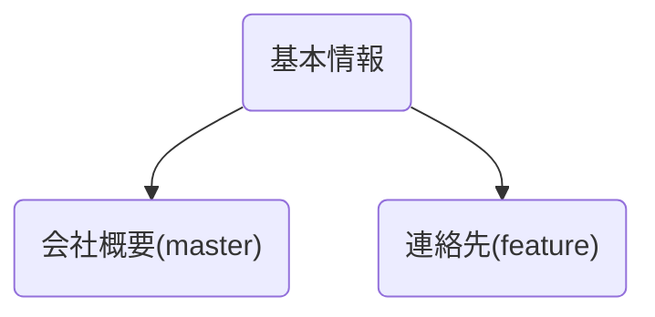
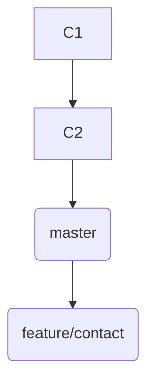

# 第20章: マージの実践演習

この章は、第3部「マージとコンフリクト」で学んだ知識を総動員して、より実践的なシナリオに挑戦する総合演習です。2人の開発者（あなたと、もう一人の架空の同僚）が、簡単な会社のウェブサイトを開発するという設定で進めます。

この演習を通じて、以下の3つのマージシナリオをすべて体験します。
-   **Three-way マージ**: 平和的に、しかし歴史が分岐した場合の統合。
-   **コンフリクトの解決**: 同じ箇所を編集してしまった場合の対処。
-   **Fast-forward マージ**: クリーンで一直線な歴史の統合。

---
## 20.1 演習の準備: Three-wayマージのシナリオ

まず、演習用のリポジトリを準備します。

```bash
mkdir company-website && cd company-website
git init

# あなたの作業として、会社の基本情報を含む index.html を作成
echo "<h1>我が社</h1>" > index.html
echo "<p>最高の製品を作ります。</p>" >> index.html
git add .
git commit -m "docs: 会社の基本情報を作成"
```

次に、同僚が「連絡先」を追加する作業を始めるとします。そのために、同僚用のブランチを作成します。
```bash
git switch -c feature/contact
echo "<h2>連絡先</h2>" >> index.html
echo "<p>Email: contact@example.com</p>" >> index.html
git add .
git commit -m "feat: 連絡先情報を追加"
```

その間に、あなたは`master`ブランチで「会社概要」のセクションを追加する作業を行いました。
```bash
git switch master
echo "<h2>会社概要</h2>" >> index.html
echo "<p>設立: 2025年</p>" >> index.html
git add .
git commit -m "feat: 会社概要を追加"
```

これで、共通の祖先から`master`と`feature/contact`がそれぞれ異なるコミットを持ち、歴史が分岐しました。Three-wayマージの準備が整いました。


`master`ブランチで、同僚の作業を取り込みましょう。
```bash
git merge feature/contact
```
Gitはマージコミットメッセージのエディタを開きます。そのまま保存して閉じれば、Three-wayマージが完了します。`index.html`には「会社概要」と「連絡先」の両方が追加されているはずです。

---
## 20.2 コンフリクトの発生と解決

次に、あなたも同僚も、同じ箇所を編集してしまったシナリオを体験します。

同僚は、連絡先のメールアドレスが間違っていたことに気づき、`feature/contact`ブランチで修正しました。
```bash
git switch feature/contact
# sedコマンドでメールアドレスを置換します
sed -i 's/contact@example.com/support@example.com/g' index.html
git add .
git commit -m "fix: メールアドレスを修正"
```

しかし、あなたも`master`ブランチで、同じメールアドレスを別のものに「修正」してしまいました。
```bash
git switch master
sed -i 's/contact@example.com/info@example.com/g' index.html
git add .
git commit -m "fix: メールアドレスを更新"
```
これでコンフリクトが発生する準備が整いました。`master`ブランチで、再度同僚のブランチをマージしてみましょう。
```bash
git merge feature/contact
```
案の定、コンフリクトが発生します。
```
Auto-merging index.html
CONFLICT (content): Merge conflict in index.html
Automatic merge failed; fix conflicts and then commit the result.
```
今回は、同僚の修正が正しい（`support@example.com`）ということにします。
コンフリクトマーカーを削除し、`index.html`の該当箇所を以下のように修正してください。

```html
<!-- ...その他のHTML... -->
<h2>連絡先</h2>
<p>Email: support@example.com</p>
<!-- ...その他のHTML... -->
```
ファイルを修正したら、第18章で学んだ手順に従って解決します。
```bash
git add index.html
git commit
```
エディタが開いたら、デフォルトのメッセージのまま保存してマージを完了します。

---
## 20.3 Fast-forwardマージのシナリオ

最後に、最もシンプルなFast-forwardマージを体験します。
同僚が、`feature/contact`ブランチに電話番号を追加しました。その間、`master`ブランチには何の変更もありませんでした。
```bash
git switch feature/contact
echo "<p>Tel: 03-1234-5678</p>" >> index.html
git add .
git commit -m "feat: 電話番号を追加"
```
この状態では、`master`の歴史は`feature/contact`の歴史に完全に含まれています。

`master`ブランチに戻り、マージを実行しましょう。
```bash
git switch master
git merge feature/contact
```
出力に "Fast-forward" と表示され、マージコミットが作られることなく、`master`ブランチのポインタが`feature/contact`の先端まで移動したことがわかります。

---
**まとめ**

お疲れ様でした！この実践演習を通して、あなたはチーム開発で発生しうる主要なマージシナリオをすべて一人で乗り越えました。

-   **Three-wayマージ**で、平和的な機能統合を経験し、
-   **コンフリクト**を意図的に発生させ、冷静に解決し、
-   **Fast-forwardマージ**で、クリーンな歴史の統合も行いました。

これで、第3部の内容は完全にあなたのものになりました。コンフリクトはもはや恐怖の対象ではなく、冷静に対処できる技術的な課題の一つに過ぎません。

最後に演習用ディレクトリを削除しておきましょう。
```bash
cd ..
rm -rf company-website
```
