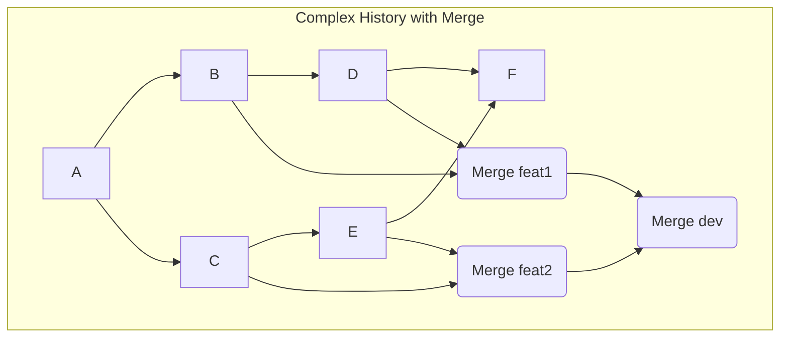
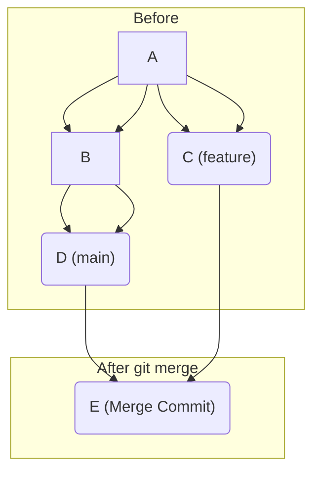
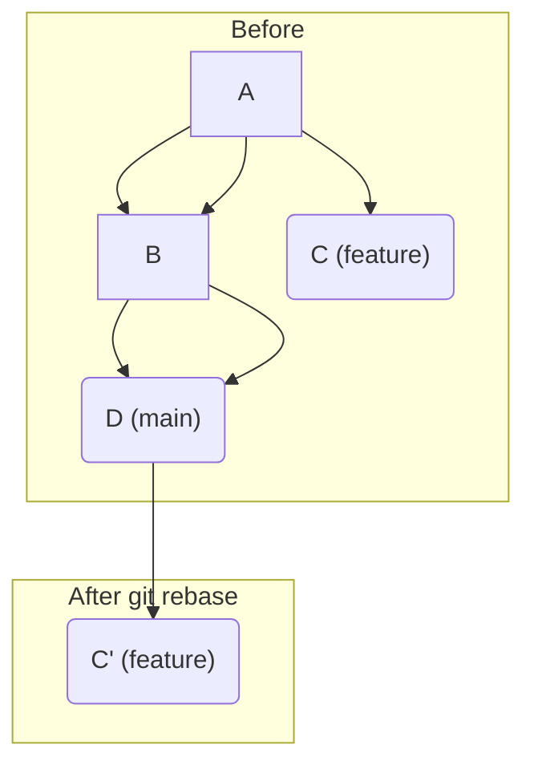

# 第 4 部: 歴史を書き換える Rebase

---

# 第 21 章: Rebase の基本

`git merge` は、分岐した歴史を正直に記録し、マージコミットによって一つに統合する方法でした。これは安全で traceability の高い方法ですが、多くのフィーチャーブランチが同時にマージされると、歴史のグラフが複雑になり、見通しが悪くなるという側面もあります。



もし、この複雑な歴史を、まるで一本道で開発が進んだかのように、クリーンな一直線の歴史に整えることができたらどうでしょうか？ それを実現するのが `git rebase` コマンドです。

`rebase` は文字通り、**ブランチの土台 (base) を変え、歴史を書き換える (rewrite history)** 強力なコマンドです。

---
## 21.1 Rebase とは何か？ Merge との比較

`rebase` を理解する最良の方法は、`merge` と比較することです。
`main` から分岐した `feature` ブランチがあり、その間に `main` も進んだという、Three-way マージが発生する典型的な状況を考えます。

**Merge の場合**:
- **目的**: 2 つの歴史の**統合**。
- **結果**: `main` と `feature` の歴史を両方とも正直に保存し、2 つを親に持つ新しい**マージコミット**を作成する。歴史は分岐したまま記録される。



**Rebase の場合**:
- **目的**: 歴史の**整形**。
- **結果**: `feature` ブランチの一連のコミットを一旦取り消し、現在の `main` の先端に一つずつ**再適用**する。マージコミットは作られず、歴史は一直線になる。


`rebase` 後の `C'` は、元の `C` とは**全く別のコミット**であることに注意してください。`rebase` は `feature` ブランチの各コミットの差分 (patch) を取り出し、それを新しい土台 (ここでは D) の上に適用し直すことで、新しいコミットを作成します。元のコミット `C` は参照を失い、いずれ破棄されます。

---
## 21.2 Rebase の内部動作

`feature` ブランチ上で `git rebase main` を実行したとき、Git の内部では何が起こっているのでしょうか。

```bash
# 実験用ディレクトリを作成
mkdir rebase-practice && cd rebase-practice
git init

# baseコミット
echo "base" > file.txt && git add . && git commit -m "base"

# featureブランチでコミット
git switch -c feature
echo "feat1" >> file.txt && git add . && git commit -m "feat1"
echo "feat2" >> file.txt && git add . && git commit -m "feat2"
# feat2のコミットハッシュを控えておく

# mainブランチでもコミット
git switch main
echo "main1" >> file.txt && git add . && git commit -m "main1"
```
これで準備完了です。`main` と `feature` は `base` から分岐しています。

`feature` ブランチ上で `rebase` を実行します。
```bash
git switch feature
git rebase main
```
出力結果:
```
Successfully rebased and updated refs/heads/feature.
```
`git log --oneline --graph --all` で歴史を見てみましょう。一直線になっているはずです。
そして、rebase 後の `feat2` に相当するコミットのハッシュが、rebase 前に控えておいたハッシュと**異なっている**ことを確認してください。

**`git rebase main` のステップ**:
1. Git は `feature` ブランチと `main` ブランチの共通の祖先 (`base` コミット) を見つける。
2. 共通祖先から `feature` の先端までのコミット (`feat1`, `feat2`) の差分 (patch) を一時的な場所に保存する。
3. `feature` ブランチの `HEAD` を `main` ブランチの現在の先端 (`main1` コミット) まで移動させる。
4. 保存しておいた差分 (`feat1` の変更、`feat2` の変更) を、移動した `HEAD` の上に順番に適用し、**新しいコミットを一つずつ作成する**。
5. 全ての差分の適用が終わったら、`feature` ブランチの参照を、新しく作られた最後のコミットに向ける。

このプロセスにより、あたかも `feature` ブランチが `main1` の後から作業を始めたかのような、クリーンな歴史が再構築されるのです。

---
## 21.3 Rebase の黄金律

Rebase は歴史を綺麗にする強力なツールですが、一つだけ絶対に守らなければならない**黄金律**があります。

**公共のブランチを決して rebase しない (Never rebase public branches)**

「公共のブランチ」とは、あなた以外の開発者も利用しているブランチのことです。典型的には、`origin/main` や `origin/develop` といった、リモートリポジトリに `push` 済みのブランチがこれにあたります。

なぜなら、あなたが `rebase` をして `push --force` すると、他の人が持っている古い歴史と、あなたが作った新しい歴史が食い違い、チーム全体の歴史が非常に混乱してしまうからです。この問題については、後の章で詳しく解説します。

Rebase は、まだ `push` していない、**あなたのローカル環境にしかないプライベートなブランチ**の歴史を整えるために使うのが、安全で正しい使い方です。

---
**まとめ**

- `git rebase` は、ブランチの土台を変更し、コミットを再適用することで、歴史を一直線に書き換えるコマンドである。
- `merge` が「統合」を目的とし歴史をありのまま残すのに対し、`rebase` は「整形」を目的とし、よりクリーンな歴史を作り出す。
- 内部的には、元のコミットをコピーして新しい土台の上に新しいコミットを作成している。そのため、コミットハッシュは変わる。
- **「公共のブランチは rebase しない」** という黄金律を必ず守る必要がある。

次の章では、`rebase` のもう一つの強力な機能、`--interactive` モードを使って、コミットそのものを編集、結合、削除する方法を学びます。

最後に実験用ディレクトリを削除しておきましょう。
```bash
cd ..
rm -rf rebase-practice
```
