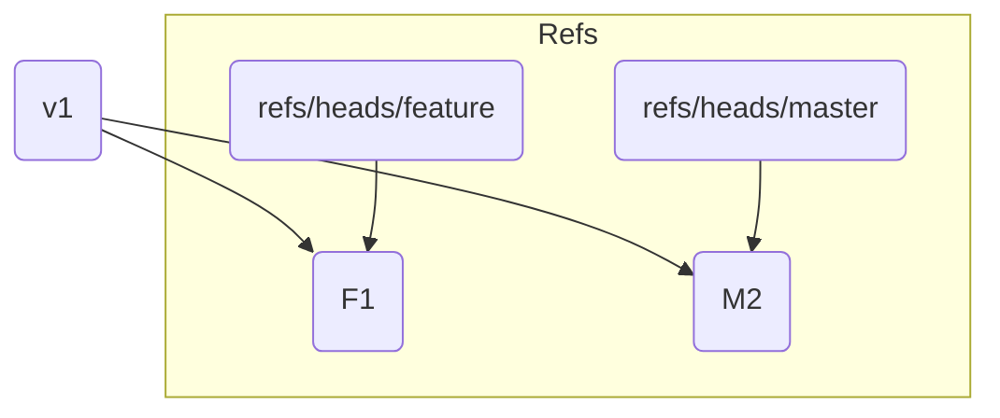
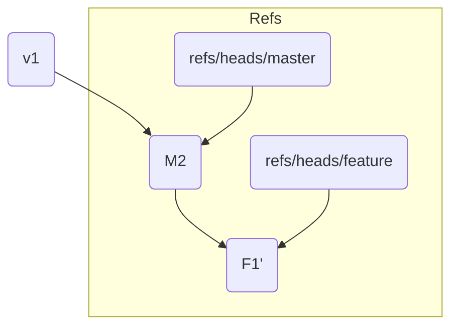

# 第4部: リベースと履歴の書き換え

---

# 第21章: リベースの基本

第3部で学んだ `git merge` は、歴史の事実をありのままに記録する方法でした。2つのブランチが分岐し、最終的に1つに合流したという事実を「マージコミット」という形で正直に残します。これは安全で確実な方法ですが、機能開発が複雑に絡み合うと、コミットグラフが非常に複雑になり、プロジェクトの歴史を追うのが難しくなることがあります。

これに対し、今回学ぶ `git rebase` は、歴史をよりクリーンに、より直線的に「見せる」ためのコマンドです。「re-base」という名の通り、**ブランチの土台（base）となっているコミットを変更し、歴史を再構築**します。

`rebase`を理解する鍵は、**コミットを移動させているように見えるが、実際には新しいコミットを作り直している**という点です。この「歴史の書き換え」という性質が、`rebase`を強力であると同時に、注意が必要なコマンドにしています。

---
## 21.1 Rebase vs Merge: シナリオで理解する

`rebase`が何をするのかを理解するために、`merge`の時と同じ状況設定でその動きを見ていきましょう。

```bash
# 実験用ディレクトリを作成
mkdir git-rebase-practice && cd git-rebase-practice
git init

# masterブランチで最初のコミット
echo "v1" > file.txt && git add . && git commit -m "v1"

# featureブランチを作成し、作業を進める
git switch -c feature
echo "feature work" >> file.txt && git add . && git commit -m "F1"
```

この間に、`master`ブランチも他の誰かによって更新されました。
```bash
git switch master
echo "master work" >> file.txt && git add . && git commit -m "M2"
```

現在のコミット履歴は以下のようになっています。`v1`を共通の祖先として、歴史が分岐しています。
```bash
git log --oneline --graph --all
* <hash_m2> (HEAD -> master) M2
| * <hash_f1> (feature) F1
|/
* <hash_v1> v1
```



`merge`の場合、ここから `git merge feature` を実行し、`F1`と`M2`を親に持つ新しいマージコミットが作られました。

---
## 21.2 `git rebase`の実行

`rebase`は、「`feature`ブランチの作業を、最新の`master`ブランチの上でやり直したい」というケースで使います。`feature`ブランチに切り替えて、`rebase`を実行してみましょう。

```bash
git switch feature
git rebase master
```

コマンドを実行すると、以下のようなメッセージが表示されることがあります。
```
Successfully rebased and updated refs/heads/feature.
```

何が起こったのでしょうか？ `git log --oneline --graph --all` で歴史を見てみましょう。
```
* <hash_f1_prime> (HEAD -> feature) F1
* <hash_m2> (master) M2
* <hash_v1> v1
```
驚くことに、分岐していたはずの歴史が一直線になりました。あたかも、`M2`のコミットが完了した**後**で、`F1`の作業を始めたかのような歴史に見えます。



---
## 21.3 Rebaseの内部動作: コミットの再適用

`git rebase master` を実行したとき、Gitの内部では以下のステップが実行されています。

1.  **共通祖先の特定**: 現在のブランチ(`feature`)と`master`ブランチの共通の祖先（`v1`）を見つけます。
2.  **差分の保存**: `feature`ブランチにだけ存在するコミット（`F1`）の差分（変更内容）を一時的なパッチファイルとして保存します。
3.  **ブランチの移動**: `feature`ブランチのポインタを`master`ブランチの現在の先端（`M2`）に移動させます。
4.  **パッチの適用**: 保存しておいたパッチ（`F1`の変更内容）を、移動後の`feature`ブランチの先端（`M2`の上）に適用し、**全く新しいコミットを作成**します。

これが最も重要なポイントです。リベース後のコミット`F1'`は、変更内容は`F1`と全く同じですが、親コミットが`v1`から`M2`に変わったため、**コミットハッシュ（SHA-1）は全く別のものになります**。

元の`F1`コミットは歴史から消え去ったように見えますが、実際には参照されなくなっただけで、しばらくは`.git`ディレクトリ内に存在しています（いずれガベージコレクションによって削除されます）。

このように、リベースは歴史をマージするのではなく、コミットを一つずつ新しい土台の上に**再適用（re-apply）** することで、歴史をクリーンに書き換えるのです。

---
**まとめ**

この章では、`git rebase`の基本的な概念とその動作を学びました。

-   `rebase`は、ブランチの土台となるコミットを移動させ、歴史を一直線に再構築するコマンドである。
-   `merge`が歴史を正直に記録するのに対し、`rebase`は歴史をクリーンに**書き換える**。
-   内部的には、元のコミットは破棄され、同じ変更内容を持つ新しいコミットが新しい土台の上に作り直される。

この「歴史を書き換える」という性質から、リベースには非常に重要な「黄金律」が存在します。「**決して、チームで共有しているブランチ（例: `master`）をリベースしてはいけない**」。なぜなら、他の人が古い歴史を元に作業している場合、書き換えられた歴史を`push`すると、チーム全体のリポジトリに深刻な混乱を引き起こすからです。

リベースは、まだ誰にも見せていないローカルのトピックブランチを整理する際に使うのが最も安全で効果的です。

次章では、単にブランチを移動させるだけでなく、コミットをまとめたり、編集したり、並べ替えたりできる、さらに強力な「インタラクティブリベース」について学びます。

最後に演習用ディレクトリを削除しておきましょう。
```bash
cd ..
rm -rf git-rebase-practice
```
