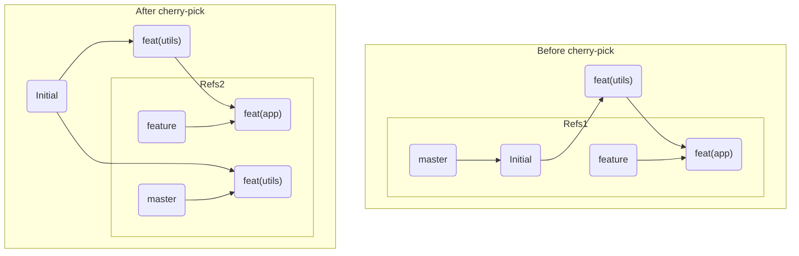

# 第23章: Cherry-pick

`git merge`はブランチ全体の歴史を統合し、`git rebase`はブランチ全体の土台を付け替えます。しかし、時にはブランチ全体ではなく、**特定のコミット一つだけ**を別のブランチに取り込みたい場合があります。

例えば、
-   ある`feature`ブランチで行ったバグ修正を、緊急リリース用の`hotfix`ブランチにも適用したい。
-   同僚が開発中のブランチにある、便利な共通関数だけを自分のブランチで先に使いたい。

このような「コミット単位での移植」を可能にするのが `git cherry-pick <commit>` コマンドです。

---
## 23.1 Cherry-pickの実演

`cherry-pick`がどのように機能するかを、具体的なシナリオで見ていきましょう。

```bash
# 実験用ディレクトリを作成
mkdir git-cherry-pick-practice && cd git-cherry-pick-practice
git init

# masterブランチで初期ファイルを作成
echo "Version 1" > app.js
git add .
git commit -m "Initial commit"
```

次に、新機能開発のための`feature`ブランチを作成し、2つのコミットを追加します。1つは便利な共通関数の追加、もう1つは機能本体の実装です。
```bash
git switch -c feature

# 1つ目のコミット: 共通関数
echo "// Utility function" >> utils.js
git add .
git commit -m "feat(utils): Add helpful utility function"

# 2つ目のコミット: 機能本体
echo "// Feature implementation" >> feature.js
git add .
git commit -m "feat(app): Implement the main feature"
```

`git log --oneline feature` で`feature`ブランチの歴史を確認します。
```
<hash_F2> feat(app): Implement the main feature
<hash_F1> feat(utils): Add helpful utility function
<hash_M1> Initial commit
```
ここで、`master`ブランチでの開発中に、`feature`ブランチで作られた共通関数(`hash_F1`)だけが欲しくなりました。機能本体(`hash_F2`)はまだ未完成なのでマージはできません。

`master`ブランチに戻り、`cherry-pick`を実行します。
```bash
git switch master
git cherry-pick <hash_F1> # "feat(utils): Add helpful utility function" のハッシュを指定
```
コマンドが成功すると、`master`ブランチに`utils.js`が作成され、新しいコミットが追加されます。

`git log --oneline`で`master`ブランチの歴史を見てみましょう。
```
<hash_F1_prime> feat(utils): Add helpful utility function
<hash_M1> Initial commit
```
`feature`ブランチにあったコミットが、`master`ブランチの先端にコピーされました。

---
## 23.2 Cherry-pickの内部動作

`cherry-pick`の内部動作は、`rebase`と非常によく似ています。

1.  指定されたコミット（`hash_F1`）の変更内容（差分、パッチ）を取得します。
2.  現在のブランチ（`master`）の`HEAD`に、そのパッチを適用します。
3.  **新しいコミット**（`hash_F1_prime`）を作成します。

`rebase`と同様に、`cherry-pick`も**歴史を書き換える**操作の一種です。なぜなら、移植されたコミットは、元のコミットと作者やメッセージ、変更内容は同じですが、親が異なるため**全く新しいコミットハッシュを持つ**からです。


図が示すように、`master`ブランチには`F1`と同じ変更内容を持つ新しいコミット`F1'`が生まれます。

---
## 23.3 Cherry-pickとコンフリクト

`cherry-pick`しようとした変更が、現在のブランチの内容と衝突する場合、マージやリベースの時と同じようにコンフリクトが発生します。

その解決方法も全く同じです。
1.  コンフリクトマーカーの入ったファイルを修正する。
2.  `git add <file>`で解決を伝える。
3.  `git cherry-pick --continue`でプロセスを続行する。（`rebase`の`--continue`と同じです）

もし途中でcherry-pickを中止したくなった場合は `git cherry-pick --abort` を実行します。

---
**まとめ**

この章では、特定のコミットだけを別のブランチに移植する`git cherry-pick`を学びました。

-   `git cherry-pick <commit-hash>`で、指定したコミットの変更内容を現在のブランチの先端に適用できる。
-   内部的には、指定されたコミットのパッチを適用して新しいコミットを作り直す、歴史書き換え操作の一種である。
-   コンフリクトが発生した場合は、マージやリベースと同様の手順で解決し、`git cherry-pick --continue`で続行する。
-   複数のコミットを連続してcherry-pickすることも可能 (`git cherry-pick <hash1> <hash2>`)。

`cherry-pick`は非常に便利ですが、乱用するとブランチ間の関係が複雑になり、どの変更がどこから来たのか追跡しにくくなるという側面もあります。基本的には、緊急のバグ修正の移植など、限定的な状況で使うのが望ましいでしょう。

最後に演習用ディレクトリを削除しておきましょう。
```bash
cd ..
rm -rf git-cherry-pick-practice
```
