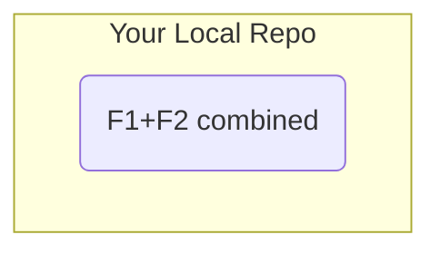

# 第24章: リベースの注意点

これまでの章で、私たちはリベースの持つ絶大な力を学びました。歴史を一直線にしたり、コミットをまとめたり、修正したりと、まるで時間を遡って歴史を理想的な形に整えることができます。しかし、この「歴史を書き換える」という行為は、使い方を間違えると大きな混乱を招く危険性をはらんでいます。

この章では、リベースを安全に使うために絶対に守るべき、たった一つの、しかし最も重要なルールについて学びます。

---
## 24.1 リベースの黄金律

リベースを使う上で、絶対に破ってはならない**黄金律**があります。

**決して、チームで共有しているブランチをリベースしてはならない (Never rebase shared branches)**

共有しているブランチとは、具体的には`master`や`main`、`develop`といった中心的なブランチや、一度リモートリポジトリに`push`して他の開発者と共有した`feature`ブランチなどを指します。

なぜ、このルールがそれほどまでに重要なのでしょうか？ それを理解するために、このルールを破ったときに何が起こるのか、2人の開発者（あなたとAさん）がいるシナリオで見ていきましょう。

---
## 24.2 黄金律を破った場合のシナリオ

まず、中央のリモートリポジトリの役割を果たす「共有リポジトリ」を準備します。
```bash
# bareオプション付きで初期化すると、作業ディレクトリを持たない純粋なリポジトリになる
git init --bare shared-repo.git
```
次に、あなたとAさんが、それぞれこの共有リポジトリを自分のローカルマシンにクローンします。
```bash
# あなたのリポジトリ
git clone shared-repo.git my-repo && cd my-repo
git config user.name "You" && git config user.email "you@example.com"
cd ..

# Aさんのリポジトリ
git clone shared-repo.git collaborator-repo && cd collaborator-repo
git config user.name "Collaborator A" && git config user.email "a@example.com"
cd ..
```
準備ができました。それでは、開発を開始します。

**ステップ1: あなたが`feature`ブランチをpushする**
あなたのリポジトリで、機能開発を開始し、そのブランチを共有リポジトリに`push`します。
```bash
cd my-repo
git switch -c feature
echo "work 1" > file.txt && git add . && git commit -m "F1"
echo "work 2" >> file.txt && git add . && git commit -m "F2"
git push origin feature # 共有リポジトリにfeatureブランチを公開
```
この時点で、あなたと共有リポジトリの歴史は一致しています。

**ステップ2: Aさんがあなたの作業の続きを始める**
Aさんは、あなたが公開した`feature`ブランチを取得し、その上で自分の作業を開始します。
```bash
cd ../collaborator-repo
git fetch origin
git switch feature
echo "work 3 by A" >> file.txt && git add . && git commit -m "F3 by A"
```
Aさんのローカルでは、歴史は`F1 -> F2 -> F3`と進んでいます。

**ステップ3: あなたがローカルでリベースし、強制プッシュする**
ここで、あなたは自分のローカルの`feature`ブランチのコミット`F1`と`F2`を一つにまとめたくなりました。あなたはインタラクティブリベースを実行します。
```bash
cd ../my-repo
git rebase -i HEAD~2 # F1とF2をsquashして一つにまとめる
# エディタで F1 を pick, F2 を squash に変更し、メッセージを "F1+F2 combined" に編集
```
あなたのローカルの歴史は書き換えられました。`F1`と`F2`は消え、新しいコミット`F12`が生まれました。

当然、この書き換えた歴史を普通に`git push`しようとしても、リモートの歴史と矛盾するため拒否されます。そこで、あなたはこの黄金律を破り、強制的に`push`してしまいました。
```bash
git push origin feature --force
```
これで、共有リポジトリの歴史は、あなたのローカルの歴史で上書きされました。

---
## 24.3 訪れる混乱

Aさんのリポジトリで何が起こるでしょうか？ Aさんは自分の作業`F3`を`push`しようとします。
```bash
cd ../collaborator-repo
git push origin feature
```
しかし、これも拒否されます。Aさんはリモートの変更を取り込もうと`git pull`を実行します。
```bash
git pull origin feature
```
すると、Gitは共通の祖先を見つけられず、2つの異なる歴史を無理やりマージしようとし、結果として**コミットが重複した非常に汚い歴史**が生まれます。
`git log --oneline --graph`を見てみると、このようになっています。
```
*   Merge branch 'feature' of ../shared-repo
|\
| * F12 (origin/feature)
* | F3 by A
| * F2
| * F1
|/
...
```
`F1`と`F2`の変更が、`F12`の中に含まれているにも関わらず、元の`F1`と`F2`も歴史上に残ってしまっています。同じ変更が2度適用され、歴史は完全に混乱してしまいました。

これが、共有ブランチをリベースしてはいけない理由です。あなたがローカルで行った歴史の書き換えは、他の人がその歴史を土台にして行った作業と深刻な矛盾を引き起こし、チーム全体のリポジトリを汚染してしまうのです。

---
**まとめ**

この章では、リベースの黄金律とその重要性を学びました。

-   **黄金律: 一度でもリモートに`push`して共有したブランチは、決してリベースしてはならない。**
-   共有ブランチをリベースして強制`push`すると、他の開発者のリポジトリと深刻な矛盾が生じ、マージの際にコミットが重複するなど、歴史が修復困難なほど汚染される。
-   `rebase`は、まだ自分しか知らない、リモートに`push`する前のローカルブランチのコミットを整理するために使うのが、唯一安全で推奨される使い方である。

リベースは強力な道具ですが、その力を正しく理解し、適切な場面で使うことが極めて重要です。

最後に演習用ディレクトリを削除しておきましょう。
```bash
cd ..
rm -rf shared-repo.git my-repo collaborator-repo
```
