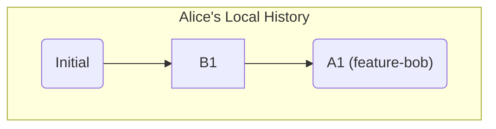
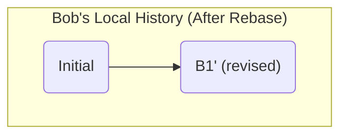

# 第 24 章: Rebase の黄金律: なぜ共有ブランチを Rebase してはいけないのか

---

これまでの章で、`rebase` が歴史を綺麗に書き換える強力なコマンドであることを学びました。同時に、「**公共の (共有された) ブランチを決して rebase しない**」という黄金律にも触れました。

この章では、なぜそれが絶対的なルールなのか、その理由を具体的なシナリオを通して深く理解します。このルールを破ると、チームの開発ワークフローにどれほど深刻な混乱をもたらす可能性があるのかを見ていきましょう。

---
## 24.1 シナリオ設定: 共有ブランチの悲劇

ここに、あなた (Alice) と、同僚 (Bob) の 2 人で開発しているプロジェクトがあるとします。
共有のリモートリポジトリ (`origin`) があり、2 人ともそこから `clone` しています。

1.  **Bob の作業**: Bob は `main` ブランチから `feature-bob` というブランチを切り、作業を開始し、コミット `B1` を作成します。そして、そのブランチをリモートに `push` します。
    ```bash
    # Bob's machine
    git switch -c feature-bob
    echo "bob" > file.txt && git add . && git commit -m "B1"
    git push origin feature-bob
    ```
    これで、コミット `B1` を含む `feature-bob` が共有ブランチになりました。

2.  **Alice の作業**: Alice は Bob の作業を引き継ぐか、あるいはレビューするために、Bob が `push` した `feature-bob` を `fetch` して、ローカルにチェックアウトします。そして、その上で新しいコミット `A1` を作成します。
    ```bash
    # Alice's machine
    git fetch origin
    git switch feature-bob
    echo "alice" >> file.txt && git add . && git commit -m "A1"
    ```

ここまでの歴史は、Alice のローカルでは以下のようになっています。


---
## 24.2 黄金律が破られるとき

ここで、Bob が自分の最初のコミット `B1` のメッセージが気に入らないと思い、インタラクティブリベースを使って修正することにしました。**これは、共有ブランチを rebase するという、やってはいけない行為です。**

```bash
# Bob's machine
git switch feature-bob
git rebase -i HEAD~1 # B1のメッセージをrewordする
# ... メッセージを "B1 (revised)" に修正 ...
```
Bob のローカルでは、`B1` は消え、代わりに新しいコミット `B1'` が作られました。

Bob はこの変更に満足し、リモートリポジトリに `push` しようとします。しかし、リモートの歴史と Bob のローカルの歴史が食い違っているため、通常の `git push` は拒否されます (non-fast-forward)。

そこで Bob は、`--force` オプションを使って強制的に `push` してしまいます。
```bash
# Bob's machine
git push --force origin feature-bob
```
これで、リモートリポジトリの `feature-bob` の歴史は、Bob が作った `B1'` を持つ新しい歴史に**上書き**されました。

---
## 24.3 混乱の始まり

さて、何も知らない Alice は、自分の作業 `A1` をリモートに `push` しようとします。
```bash
# Alice's machine
git push origin feature-bob
```
しかし、これも `non-fast-forward` エラーで拒否されます。Alice のローカルにある `feature-bob` の歴史の親 (`B1`) が、リモートリポジトリの `feature-bob` の歴史 (`B1'`) には存在しないからです。

不思議に思った Alice は、とりあえず `git pull` を試します。
```bash
# Alice's machine
git pull origin feature-bob
```
`git pull` は内部的に `git fetch` と `git merge` を行います。その結果、Git は Alice のローカルの歴史 (`B1` -> `A1`) と、リモートから持ってきた新しい歴史 (`B1'`) をマージしようとします。

`B1` と `B1'` は、変更内容は全く同じですがコミットハッシュが異なるため、Git はこれを**別の歴史**として認識します。その結果、Alice のローカルには、**同じ変更が 2 回適用された奇妙なマージコミット**が生まれてしまいます。

`git log --oneline --graph` で見ると、歴史はこのようになっています。
```
*   Merge branch 'feature-bob' of ...
|\
| * B1' (revised)
* | A1
|/
* B1
|
...
```
`B1` と `B1'` という、ほぼ重複したコミットが歴史に現れてしまいました。もし、これが一度だけでなく、チームの複数のメンバーが何度も `rebase --force` と `pull` を繰り返したら、歴史はあっという間に解読不可能なほど複雑に絡み合ってしまうでしょう。

---
## 24.4 正しい対処法

もし共有ブランチのコミットを修正したい場合は、`rebase` ではなく、**`git revert`** を使って、間違いを打ち消す新しいコミットを作成するべきです。`revert` は歴史を書き換えず、新しいコミットを追加するだけなので、他の開発者に影響を与えません。(詳しくは後の章で学びます)

もし間違って共有ブランチを `rebase` してしまったら、すぐにチームに連絡し、全員のローカルリポジトリを修正するための協調作業が必要になります。

---
**まとめ**

- 共有ブランチを `rebase` すると、ローカルの歴史とリモートの歴史が分岐する。
- `rebase` した歴史を `--force` で `push` すると、リモートの歴史が上書きされ、他のチームメンバーのローカルリポジトリと食い違いが生じる。
- 他のメンバーが `pull` すると、重複したコミットを持つ不要なマージコミットが生成され、プロジェクトの歴史が非常に汚く、追跡困難になる。
- この黄金律は、チーム開発を円滑に進めるための絶対的なルールである。`rebase` は、まだ `push` していないプライベートなローカルブランチの整理にのみ使うこと。
- 共有ブランチの変更を元に戻したい場合は、歴史を書き換えない `git revert` を使うのが安全である。
