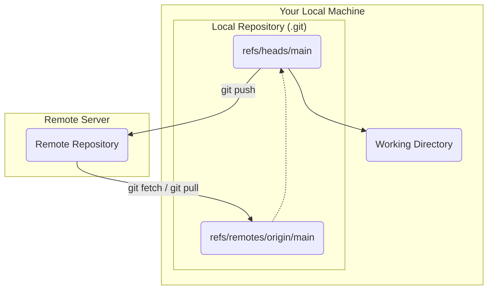

# 第5部: リモートリポジトリと GitHub

---

# 第26章: リモートリポジトリの仕組み

これまでの章では、すべての操作があなたのローカルマシン上にある単一のリポジトリ（`.git`ディレクトリ）で完結していました。しかし、Gitは「分散」バージョン管理システムです。その真価は、他の開発者のリポジトリと変更履歴を交換することで発揮されます。その履歴交換の中心的なハブとなるのが**リモートリポジトリ**です。

リモートリポジトリは、GitHubやGitLabといったサービス上にあることがほとんどですが、魔法の箱ではありません。本質的には、**あなたのローカルリポジトリと全く同じ構造を持つ、ただの別の場所にあるGitリポジトリ**です。多くの場合、開発者が直接ファイルを編集することがないため、作業ディレクトリを持たない**ベアリポジトリ (bare repository)** という形式を取ります。

この章では、ローカルリポジトリがリモートリポジトリをどのように追跡し、連携するのか、その基本的な仕組みを学びます。

---
## 26.1 `git remote`: リモートの登録と確認

Gitが他のリポジトリと通信するためには、まずその場所と名前を知る必要があります。そのために使うのが`git remote`コマンドです。

`git clone`を使ってリポジトリを複製した場合、Gitは自動的にクローン元のリポジトリを`origin`という名前でリモートリポジトリとして登録します。これが最も一般的なリモートリポジトリの名前です。

リモートリポジトリの情報を確認してみましょう。
```bash
# 実験用に、まずリモートリポジトリの役割を果たすベアリポジトリを作成
git init --bare ../remote-repo.git

# 次に、それをクローンしてローカルリポジトリを作成
git clone ../remote-repo.git local-repo
cd local-repo

# 登録されているリモートリポジトリを確認
git remote -v
```
出力結果:
```
origin	../remote-repo.git (fetch)
origin	../remote-repo.git (push)
```
`origin`という名前で、データの取得元（fetch）と送信先（push）のURLが登録されていることがわかります。

自分で新しいリモートリポジトリを登録するには、`git remote add <name> <url>`を使います。
```bash
git remote add upstream ../another-remote.git
git remote -v
```
これで`upstream`という名前の新しいリモートが追加されました。

---
## 26.2 リモート追跡ブランチ (Remote-tracking branches)

リモートリポジトリと連携する上で、最も重要な概念が**リモート追跡ブランチ**です。

リモート追跡ブランチとは、**リモートリポジトリにあるブランチの状態を、あなたのローカルリポジトリに記録しておくための、読み取り専用の特別なブランチ**です。`origin/main`や`upstream/feature`のように、`<remote-name>/<branch-name>`という形式で名前が付けられます。

これは、あなたが最後にリモートと通信した時点での「リモートのブランチは、あのコミットを指していましたよ」という**ブックマーク**や**キャッシュ**のようなものです。このおかげで、ネットワークに接続していなくても、リモートの`main`と自分の`main`の差分を確認する、といった操作が可能になります。

リモート追跡ブランチは、`.git/refs/remotes/`ディレクトリ以下に実体があります。
```bash
# 最初のコミットを作成してpushしてみる
echo "hello" > README.md && git add . && git commit -m "Initial"
git push origin main

# リモート追跡ブランチを確認
git branch -r # -r は remote の略
# 出力: origin/main

ls .git/refs/remotes/origin/
# 出力: main
```
`git push`や`git fetch`といったコマンドでリモートと通信するたびに、Gitはこれらのリモート追跡ブランチを自動的に更新し、常にリモートの状態を反映させようとします。

---
## 26.3 ローカルとリモートの関係

ここまでの概念をまとめると、Gitにおけるローカルとリモートの関係は以下の図のように表せます。


-   **ローカルブランチ (`main`)**: あなたが実際に作業を行い、コミットを作成するブランチ。
-   **リモート追跡ブランチ (`origin/main`)**: リモートリポジトリの`main`ブランチの状態を追跡する読み取り専用のポインタ。あなたが直接動かすことはない。
-   **リモートリポジトリのブランチ**: サーバー上にある実際のブランチ。

`git push`は、あなたのローカルブランチの変更をリモートリポジトリに送信し、リモートのブランチを更新する操作です。
`git fetch`は、リモートリポジトリの最新情報を取得し、あなたのリモート追跡ブランチ (`origin/main`) を更新する操作です。あなたのローカルブランチ (`main`) には一切影響を与えません。

---
**まとめ**

この章では、リモートリポジトリとの連携の基本的な仕組みを学びました。

-   リモートリポジトリは、単に別の場所にあるGitリポジトリであり、`git remote`コマンドで管理される。
-   **リモート追跡ブランチ** (`origin/main`など) は、リモートの状態をローカルに記録しておくためのキャッシュであり、`git fetch`などで更新される。
-   ローカルブランチとリモート追跡ブランチは別物であり、この2つを区別して考えることが、リモート操作を理解する鍵である。

この基本構造を理解した上で、次章からは`fetch`, `pull`, `push`といったコマンドが、これらのブランチ間で具体的にどのようなデータのやり取りを行っているのかを詳しく見ていきましょう。

最後に演習用ディレクトリを削除しておきましょう。
```bash
cd ..
rm -rf remote-repo.git local-repo another-remote.git
```
