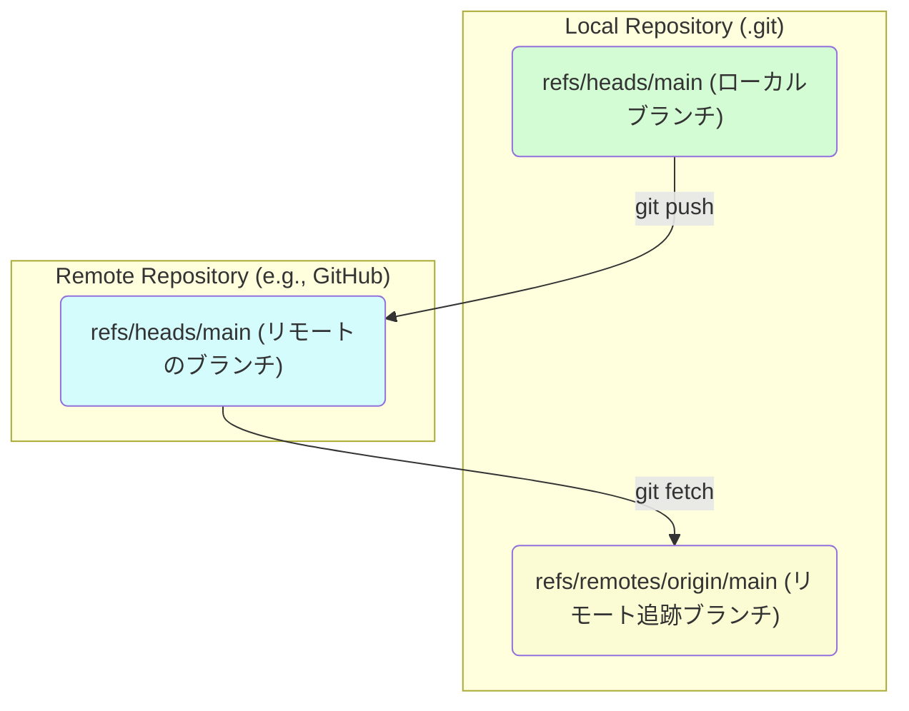

# 第 5 部: チーム開発とリモートリポジトリ

---

# 第 26 章: リモートリポジトリの基本

これまでの章では、主に自分のローカルマシン上にある単一のリポジトリ (`.git` ディレクトリ) の中で、Git がどのように歴史を管理しているかを学んできました。しかし、Git の真価は、**分散バージョン管理システム (DVCS)** としての機能、つまり**複数のリポジトリ間で歴史を同期し、協力して開発を進める**能力にあります。

この Part5 では、他の開発者とコードを共有し、共同作業を行うための中心的な概念である**リモートリポジトリ**について学びます。GitHub などのプラットフォームを利用したモダンな開発フローの根幹を理解することが、この部のゴールです。

---
## 26.1 リモートリポジトリとは？

**リモートリポジトリ**とは、一言で言えば、**あなたのローカルマシン以外の場所 (通常はインターネット上の専用サーバー) に置かれた Git リポジトリ**のことです。

- **役割**: チームメンバー全員の作業を集約し、共有するための**中心的な場所**として機能します。
- **実体**: GitHub, GitLab, Bitbucket などのホスティングサービス上で管理されることがほとんどです。その実体は、`--bare` オプション付きで初期化された、**作業ディレクトリを持たない純粋な Git リポジトリ**です。中身は `.git` ディレクトリそのものです。
- **目的**: 自分のローカルリポジトリで行った変更をリモートリポジトリにアップロード (`push`) したり、他の人がアップロードした変更を自分のローカルリポジトリに取り込んだり (`fetch`, `pull`) するために使います。

---
## 26.2 `git remote`: リモートリポジトリの管理

Git は、ローカルリポジトリから接続するリモートリポジトリを「名前」で管理します。そのためのコマンドが `git remote` です。

GitHub などでリポジトリを新規作成し、`git clone` コマンドでローカルにコピーしてきた場合、Git は自動的に `clone` 元のリポジトリを `origin` という名前でリモートリポジトリとして登録します。

`git remote -v` コマンドを使うと、登録されているリモートリポジトリの名前と、その URL を確認できます。
```bash
$ git remote -v
origin  https://github.com/your-username/your-repo.git (fetch)
origin  https://github.com/your-username/your-repo.git (push)
```
`fetch` (取得用) と `push` (アップロード用) の 2 つの URL が表示されますが、通常は同じ場所を指します。

`git remote add` を使えば、新しいリモートリポジトリを追加することもできます。例えば、オープンソースプロジェクトに貢献する際、本家のリポジトリを `upstream` という名前で登録する、といった使い方が一般的です。
```bash
git remote add upstream https://github.com/original-author/original-repo.git
```

---
## 26.3 リモート追跡ブランチ (Remote-tracking branches)

リモートリポジトリの概念を理解する上で、最も重要なのが**リモート追跡ブランチ**です。

- **定義**: リモートリポジトリにあるブランチの状態を、あなたの**ローカルリポジトリに記録しておくための、読み取り専用のブックマーク**のようなものです。
- **命名規則**: `<remote-name>/<branch-name>` という形式になります。例えば、`origin` というリモートの `main` ブランチは、ローカルでは `origin/main` として追跡されます。
- **役割**:
    1.  最後にリモートと通信した時点での、リモートのブランチの先端がどこだったかを記録します。
    2.  ローカルのブランチが、リモートのブランチとどれだけ進んだか、あるいは遅れているかを比較するための基準点となります。

`git branch -r` を使うとリモート追跡ブランチの一覧を、`git branch -a` を使うとローカルブランチとリモート追跡ブランチの両方を見ることができます。

**重要な注意点**:
`origin/main` は、あなたのローカルの `.git` ディレクトリの中に存在する**ポインタ**です。これはリモートサーバーに直接接続して情報を得ているわけではありません。
`git fetch` などのコマンドを実行したときに初めて、リモートサーバーの状態に合わせてこのポインタが更新されます。

---
## 26.4 全体像の理解

ローカルリポジトリ、リモートリポジトリ、そしてそれらを繋ぐリモート追跡ブランチの関係性を図で理解しましょう。



1.  **`git fetch origin`**: リモートリポジトリ (`C`) の最新情報を取得し、ローカルにあるリモート追跡ブランチ (`B`) のポインタを更新します。ローカルブランチ (`A`) には**一切影響を与えません**。
2.  **`git push origin main`**: ローカルブランチ (`A`) のコミットをリモートリポジトリ (`C`) にアップロードし、リモートのブランチ (`C`) のポインタを進めます。成功すれば、リモート追跡ブランチ (`B`) も追随して更新されます。
3.  **ローカルブランチ (`A`) とリモート追跡ブランチ (`B`) の関係**: `git status` を実行すると、Git はこの 2 つのポインタを比較して、「Your branch is ahead of 'origin/main' by X commits.」のようなメッセージを表示します。

---
**まとめ**

- リモートリポジトリは、チーム開発の中心となる、サーバー上に置かれた共有リポジトリである。
- `git remote` コマンドで、ローカルから接続するリモートリポジトリを管理する。`clone` すると自動的に `origin` という名前で登録される。
- リモート追跡ブランチ (`origin/main` など) は、リモートのブランチの状態をローカルに記録しておくための**読み取り専用のポインタ**である。
- リモート追跡ブランチは `git fetch` によってのみ更新される。
- この 3 者の関係性を理解することが、チーム開発のコマンド (`fetch`, `pull`, `push`) を正しく使いこなすための鍵となる。
