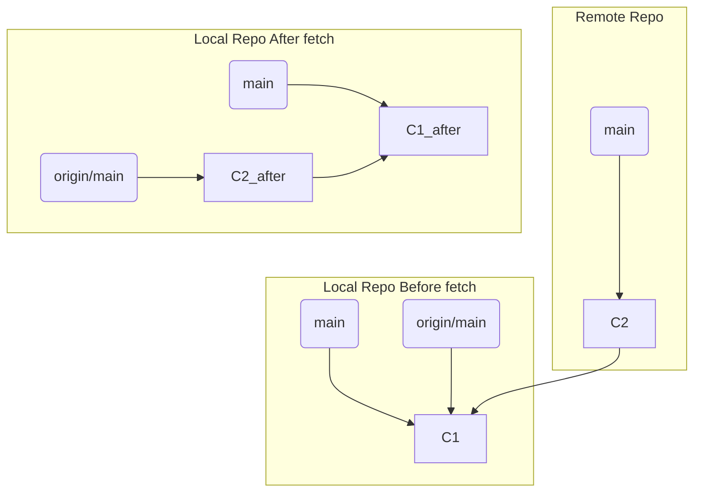

# 第 27 章: Fetch と Pull の違い: 安全な同期方法

---

リモートリポジトリから他のメンバーの変更を自分のローカルリポジトリに取り込むコマンドとして、`git fetch` と `git pull` の 2 つがあります。初心者が混乱しやすいこの 2 つのコマンドは、似ているようでいて、その動作と安全性において**決定的な違い**があります。

この章では、両者の内部動作を正確に理解し、なぜチーム開発において `fetch` を使ったワークフローが推奨されるのかを学びます。

---
## 27.1 `git fetch` の動作: 安全な情報収集

`git fetch` は、リモートリポジトリから最新の情報を**取得するだけ**の、非常に安全なコマンドです。

`git fetch origin` を実行すると、Git は以下のことを行います。
1.  リモートリポジトリ (`origin`) に接続します。
2.  あなたのローカルリポジトリにまだ存在しない、リモートのコミットオブジェクトやツリーオブジェクトなどをすべてダウンロードしてきます。
3.  リモートの各ブランチの最新のコミットを指すように、あなたのローカルにある**リモート追跡ブランチ** (`origin/main` など) のポインタを更新します。

**重要なポイント**:
`fetch` は、あなたのローカルブランチ (`main` など) には**一切触れません**。作業ディレクトリやステージングエリアのファイルも全く変更しません。
リモートの状況をローカルに同期するための、純粋な「情報収集」コマンドです。

`fetch` 後、`origin/main` はリモートと同じ `C2` を指すようになりますが、あなたの `main` は `C1` のままです。この時点で、`git log main..origin/main` を実行すれば、リモートでどのような変更があったかを確認できます。

---
## 27.2 `git pull` の動作: 取得して、即統合

`git pull` は、多くの人が `fetch` の代わりによく使うコマンドですが、その実体は**2 つのコマンドのショートカット (組み合わせ)** です。

`git pull origin main` を実行することは、内部的に以下の 2 つのコマンドを連続で実行することとほぼ同義です。

1.  `git fetch origin`
2.  `git merge origin/main` (現在のブランチに `origin/main` をマージする)

つまり、`pull` はリモートの情報を取得するだけでなく、**即座にその変更をあなたの現在のローカルブランチに統合 (マージ) しようとします**。

これは便利に見えますが、危険もはらんでいます。
もしリモートに予期しない変更があった場合、`pull` を実行した瞬間にあなたの作業中のコードとマージされ、コンフリクトが発生したり、意図しない変更が混入したりする可能性があります。「どんな変更があるか」を**確認する前に、統合が始まってしまう**のです。

---
## 27.3 なぜ `fetch` + `merge` が推奨されるのか

チーム開発におけるベストプラクティスとして、`pull` を無条件に使うのではなく、`fetch` を使った以下の 2 ステップのワークフローが強く推奨されます。

**推奨ワークフロー**:
1.  **`git fetch origin`**: まずはリモートの変更を取得し、リモート追跡ブランチ (`origin/main`) を更新します。
2.  **変更の確認と比較**:
    - `git log origin/main` や `git diff main origin/main` を使って、リモートでどのような変更が行われたのかを確認します。
    - `git status` を実行すると、「Your branch is behind 'origin/main' by X commits...」といったメッセージで、自分のブランチがどれだけ遅れているかを確認できます。
3.  **統合**: 変更内容を把握した上で、手動で統合します。
    - `git merge origin/main` を実行して、リモートの変更をローカルブランチに取り込みます。
    - あるいは、歴史を一直線に保ちたい場合は `git rebase origin/main` を使うこともできます。

このワークフローの**最大の利点**は、リモートの変更を自分の作業に統合する前に、**「何が変更されたのか」をじっくりと確認し、心の準備をする時間がある**ことです。これにより、予期せぬコンフリクトに慌てることなく、計画的に変更を取り込むことができます。

---
**まとめ**

- `git fetch`: リモートの情報を取得し、**リモート追跡ブランチのみを更新する**。ローカルの作業ブランチには影響を与えない安全なコマンド。
- `git pull`: `git fetch` と `git merge` を組み合わせたコマンド。リモートの情報を取得し、**即座に現在のロー-カルブランチにマージする**。
- `pull` は便利だが、リモートの変更内容を確認する前に統合が始まってしまうリスクがある。
- チーム開発では、**`fetch` してから `merge` (または `rebase`)** するという、意図的な 2 ステップのプロセスを踏むことで、より安全で確実なコードの同期が可能になる。
- 癖として `git pull` を使うのをやめ、`git fetch` を基本とする習慣を身につけることが、Git のスキルを一段階上げるための重要なステップです。
