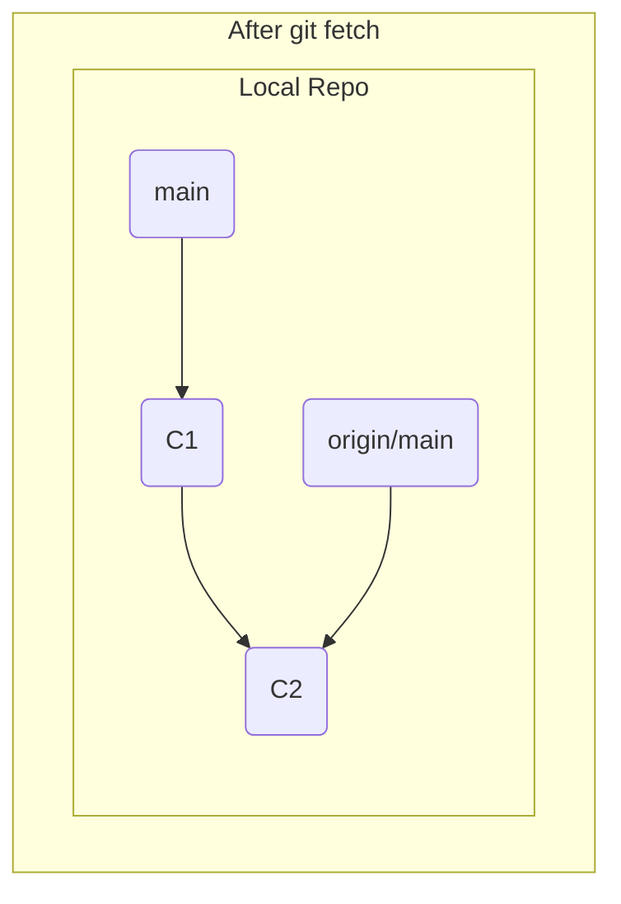
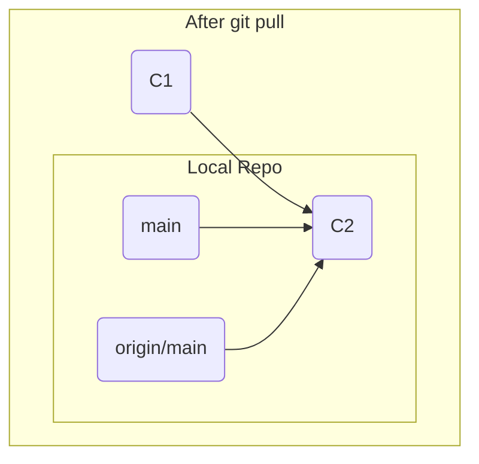

# 第27章: fetch vs pull

リモートリポジトリの最新の変更をローカルに取り込む際、`git fetch`と`git pull`という2つの主要なコマンドがあります。多くの入門書では`git pull`が紹介されますが、この2つのコマンドの挙動は根本的に異なり、特にチーム開発においては、その違いを理解し使い分けることが非常に重要です。

結論から言うと、`git pull`は**`git fetch`と`git merge`を連続で実行する便利なショートカット**です。便利である一方、意図しないマージやコンフリクトをいきなり引き起こす可能性があるため、何が起こるか予測できないうちは`git fetch`を使う方が安全です。

この章では、シミュレーションを通じて、それぞれのコマンドがローカルリポジトリに何をもたらすのかを正確に見ていきましょう。

---
## 27.1 シナリオの準備

まず、あなたと他の開発者が同じリポジトリで作業している状況をシミュレートします。
```bash
# リモートリポジトリ（bare）を作成
git init --bare ../fetch-vs-pull.git

# あなたのローカルリポジトリ
git clone ../fetch-vs-pull.git my-repo && cd my-repo
echo "Commit 1" > file.txt && git add . && git commit -m "C1"
git push origin main
```
この時点で、リモートとあなたのローカルは`C1`というコミットで完全に同期しています。

次に、他の開発者がリモートリポジトリに変更をプッシュしたと仮定します。これをシミュレートするため、別のディレクトリでリモートをクローンし、コミットを追加してプッシュします。
```bash
cd ..
git clone fetch-vs-pull.git another-repo && cd another-repo
git config user.name "Other Dev"
echo "Commit 2" >> file.txt && git add . && git commit -m "C2"
git push origin main
cd ../my-repo # あなたのリポジトリに戻る
```
これで、リモートリポジトリの`main`ブランチは`C2`に進みましたが、あなたのローカルリポジトリはまだ`C1`のまま、という状況が完成しました。

あなたのリポジトリの現在の状態:
-   `main` (ローカルブランチ): `C1`を指している
-   `origin/main` (リモート追跡ブランチ): `C1`を指している（まだリモートと通信していないため）

---
## 27.2 `git fetch`の挙動: 安全な同期

まず、安全な`git fetch`から試してみましょう。
```bash
git fetch origin
```
出力結果:
```
From ../fetch-vs-pull
   <hash_c1>..<hash_c2>  main       -> origin/main
```
このコマンドが実行したことは、たった2つです。
1.  リモートリポジトリ(`origin`)から、あなたのローカルにまだ存在しないオブジェクト（`C2`のコミットオブジェクトなど）をすべてダウンロードする。
2.  あなたのローカルにある**リモート追跡ブランチ (`origin/main`) のポインタを、リモートの最新の状態 (`C2`) まで進める**。

重要なのは、`fetch`はあなたの**ローカルブランチ (`main`) には一切触れない**ということです。作業ディレクトリのファイルも変更されません。

`git log --oneline --graph --all`で状態を確認しましょう。
```
* <hash_c2> (origin/main) C2
* <hash_c1> (HEAD -> main) C1
```
`origin/main`だけが先に進み、あなたの`main`ブランチは元の場所に取り残されていることが明確にわかります。


`fetch`は純粋に情報収集だけを行うため、非常に安全な操作です。`fetch`した後で、`git diff main origin/main`や`git log main..origin/main`を実行すれば、リモートでどのような変更があったのかをマージする前に確認できます。

---
## 27.3 `git pull`の挙動: fetch + merge

では、`git pull`はどうでしょうか。一度、`fetch`前の状態に戻って試してみましょう。
```bash
# C2コミットを消し、origin/mainもC1に戻すハードリセット
git reset --hard <hash_c1>
git update-ref refs/remotes/origin/main <hash_c1>
```
これで、再び`main`も`origin/main`も`C1`を指す、リモートと通信する前の状態に戻りました。

ここで`git pull`を実行します。
```bash
git pull origin main
```
出力結果:
```
From ../fetch-vs-pull
   <hash_c1>..<hash_c2>  main       -> origin/main
Updating <hash_c1>..<hash_c2>
Fast-forward
 file.txt | 1 +
 1 file changed, 1 insertion(+)
```
`git fetch`の時と同じ出力に加えて、「Updating... Fast-forward」という見慣れたマージのログが表示されました。

`git log --oneline --graph --all`で状態を確認します。
```
* <hash_c2> (HEAD -> main, origin/main) C2
* <hash_c1> C1
```
`pull`を実行した結果、`origin/main`だけでなく、あなたのローカルブランチ`main`も`C2`まで進みました。



これは、`git pull`が内部で以下の2つのコマンドを連続で実行したからです。
1.  `git fetch origin`
2.  `git merge origin/main` (現在のブランチに、対応するリモート追跡ブランチをマージする)

もし、リモートとローカルの両方で歴史が分岐していた場合、`git pull`は自動的にThree-wayマージを行い、あなたのローカルにマージコミットを作成します。事前に変更内容を確認するステップを挟まないため、予期せぬコンフリクトに直面することもあります。

---
**まとめ**

この章では、`git fetch`と`git pull`の決定的な違いを学びました。

-   **`git fetch`**: リモートの最新情報を取得し、**リモート追跡ブランチ (`origin/main`) のみ**を更新する。ローカルの作業ブランチには影響を与えない、安全な読み取り専用操作。
-   **`git pull`**: `git fetch`を実行した**直後に**`git merge`を実行する。リモートの変更をローカルの作業ブランチに自動で統合する。

推奨されるワークフローは以下の通りです。
1.  `git fetch`でまずリモートの変更を確認する。
2.  `git log main..origin/main`などで差分を確認する。
3.  `git merge origin/main`や`git rebase origin/main`など、状況に応じて最適な方法で手動で統合する。

この手順を踏むことで、「何がどうなるかわからないまま変更が取り込まれる」という状況を避け、常にリポジトリの状態を完全にコントロール下に置くことができます。

最後に演習用ディレクトリを削除しておきましょう。
```bash
cd ..
rm -rf fetch-vs-pull.git my-repo another-repo
```
