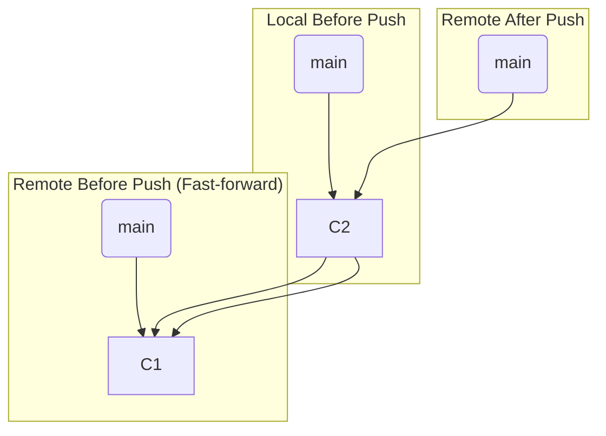
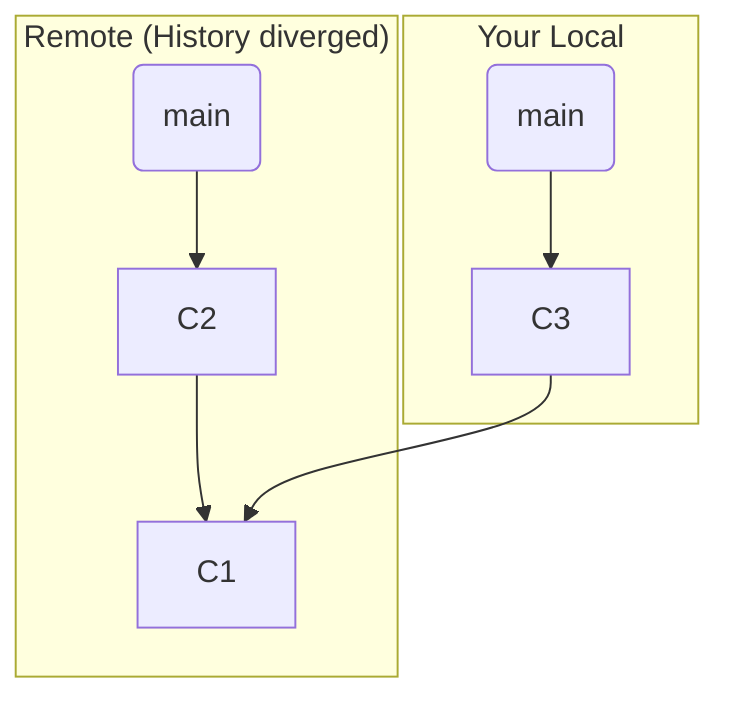

# 第 28 章: Push の内部動作: リモートを更新する

---

`git fetch` と `git pull` がリモートからローカルへ変更を取り込むためのコマンドだったのに対し、`git push` は**ローカルからリモートへ変更を送り出す**ためのコマンドです。

この章では、`git push` が内部で何を行っているのか、そしてなぜ `push` が時々「拒否 (rejected)」されるのか、その理由と対処法を学びます。特に、`--force` と `--force-with-lease` という強力なオプションの危険性と正しい使い方を理解することは、チーム開発において非常に重要です。

---
## 28.1 `git push` の基本動作

`git push <remote-name> <branch-name>` (例: `git push origin main`) を実行すると、Git は以下のステップを踏みます。

1.  **オブジェクトの転送**:
    - ローカルブランチ (`main`) が指すコミットから歴史を遡り、リモートリポジトリ (`origin`) がまだ持っていないすべてのオブジェクト (コミット、ツリー、ブロブ) を特定します。
    - それらのオブジェクトをリモートリポジトリに転送します。

2.  **リモートの参照 (ref) の更新**:
    - 転送が完了したら、Git はリモートリポジトリに対して、「あなたの `main` ブランチのポインタを、この新しいコミット (`<commit-hash>`) を指すように更新してください」というリクエストを送ります。

リモートリポジトリは、このリクエストを受け取ると、一つの重要なチェックを行います。

---
## 28.2 Fast-forward と Non-fast-forward

リモートリポジトリは、参照の更新リクエストが **Fast-forward** であるかどうかをチェックします。

- **Fast-forward Push**:
    - リクエストされた更新が、リモートの現在のブランチの歴史を**そのまま先に進めるだけ**の場合、それは Fast-forward です。
    - 例えば、リモートの `main` がコミット `C1` を指していて、あなたの `push` が `C1` を親に持つ `C2` を指すように要求する場合、これは Fast-forward です。
    - この場合、リモートはリクエストを受け入れ、ブランチのポインタを更新します。これが最もクリーンで安全な `push` です。



- **Non-fast-forward Push**:
    - もし、あなたが `push` する前に、他の誰かが同じブランチに `push` していた場合、リモートの歴史はあなたの知らないうちに進んでいます。
    - この状況であなたが `push` しようとすると、あなたのローカルの歴史とリモートの歴史が**分岐**していることになります。
    - この更新を受け入れてしまうと、リモートで他の誰かが `push` したコミットが**失われる**ことになります。
    - そのため、リモートリポジトリはデフォルトでこのような Non-fast-forward な更新を**拒否 (reject)** します。


この状態で `C3` を `push` しようとすると、リモートの `C2` が失われるため、拒否されます。
エラーメッセージは以下のようになります。
```
! [rejected]        main -> main (non-fast-forward)
error: failed to push some refs to '...'
hint: Updates were rejected because the remote contains work that you do
hint: not have locally. This is usually caused by another repository pushing
hint: to the same ref. You may want to first integrate the remote changes
hint: (e.g., 'git pull ...') before pushing again.
```
この親切なヒントが示す通り、対処法は、まず `git fetch` (または `pull`) を実行してリモートの変更 (`C2`) をローカルに取り込み、それをマージまたはリベースした上で、再度 `push` することです。

---
## 28.3 強制 Push: `--force` と `--force-with-lease`

時には、意図的にリモートの歴史を書き換えたい場合があります。例えば、`rebase` の黄金律を破らない範囲で、まだ誰も使っていない自分だけのフィーチャーブランチを `rebase -i` で綺麗にして `push` し直す、といったケースです。

このような Non-fast-forward な更新を強制的に行うためのオプションが `--force` (または `-f`) です。

`git push --force origin feature/my-branch`

このコマンドは、リモートリポジトリに「**Fast-forward チェックを無視して、私のローカルブランチの状態で、あなたのブランチを強制的に上書きしろ**」と命令します。これは非常に強力で危険なコマンドです。もし他の誰かがそのブランチに `push` していた場合、その人の作業は**警告なしに完全に消え去ります**。

### より安全な `--force-with-lease`

`--force` の危険性を少しでも和らげるために、`--force-with-lease` というオプションがあります。

`git push --force-with-lease origin feature/my-branch`

このコマンドは、`--force` と同様に強制的な上書きを行いますが、一つだけ条件を付けます。
「**もし、リモートブランチの現在の先端が、私のローカルのリモート追跡ブランチ (`origin/feature/my-branch`) が記憶している場所と同じであるならば、上書きを許可する。もし違っていたら (つまり、私が `fetch` してから他の誰かが `push` していたら)、`push` を失敗させろ。**」

つまり、あなたが最後にリモートと同期してから、誰もそのブランチに変更を加えていないことを確認してからでないと、強制 `push` が実行されないのです。これにより、他人の作業を意図せず上書きしてしまうリスクを大幅に減らすことができます。

特別な理由がない限り、強制 `push` が必要な場合は、常に `--force` よりも `--force-with-lease` を使うべきです。

---
**まとめ**

- `git push` は、ローカルのオブジェクトをリモートに転送し、リモートのブランチ参照を更新するコマンドである。
- リモートリポジトリは、歴史を失うような更新 (Non-fast-forward) をデフォルトで拒否する。
- Non-fast-forward エラーが発生した場合は、まずリモートの変更を `fetch` して統合してから再度 `push` するのが通常の解決策である。
- `--force` はリモートの歴史を強制的に上書きする危険なコマンドであり、他人の作業を消してしまう可能性がある。
- `--force-with-lease` は、自分が知らない変更がリモートに加えられていないことを確認してから上書きを行う、より安全な強制 `push` の方法である。
