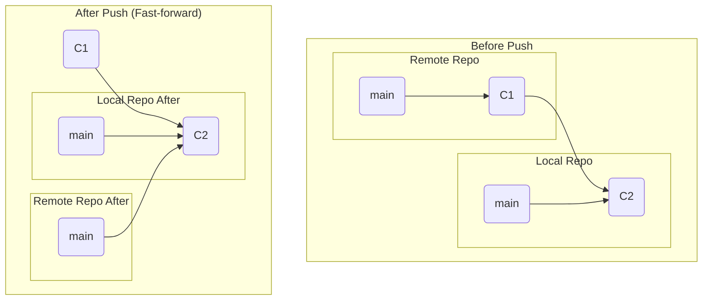
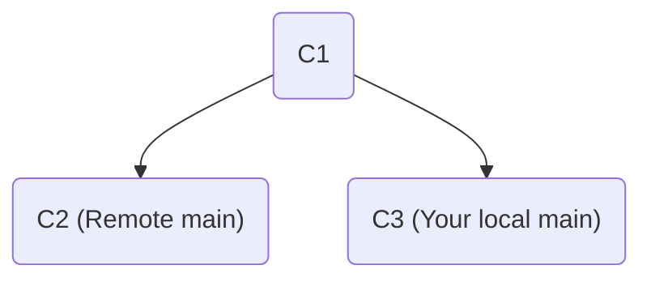

# 第28章: pushの仕組み

`git fetch`や`git pull`がリモートからローカルへ変更を取り込む「ダウンロード」の操作だとすれば、`git push`はローカルからリモートへ変更を送り出す「アップロード」の操作です。あなたのローカルリポジトリで作成したコミットをチームメンバーと共有するための、最も基本的なコマンドです。

この章では、`git push`が内部で何を行っているのか、そしてなぜ時々`push`が拒否されるのか、その安全機構について学びます。

---
## 28.1 `push`の基本動作

`git push <remote-name> <branch-name>`を実行したとき、Gitは以下の処理を行います。

1.  **オブジェクトの転送**: あなたのローカルブランチにあって、リモートブランチにないコミット（と、それに連なるツリーやブロブオブジェクト）をリモートリポジトリに転送します。
2.  **リモート参照の更新**: リモートリポジトリのブランチのポインタ（例: `refs/heads/main`）を、あなたのローカルブランチが指しているコミットと同じ場所まで進めます。

ただし、ステップ2の「リモート参照の更新」は、**ある重要な条件**を満たしていない限り、Gitによって拒否されます。

---
## 28.2 `push`が成功する条件: Fast-forward

`push`が成功するための条件は、その更新が**Fast-forward**であることです。これは、マージの際に学んだ概念と非常によく似ています。

`push`におけるFast-forwardとは、**現在のリモートブランチが指すコミットが、あなたが`push`しようとしているコミットの直接の祖先である**状態を指します。つまり、あなたが最後にリモートと同期してから、他の誰もそのブランチに新しいコミットを`push`していない状況です。

この場合、Gitは単にリモートのブランチのポインタを前に進めるだけで歴史を更新できるため、安全だと判断し、`push`を許可します。



---
## 28.3 `push`が失敗する条件: Non-fast-forward

では、`push`が失敗するのはどのような時でしょうか。それは、あなたが知らない間に、他の誰かが先にリモートブランチを更新していた場合です。

この状況をシミュレートしてみましょう。
```bash
# リモートリポジトリを作成
git init --bare ../push-practice.git

# あなたのリポジトリ
git clone ../push-practice.git my-repo && cd my-repo
echo "C1" > file.txt && git add . && git commit -m "C1"
git push origin main
cd ..

# 同僚のリポジトリ
git clone ../push-practice.git collaborator-repo && cd collaborator-repo
git config user.name "Collaborator"
```
この時点で、全員が`C1`で同期しています。

ここで、まず同僚がリモートに変更を`push`します。
```bash
echo "C2 by Collaborator" >> file.txt && git add . && git commit -m "C2"
git push origin main
```
リモートの`main`ブランチは`C2`に進みました。

そのことを知らずに、あなたも自分のローカルリポジトリで別の作業を進め、コミットを作成します。
```bash
cd ../my-repo
echo "C3 by You" >> file.txt && git add . && git commit -m "C3"
```
あなたのローカルの歴史は`C1 -> C3`ですが、リモートの歴史は`C1 -> C2`となっています。歴史が分岐してしまいました。


この状態で、あなたが`push`を試みるとどうなるでしょうか。
```bash
git push origin main
```
Gitは`push`を拒否し、以下のようなエラーメッセージを表示します。
```
To ../push-practice.git
 ! [rejected]        main -> main (non-fast-forward)
error: failed to push some refs to '../push-practice.git'
hint: Updates were rejected because the remote contains work that you do
hint: not have locally. This is usually caused by another repository pushing
hint: to the same ref. You may want to first integrate the remote changes
hint: (e.g., 'git pull ...') before pushing again.
hint: See the 'Note about fast-forwards' in 'git push --help' for details.
```
エラーメッセージは非常に明確です。「(non-fast-forward)」のため拒否したこと、そしてその理由は「あなたのローカルにない作業がリモートに含まれている」からだと教えてくれます。Gitは、あなたが同僚の`C2`のコミットを誤って消し去ってしまうことを防いでくれたのです。

---
## 28.4 拒否された`push`の解決方法

Gitのヒントが示す通り、この問題を解決する正しい手順は、まずリモートの変更をローカルに取り込み、統合することです。

1.  **`git fetch origin`**: まず、リモートの最新の歴史（`C2`）をローカルにダウンロードし、リモート追跡ブランチ`origin/main`を更新します。
2.  **`git merge origin/main`** (または `git rebase origin/main`): ダウンロードしたリモートの変更 (`origin/main`) を、あなたのローカルブランチ (`main`) に統合します。これにより、同僚の`C2`とあなたの`C3`の両方を含む新しい歴史がローカルに作られます（マージした場合はマージコミットができます）。
3.  **`git push origin main`**: 統合後の歴史は、リモートの歴史を完全に含んだ形になっているため、今度の`push`はFast-forwardとなり、成功します。

この「**Fetch -> Merge/Rebase -> Push**」という流れが、チーム開発における最も基本的で安全なワークフローです。

---
**まとめ**

この章では、`git push`の裏側にある安全機構について学びました。

-   `push`は、ローカルのオブジェクトをリモートに転送し、リモートの参照を更新する操作である。
-   デフォルトでは、`push`は**Fast-forward**更新しか許可されない。これは、他の人の作業を誤って上書きしてしまうことを防ぐための重要な安全装置である。
-   `push`が拒否された (non-fast-forward) 場合は、まず`git fetch`でリモートの変更を取り込み、ローカルで統合してから再度`push`するのが正しい解決策である。
-   `git push --force`は、この安全装置を無効にしてリモートの歴史を強制的に書き換える危険なコマンドであり、その意味を完全に理解している場合を除き、絶対に使用してはならない。

最後に演習用ディレクトリを削除しておきましょう。
```bash
cd ..
rm -rf push-practice.git my-repo collaborator-repo
```
