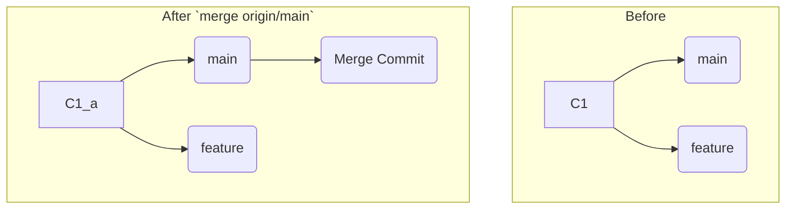
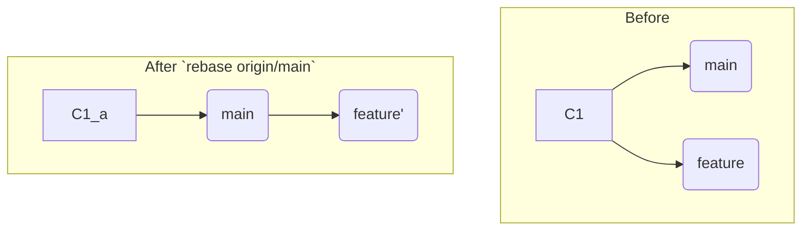

# 第30章: PRでのコンフリクト解決

Pull Request (PR) は、あなたの変更を安全に`main`ブランチに統合するための素晴らしい仕組みです。しかし、あなたが`feature`ブランチで作業している間にも、`main`ブランチは他の開発者のPRがマージされることで刻々と変化していきます。

その結果、あなたの`feature`ブランチの変更と、更新された`main`ブランチの変更が衝突し、GitHub上で「This branch has conflicts that must be resolved」と表示され、マージがブロックされることがあります。これはエラーではなく、Gitが「`main`の新しい歴史と、あなたのブランチの歴史をどう統合すれば良いか自動では判断できません」と知らせてくれている正常な状態です。

このコンフリクトを解決し、PRをマージ可能な状態にするには、**`main`ブランチの最新の変更を、あなたの`feature`ブランチに取り込んであげる**必要があります。そのためのアプローチは、主に2つあります。

1.  **マージ (`merge`)**: `main`の最新状態を`feature`ブランチにマージする。
2.  **リベース (`rebase`)**: `feature`ブランチを`main`の最新状態の上に再構築する。

この章では、それぞれの方法の具体的な手順と、どちらを選ぶべきかについて学びます。

---
## 30.1 シナリオの準備: PRでのコンフリクト

まず、PRでコンフリクトが発生する典型的な状況を再現します。
```bash
# リモートリポジトリとローカルリポジトリを準備
git init --bare ../pr-conflict.git
git clone ../pr-conflict.git my-repo && cd my-repo

# mainに最初のファイルを作成
echo "line 1: Original" > file.txt
echo "line 2: Original" >> file.txt
git add . && git commit -m "Initial file"
git push origin main
```
あなたは`file.txt`の1行目を変更する作業を始めます。
```bash
git switch -c feature/change-line1
sed -i 's/line 1: Original/line 1: Changed by feature/' file.txt
git add . && git commit -m "feat: Change line 1"
git push origin feature/change-line1
# ここでGitHub上でPRを作成したと仮定します
```
あなたがPRを作成した後、別の開発者が**同じファイルの同じ1行目**を変更し、それが先に`main`にマージされました。
```bash
# 同僚の作業をシミュレート
git switch main
git pull origin main # 最新の状態に
sed -i 's/line 1: Original/line 1: Updated on main/' file.txt
git add . && git commit -m "fix: Update line 1 on main"
git push origin main
```
この瞬間、あなたのPRは`main`ブランチとコンフリクトを起こします。

---
## 30.2 解決策1: `main`をマージする

これは最も安全で直感的な方法です。`main`ブランチの歴史を、あなたの`feature`ブランチにマージコミットとして取り込みます。

**ステップ1: ローカルブランチを更新する**
```bash
# featureブランチにいることを確認
git switch feature/change-line1

# リモートの最新情報を取得
git fetch origin
```

**ステップ2: `main`をマージしてコンフリクトを解決する**
```bash
# origin/main (リモートのmain) を現在のブランチにマージ
git merge origin/main
```
このコマンドは、あなたのローカルマシン上でコンフリクトを引き起こします。第3部で学んだ通りに、`file.txt`を開き、コンフリクトマーカーを編集してファイルを望む形に修正します。

修正後、解決をコミットします。
```bash
git add file.txt
git commit # マージコミットメッセージはデフォルトのままでOK
```
これで、あなたのローカルの`feature/change-line1`ブランチは、`main`の最新の変更と、あなたの変更、そしてコンフリクトを解決したマージコミットの全てを含む状態になりました。

**ステップ3: リモートにPushする**
```bash
git push origin feature/change-line1
```
この`push`が完了すると、GitHub上のPRは自動的に更新され、コンフリクトが解消されていることを検知し、マージ可能な状態になります。


-   **メリット**: 操作が直感的で安全。歴史の事実（`main`と合流したこと）がマージコミットとして明確に残る。
-   **デメリット**: `feature`ブランチの歴史に「Merge branch 'main' into...」のようなマージコミットが残り、PRのコミット履歴が少し煩雑になる。

---
## 30.3 解決策2: `main`にリベースする

これは、`feature`ブランチの歴史を`main`の先端に付け替えることで、あたかも`main`の最新の変更が完了した**後で**作業を始めたかのように見せる、よりクリーンな方法です。

**ステップ1: ローカルブランチを更新する**
(マージの時と同じ)
```bash
git switch feature/change-line1
git fetch origin
```

**ステップ2: `main`にリベースしてコンフリクトを解決する**
```bash
# origin/main の上に現在のブランチを再構築
git rebase origin/main
```
リベースの途中でコンフリクトが発生し、プロセスが一時停止します。ファイルを修正し、解決を伝えます。
```bash
# file.txt を編集してコンフリクトを解決
git add file.txt
git rebase --continue
```

**ステップ3: リモートに強制Pushする**
リベースは歴史を書き換えるため、通常のリモートブランチとは歴史の整合性が取れなくなります。そのため、`--force-with-lease`オプションを付けて強制的に`push`する必要があります。
```bash
git push origin feature/change-line1 --force-with-lease
```
`--force-with-lease`は、リモートのブランチがあなたの知らない間に更新されていない場合にのみ`push`を許可する、`--force`よりも安全なオプションです。


-   **メリット**: `feature`ブランチの歴史が一直線になり、PRのコミットが`main`の先端にきれいに並ぶため、最終的な`main`の歴史が非常にクリーンになる。
-   **デメリット**: 歴史の書き換えを伴うため、Gitの操作に慣れが必要。`--force` pushのリスクを理解している必要がある。

---
**まとめ**

この章では、PRで発生したコンフリプトを解決するための2つの主要な戦略を学びました。

-   **マージ戦略**: 安全で確実。チームの誰もがGitに習熟しているわけではない場合に適している。
-   **リベース戦略**: 歴史をクリーンに保つことができる。多くのOSSプロジェクトや、クリーンな`main`の歴史を重視するチームで採用される。

どちらの戦略を採用するかは、多くの場合チームの開発ルールや文化によって決まります。重要なのは、コンフリプトは日常的な出来事であり、これらの手順に従えば冷静に対処できる、と理解することです。

最後に演習用ディレクトリを削除しておきましょう。
```bash
cd ..
rm -rf pr-conflict.git my-repo
```
