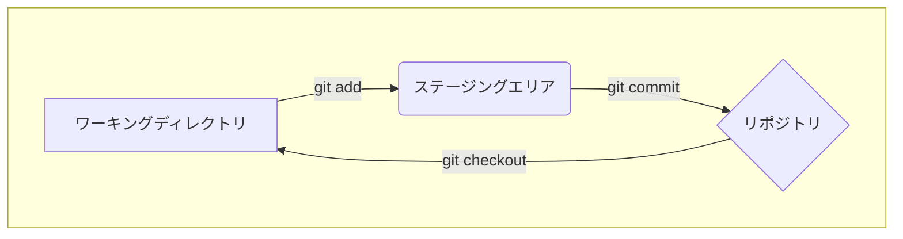

# 第 33 章: `git reset` の 3 つのモードを理解する

`git reset` は、ブランチの `HEAD` を過去の特定のコミットに移動させるための強力なコマンドです。しかし、このコマンドには `--soft`, `--mixed`, `--hard` という 3 つの主要なモードがあり、それぞれが Git の 3 つのエリア (リポジトリ、ステージングエリア、ワーキングディレクトリ) に与える影響が異なります。この違いを正確に理解することは、`reset` を安全かつ効果的に使いこなすための鍵となります。

この章では、3 つのモードが内部的に何を行っているのかを、図を交えて徹底的に解説します。

---
## 33.1 Git の 3 つのエリア (再訪)

`reset` の各モードを理解する前に、Git の 3 つのエリアの関係を再確認しましょう。

- **リポジトリ (`HEAD`)**: `.git` ディレクトリに格納されているコミット済みのスナップショット。`HEAD` は現在のブランチの最新のコミットを指しています。
- **ステージングエリア (インデックス)**: 次のコミットに含める変更内容を準備する場所。`git add` によってファイルのスナップショットが登録されます。
- **ワーキングディレクトリ**: 実際にファイルを編集する場所。



`git reset` は、この流れを逆行させるコマンドと考えることができます。つまり、`HEAD` を動かし、それに伴ってステージングエリアやワーキングディレクトリを過去の状態に戻す (あるいは戻さない) 操作です。

---
## 33.2 `--soft`: HEAD のみ移動

`git reset --soft <commit>` は、3 つのモードの中で最も影響範囲が小さいモードです。

- **`HEAD`**: 指定した `<commit>` に移動します。
- **ステージングエリア**: **変更されません**。
- **ワーキングディレクトリ**: **変更されません**。

つまり、`--soft` はブランチのポインタを付け替えるだけで、あなたの作業内容 (ステージングエリアとワーキングディレクトリ) には一切触れません。

**ユースケース**: 最新のコミットをやり直したいが、コミットした内容は保持したい場合。

**シナリオ**: コミットメッセージを間違えたので修正したい。(`git commit --amend` を知らなかった場合など)

```bash
# C1, C2 とコミットを重ねる
git init
echo "C1" > file.txt && git add . && git commit -m "C1"
echo "C2" >> file.txt && git add . && git commit -m "C2: Opps, typo"

# --soft を使って HEAD を C1 に戻す
git reset --soft HEAD~1

# 状態を確認
git status
# On branch main
# Changes to be committed:
#   (use "git restore --staged <file>..." to unstage)
#         modified:   file.txt

git log --oneline
# <hash_c1> C1
```

`git log` を見ると `HEAD` は `C1` に戻っていますが、`git status` を見ると `C2` で行った変更 (`file.txt` の修正) はステージングエリアに保持されていることがわかります。ここから、正しいメッセージで再度コミットすることができます。

```bash
git commit -m "C2: Correct message"
```

---
## 33.3 `--mixed`: HEAD とステージングエリアを移動 (デフォルト)

`git reset <commit>` または `git reset --mixed <commit>` は、`reset` コマンドのデフォルトの動作です。

- **`HEAD`**: 指定した `<commit>` に移動します。
- **ステージングエリア**: 指定した `<commit>` の状態に**リセットされます**。
- **ワーキングディレクトリ**: **変更されません**。

`--mixed` は、`HEAD` を戻し、**ステージングエリアを `HEAD` の状態に合わせます**。ただし、ワーキングディレクトリの変更は保持されるため、作業内容が失われることはありません。

**ユースケース**: 最新のコミットの内容を、ステージングからやり直したい場合。

**シナリオ**: 最新のコミットに不要なファイルを含めてしまったので、ステージングからやり直したい。

```bash
# C1 をコミット
git init
echo "C1" > important.txt && git add . && git commit -m "C1"

# C2 として、不要なファイルも一緒にステージングしてコミットしてしまう
echo "C2" >> important.txt && git add .
echo "Temporary file" > temp.txt && git add .
git commit -m "C2: Add feature and temporary file"

# --mixed を使って HEAD を C1 に戻す
git reset --mixed HEAD~1

# 状態を確認
git status
# On branch main
# Untracked files:
#   (use "git add <file>..." to include in what will be committed)
#         important.txt
#         temp.txt
```

`HEAD` とステージングエリアが `C1` の状態に戻ったため、`C2` で行った変更 (`important.txt` と `temp.txt` の両方) は「ワーキングディレクトリの変更」として扱われます (`Changes not staged for commit`)。ここから、本当に必要な `important.txt` だけを `add` して、再度コミットすることができます。

```bash
git add important.txt
git commit -m "C2: Add feature correctly"
```

---
## 33.4 `--hard`: HEAD, ステージングエリア, ワーキングディレクトリすべてを移動

`git reset --hard <commit>` は、最も強力で**危険**なモードです。このコマンドは、3 つのエリアすべてを指定したコミットの状態に完全に一致させます。

- **`HEAD`**: 指定した `<commit>` に移動します。
- **ステージングエリア**: 指定した `<commit>` の状態に**リセットされます**。
- **ワーキングディレクトリ**: 指定した `<commit>` の状態に**リセットされます**。

`--hard` を実行すると、指定したコミット以降の**すべての変更 (コミット、ステージングされた変更、ワーキングディレクトリの未保存の変更) が消え去ります**。この操作は `reflog` を使わない限り元に戻せないので、使用には細心の注意が必要です。

**ユースケース**: 最新のコミ-ット (とそれに関連するすべての変更) を完全に破棄して、過去の状態からやり直したい場合。

**シナリオ**: 直近の作業がすべて間違いだったので、完全に元に戻したい。

```bash
# C1, C2 とコミット
git init
echo "C1" > file.txt && git add . && git commit -m "C1"
echo "C2" >> file.txt && git add . && git commit -m "C2"

# さらにワーキングディレクトリでも編集
echo "Something wrong" >> file.txt

# --hard を使って HEAD を C1 に戻す
git reset --hard HEAD~1

# 状態を確認
git status
# On branch main
# nothing to commit, working tree clean

cat file.txt
# C1
```

`C2` のコミットも、ワーキングディレクトリで行った `Something wrong` の変更もすべて消え、リポジトリは完全に `C1` の状態に戻りました。

---
**まとめ**

`git reset` の 3 つのモードは、リセットの影響がどこまで及ぶかで区別できます。

| モード      | `HEAD` (リポジトリ) | ステージングエリア | ワーキングディレクトリ | 主な用途                                     |
| :-------- | :---------------- | :--------------- | :------------------- | :------------------------------------------- |
| `--soft`  | **移動する**      | 変更なし         | 変更なし             | コミットのやり直し (メッセージ修正など)      |
| `--mixed` | **移動する**      | **リセットされる** | 変更なし             | ステージングのやり直し (`add` するファイルの選択) |
| `--hard`  | **移動する**      | **リセットされる** | **リセットされる**   | コミットと作業内容の完全な破棄 (危険！)      |

この表を頭に入れておけば、`git reset` を安全に、そして意図通りに使いこなすことができるようになります。
